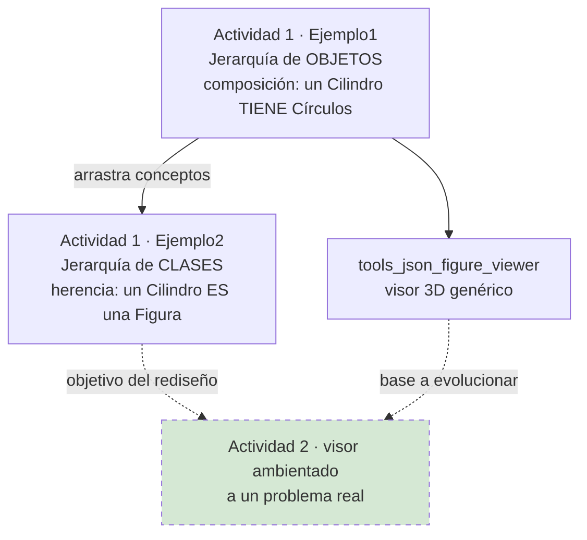
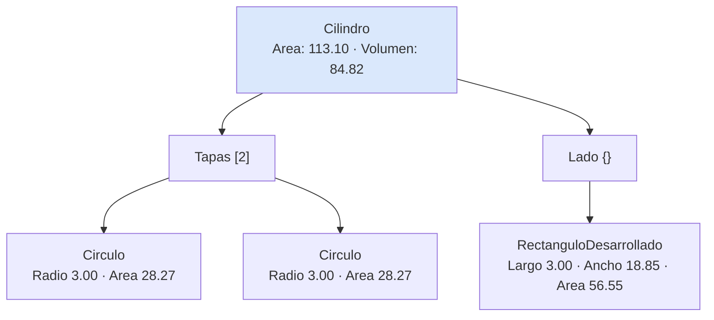
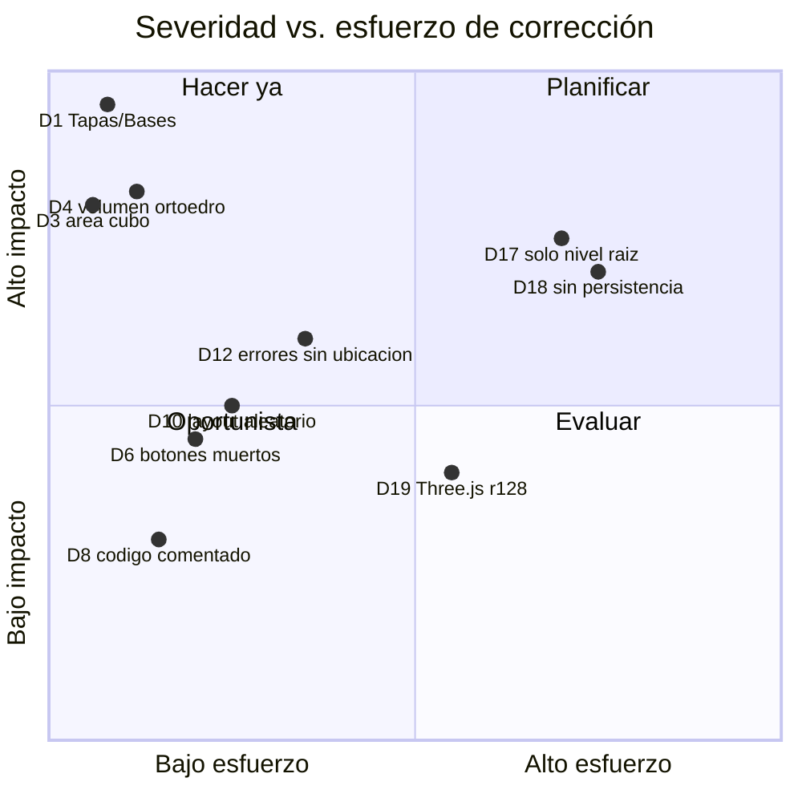
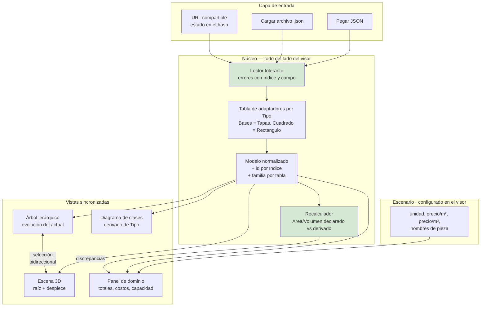

# Análisis Final Integrado — Ecosistema Geometría (Actividad 1 + Visor JSON 3D)

> Documento único, autocontenido y trazable del estado actual de `tup_prog_2_2026_actividad1` (Ejemplo1 y Ejemplo2) y `tools_json_figure_viewer`, orientado a maquetar una versión del visor más ambientada a un problema real.
>
> **Regla de veracidad aplicada:** todo dato numérico, nombre de campo, firma de método y comportamiento descrito fue leído del código fuente del workspace y, cuando es un cálculo, recomputado y contrastado. Las secciones interpretativas o propositivas están explícitamente rotuladas como **[PROPUESTA]** o **[INTERPRETACIÓN]**.

---

## Tabla de contenidos

1. [Resumen ejecutivo](#1-resumen-ejecutivo)
2. [Alcance, fuentes e inventario](#2-alcance-fuentes-e-inventario)
3. [Panorama del ecosistema](#3-panorama-del-ecosistema)
4. [Actividad 1 — Ejemplo1: jerarquía de objetos](#4-actividad-1--ejemplo1-jerarquía-de-objetos)
5. [Actividad 1 — Ejemplo2: jerarquía de clases](#5-actividad-1--ejemplo2-jerarquía-de-clases)
6. [Comparación Ejemplo1 vs Ejemplo2](#6-comparación-ejemplo1-vs-ejemplo2)
7. [El visor web `tools_json_figure_viewer`](#7-el-visor-web-tools_json_figure_viewer)
8. [Contrato de datos consolidado (modelo JSON)](#8-contrato-de-datos-consolidado-modelo-json)
9. [Verificación numérica de las corridas](#9-verificación-numérica-de-las-corridas)
10. [Hallazgos: defectos e inconsistencias verificadas](#10-hallazgos-defectos-e-inconsistencias-verificadas)
11. [Evaluación general](#11-evaluación-general)
12. [Lineamientos para la próxima versión \[PROPUESTA\]](#12-lineamientos-para-la-próxima-versión-propuesta)
13. [Glosario](#13-glosario)
14. [Anexos — JSON completos](#14-anexos--json-completos)

---

## 1. Resumen ejecutivo

**Hallazgo principal:** el ecosistema funciona como cadena didáctica *modelar en C# → describir en texto JSON → pegar en el visor web → ver en 3D*, pero **el visor no lee una de las claves que la aplicación realmente emite**, y **el JSON semilla que trae el visor no es el que producen los programas de la actividad**: fue editado a mano para que funcionara.

> **Premisa de todo el documento:** el formato JSON y la construcción manual con `Describir()` son **decisión didáctica y no se modifican**. Toda recomendación de la sección 12 opera sobre el visor.

Los tres hechos que condicionan cualquier rediseño:

| # | Hecho verificado | Evidencia |
|---|---|---|
| H1 | El C# de Ortoedro emite la clave `"Tapas"`, pero el visor exige `"Bases"` para dibujar un ortoedro. Ningún ortoedro generado por la aplicación se renderiza. | `Ejemplo1/Models/Ortoedro.cs:55`, `Ejemplo2/Models/Ortoedro.cs:55` vs `js/visor.js:852` |
| H2 | El texto emitido por los `Describir()` **no es JSON estrictamente válido**: hay comas finales dentro de arrays y antes del cierre del array raíz. El visor las tolera de forma **deliberada** mediante `cleanJSON()`, y así lo anuncia en la UI. | `Ejemplo1/Models/Cubo.cs:40`, `Ejemplo1/Models/Ortoedro.cs:57-61`, `Ejemplo1/FormPrincipal.cs:29` vs `js/visor.js:402-417` e `index.html:158-161` |
| H3 | Dos fórmulas de Ejemplo1 son geométricamente incorrectas y **sus valores erróneos están congelados en el JSON semilla del visor**: área del cubo `4·l²` en vez de `6·l²`, y volumen del ortoedro que ignora la altura. | `Ejemplo1/Models/Cubo.cs:22`, `Ejemplo1/Models/Ortoedro.cs:36-40`, `index.html:100` (`"Area": 36.00`), `index.html:151` (`"Volumen": 343.00`) |

**Estado de madurez:** el visor es un prototipo de una sola página, sin build, sin dependencias locales, sin persistencia y con ~55 % de su archivo JavaScript ocupado por variantes comentadas de la misma función (`js/visor.js:203-730`). Es apto como demostrador de aula; no es una base sobre la que crecer sin refactor.

**Oportunidad para la Actividad 2 [INTERPRETACIÓN]:** el JSON ya trae todo lo necesario para una versión mucho más rica sin cambiarle una coma. `Tipo` alcanza para derivar la familia de clase y dibujar la jerarquía; el índice del array alcanza como identidad; y `Area` y `Volumen`, contrastados contra las dimensiones, permiten que el visor **verifique** lo que el alumno calculó. La ambientación al dominio (unidades, precios, capacidades) se configura del lado del visor. Ese es el eje de la sección 12.

---

## 2. Alcance, fuentes e inventario

### 2.1 Repositorios analizados

| Repositorio | Rol | Estado |
|---|---|---|
| `PROG2/Geometria/tup_prog_2_2026_actividad1` | Aplicación de escritorio Windows Forms (.NET 10) que el alumno completa y que **produce** el JSON | Con contenido: 2 proyectos, 17 archivos de código |
| `PROG2/Geometria/tools_json_figure_viewer` | Página web estática que **consume** el JSON y lo renderiza en 3D | Con contenido: 3 archivos (HTML/CSS/JS) + 1 imagen |
| `PROG2/Geometria/Lab-Geometria` | — | Vacío: solo `README.md` con el título y `.gitignore` |
| `PROG2/Geometria/Lab-Geometria.Documentacion` | Documentación del laboratorio | `Analisis/` y `Guides/` vacíos al momento del análisis; solo existe el árbol `PROMPTs/` |

### 2.2 Inventario de archivos con contenido

```
tools_json_figure_viewer/
├── index.html          238 líneas — layout Bootstrap 4.3.1 + JSON semilla embebido (líneas 32-153)
├── css/visor.css       ~120 líneas — estilos del árbol JSON, canvas y paneles
├── js/visor.js         1101 líneas — Three.js r128, parser, generador de mallas, árbol JSON
├── Docs/objetos.png    imagen de referencia del conjunto de objetos
└── README.md           enlaces a documentos de consulta + nota de versión v9

tup_prog_2_2026_actividad1/
└── Actividad1/
    ├── Actividad1.sln                          2 proyectos
    ├── Ejemplo1/  (Ejemplo1.JerarquiaDeObjetos.csproj, net10.0-windows, WinForms)
    │   ├── FormPrincipal.cs / .Designer.cs / .resx / Program.cs
    │   ├── Docs/conjunto_de_objetos.png
    │   └── Models/ Circulo, Cuadrado, Rectangulo, RectanguloDesarrollado,
    │              Cilindro, Cubo, Ortoedro            (7 clases, sin herencia)
    └── Ejemplo2/  (Ejemplo2.JerarquíaClases.csproj, net10.0-windows, WinForms)
        ├── FormPrincipal.cs / .Designer.cs / .resx / Program.cs
        ├── Docs/jerarquia_de_clases.png
        └── Models/ Figura, FiguraPlana, FiguraVolumetrica, Circulo, Rectangulo,
                    Cuadrado, RectanguloDesarrollado, Ortoedro, Cubo  (10 clases, con herencia)
```

### 2.3 Limitaciones del análisis

- Los enunciados de la actividad están en Google Docs enlazados desde los `README.md`; **no se accedió a ellos**. Toda afirmación sobre la intención didáctica proviene del código y del contexto provisto por el usuario, y está rotulada como interpretación.
- Los proyectos son `net10.0-windows` con WinForms: **no se compilaron ni ejecutaron** en este entorno Linux. Las salidas de `Describir()` de la sección 14 son **reconstrucciones deterministas** obtenidas leyendo las plantillas de cadena interpolada, con los valores numéricos recomputados de forma independiente (sección 9) y contrastados contra el JSON semilla del visor.
- El visor no se ejecutó en navegador; el comportamiento descrito surge de lectura estática del código.

---

## 3. Panorama del ecosistema

### 3.1 Cadena de valor actual

```mermaid
flowchart LR
    subgraph escritorio["Aplicación de escritorio · .NET 10 WinForms"]
        A["Alumno modela clases<br/>en C#"] --> B["Describir&#40;&#41;<br/>string interpolado"]
        B --> C["TextBox tbDescripcion<br/>texto JSON-like"]
    end
    C -->|"copiar / pegar<br/>transporte manual"| D
    subgraph web["Visor web estático · GitHub Pages"]
        D["textarea #jsonInput"] --> E["cleanJSON&#40;&#41;<br/>saneado por regex"]
        E --> F["JSON.parse"]
        F --> G["createJSONTree&#40;&#41;<br/>árbol colapsable"]
        F --> H["processObjectArray&#40;&#41;<br/>layout en cuadrícula"]
        F --> I["updateObjectInfo&#40;&#41;<br/>panel de datos"]
        H --> J["create3DObject&#40;&#41;<br/>Three.js r128"]
        J --> K["canvas WebGL"]
    end
    style C fill:#ffe6cc
    style D fill:#ffe6cc
    style E fill:#ffcccc
```



**Punto crítico [INTERPRETACIÓN]:** el único acoplamiento entre los dos mundos es el **texto pegado a mano**, sin versión de esquema, sin validación y sin mensaje de error accionable. El paso rojo (`cleanJSON`) existe únicamente para compensar defectos del emisor.

### 3.2 Progresión didáctica declarada



---

## 4. Actividad 1 — Ejemplo1: jerarquía de objetos

**Proyecto:** `Ejemplo1.JerarquiaDeObjetos.csproj` · `net10.0-windows` · `UseWindowsForms=true` · `Nullable=enable` · `ImplicitUsings=enable`
**Namespace:** `Ejercicio1.Models` (nótese: el namespace dice *Ejercicio*, la carpeta y el ensamblado dicen *Ejemplo*).

### 4.1 Modelo: composición sin herencia

Las 7 clases son independientes. Ninguna deriva de otra; el vínculo es **tener-un** (arrays de campos).

```mermaid
classDiagram
    class Circulo {
        +double Radio
        +CalcularArea&#40;&#41; double
        +Describir&#40;&#41; string
    }
    class Cuadrado {
        +double Largo
        +double Ancho
        +CalcularArea&#40;&#41; double
        +Describir&#40;&#41; string
    }
    class Rectangulo {
        +double Largo
        +double Ancho
        +CalcularArea&#40;&#41; double
        +Describir&#40;&#41; string
    }
    class RectanguloDesarrollado {
        +double Largo
        +double Ancho
        +CalcularArea&#40;&#41; double
        +Describir&#40;&#41; string
    }
    class Cilindro {
        -Circulo[] tapas
        -RectanguloDesarrollado lado
        +CalcularArea&#40;&#41; double
        +CalcularVolumen&#40;&#41; double
        +Describir&#40;&#41; string
    }
    class Cubo {
        #Cuadrado[] caras
        +CalcularArea&#40;&#41; double
        +CalcularVolumen&#40;&#41; double
        +Describir&#40;&#41; string
    }
    class Ortoedro {
        #Rectangulo[] bases
        #Rectangulo[] laterales
        +CalcularArea&#40;&#41; double
        +CalcularVolumen&#40;&#41; double
        +Describir&#40;&#41; string
    }
    Cilindro o-- "2" Circulo : tapas
    Cilindro o-- "1" RectanguloDesarrollado : lado
    Cubo o-- "6" Cuadrado : caras
    Ortoedro o-- "2" Rectangulo : bases
    Ortoedro o-- "4" Rectangulo : laterales
```



**Lectura didáctica [INTERPRETACIÓN]:** el alumno descubre que `CalcularArea()` y `Describir()` se repiten con la misma firma en las 7 clases sin que nada del lenguaje lo obligue. Esa repetición es exactamente la motivación de Ejemplo2.

### 4.2 Constructores y semántica de los parámetros

| Clase | Firma | Semántica verificada |
|---|---|---|
| `Circulo` | `Circulo(double radio)` | `Radio = radio` |
| `Cuadrado` | `Cuadrado(double lado)` | `Largo = Ancho = lado` |
| `Rectangulo` | `Rectangulo(double ancho, double largo)` | **Orden invertido respecto de los nombres de propiedad**: el 1.º parámetro va a `Ancho`, el 2.º a `Largo` |
| `RectanguloDesarrollado` | `RectanguloDesarrollado(double radio, double altura)` | `Ancho = 2·π·radio` (perímetro desarrollado), `Largo = altura` |
| `Cilindro` | `Cilindro(double radio, double altura)` | crea `tapas[2]` de `Circulo(radio)` y `lado = RectanguloDesarrollado(radio, altura)` |
| `Cubo` | `Cubo(double lado)` | crea `caras[6]` de `Cuadrado(lado)` |
| `Ortoedro` | `Ortoedro(double anchoBase, double ladoComun, double largoLateral)` | `bases[2] = Rectangulo(anchoBase, ladoComun)`; `laterales[4] = Rectangulo(ladoComun, largoLateral)` |

### 4.3 Fórmulas implementadas (tal como están en el código)

```csharp
// Circulo.cs
public double CalcularArea() => Math.PI * Math.Pow(Radio, 2);

// Cuadrado.cs / Rectangulo.cs / RectanguloDesarrollado.cs
public double CalcularArea() => Largo * Ancho;

// Cilindro.cs
public double CalcularArea()    => 2 * tapas[0].CalcularArea() + lado.CalcularArea();
public double CalcularVolumen() => tapas[0].CalcularArea() * lado.Largo;

// Cubo.cs  ← línea 22
public double CalcularArea()    => 4 * caras[0].CalcularArea();   // ⚠ debería ser 6 *
public double CalcularVolumen() => Math.Pow(caras[0].Ancho, 3);

// Ortoedro.cs  ← líneas 36-40
public double CalcularArea()    => bases[0].Area + bases[1].Area + Σ laterales[0..3].Area;
public double CalcularVolumen()
{
    double ancho = bases[0].Ancho;      // = anchoBase
    double alto  = bases[0].Largo;      // = ladoComun  (comentario original: "este seria el lado común")
    double largo = laterales[0].Ancho;  // ⚠ = ladoComun, NO largoLateral
    return ancho * alto * largo;
}
```

**Defecto de área del cubo (D3, sección 10):** un cubo tiene 6 caras; el código suma 4. Para `Cubo(3)` devuelve `36.00` en lugar de `54.00`.

**Defecto de volumen del ortoedro (D4):** `laterales[0]` se construyó como `Rectangulo(ladoComun, largoLateral)`, y por el orden invertido de parámetros (§4.2) su `Ancho` vale `ladoComun`, no `largoLateral`. El volumen resulta `anchoBase · ladoComun²` en vez de `anchoBase · ladoComun · largoLateral`. Para `Ortoedro(7,7,21)` devuelve `343.00` en lugar de `1029.00`.

### 4.4 Interfaz de usuario

`FormPrincipal.Designer.cs` define exactamente tres controles:

| Control | Tipo | Texto | Handler |
|---|---|---|---|
| `tbDescripcion` | `TextBox` multilínea con scroll vertical, 434×294 | — | — |
| `btnDescribirTapa` | `Button` 128×90 | "Construir Una Tapa y Describir" | `btnDescribirTapa_Click` |
| `btnDescribirLista` | `Button` 128×78 | "Construir Todos y Describir" | `btnDescribirLista_Click` |

El caso de uso completo (`FormPrincipal.cs`):

```csharp
private void btnDescribirLista_Click(object sender, EventArgs e)
{
    Cilindro objeto1 = new Cilindro(3, 3);
    Cubo     objeto2 = new Cubo(3);
    Ortoedro objeto3 = new Ortoedro(7, 7, 21);
    Cilindro objeto4 = new Cilindro(9, 13);
    Cubo     objeto5 = new Cubo(7);
    Cilindro objeto6 = new Cilindro(13, 23);

    tbDescripcion.Text = $@"[
  {objeto1.Describir()},
  {objeto2.Describir()},
  {objeto3.Describir()},
  {objeto4.Describir()},
  {objeto5.Describir()},
  {objeto6.Describir()},   // ← coma final: rompe el JSON
            ]";
}
```

Cada objeto se declara con **variable propia y llamada explícita**: no hay colección ni iteración. Es la contracara deliberada del `foreach` polimórfico de Ejemplo2.

### 4.5 Serialización

`Describir()` construye el JSON por concatenación de texto con `@$"..."`, formateando cada número con `ToString("f2", CultureInfo.InvariantCulture)`. Cada objeto se autodescribe y compone la descripción de sus partes.

> **Premisa fija:** el JSON lo construye el alumno y el formato es el que está. Ni la forma de emitirlo ni la estructura resultante son variables de diseño en este análisis.

El uso de `InvariantCulture` es correcto y necesario —sin él, una máquina con configuración regional española escribiría `28,27` y produciría JSON inválido— y está aplicado consistentemente en las 17 clases de ambos proyectos.

---

## 5. Actividad 1 — Ejemplo2: jerarquía de clases

**Proyecto:** `Ejemplo2.JerarquíaClases.csproj` (nótese la tilde en el nombre) · mismo target y flags que Ejemplo1.
**Namespace:** `Ejercicio2.Models`.

### 5.1 Modelo: herencia con abstractas

```mermaid
classDiagram
    class Figura {
        <<abstract>>
        +CalcularArea&#40;&#41;* double
        +Describir&#40;&#41;* string
    }
    class FiguraPlana {
        <<abstract>>
    }
    class FiguraVolumetrica {
        <<abstract>>
        +CalcularVolumen&#40;&#41;* double
    }
    class Circulo {
        +double Radio
    }
    class Rectangulo {
        +double Largo
        +double Ancho
    }
    class Cuadrado
    class RectanguloDesarrollado
    class Ortoedro {
        #Rectangulo[] bases
        #Rectangulo[] laterales
    }
    class Cilindro {
        -Circulo[] tapas
        -RectanguloDesarrollado lado
    }
    class Cubo

    Figura <|-- FiguraPlana
    Figura <|-- FiguraVolumetrica
    FiguraPlana <|-- Circulo
    FiguraPlana <|-- Rectangulo
    Rectangulo <|-- Cuadrado
    Rectangulo <|-- RectanguloDesarrollado
    FiguraVolumetrica <|-- Ortoedro
    FiguraVolumetrica <|-- Cilindro
    Ortoedro <|-- Cubo
    Cilindro o-- "2" Circulo : tapas
    Cilindro o-- "1" RectanguloDesarrollado : lado
    Ortoedro o-- "2" Rectangulo : bases
    Ortoedro o-- "4" Rectangulo : laterales
```



Contrato raíz (`Figura.cs`, íntegro):

```csharp
namespace Ejercicio2.Models;

abstract public class Figura
{
    abstract public double CalcularArea();
    abstract public string Describir();
}
```

`FiguraPlana` no agrega nada (`FiguraPlana.cs:4` — cuerpo vacío); existe como **marcador semántico** que separa 2D de 3D. `FiguraVolumetrica` agrega `abstract public double CalcularVolumen()`.

### 5.2 Los cuatro mecanismos de POO que la refactorización pone en juego

| Mecanismo | Dónde se ve | Efecto medible |
|---|---|---|
| **Abstracción** | `Figura` declara `CalcularArea()` y `Describir()` sin implementarlos | Ninguna subclase puede olvidarse de implementarlos: lo impide el compilador |
| **Herencia de estado** | `Cuadrado : Rectangulo` con `base(lado, lado)` | `Cuadrado` pasa de 2 propiedades + método propio (Ejemplo1) a **solo el constructor y `Describir()`** |
| **Reutilización de comportamiento** | `Cubo : Ortoedro` con `base(lado, lado, lado)` | `Cubo` **hereda** `CalcularArea()` y `CalcularVolumen()`; no los reimplementa |
| **Polimorfismo** | `FiguraVolumetrica[] figuras` recorrido con `foreach` | Un solo bucle describe 6 objetos de 3 tipos distintos |

### 5.3 Reducción de código medible

| Clase | Ejemplo1 | Ejemplo2 | Diferencia |
|---|---|---|---|
| `Cuadrado` | 2 propiedades + constructor + `CalcularArea()` + `Describir()` | `: Rectangulo`, constructor `base(lado,lado)` + `Describir()` | −2 propiedades, −1 método |
| `RectanguloDesarrollado` | 2 propiedades + constructor + `CalcularArea()` + `Describir()` | `: Rectangulo`, constructor `base(2·π·radio, altura)` + `Describir()` | −2 propiedades, −1 método |
| `Cubo` | campo `Cuadrado[] caras` + `CalcularArea()` + `CalcularVolumen()` + `Describir()` | `: Ortoedro`, constructor `base(l,l,l)` + `Describir()` | −1 campo, −2 métodos |

**Efecto colateral que corrige un bug:** al heredar `CalcularArea()` de `Ortoedro`, el `Cubo` de Ejemplo2 pasa a sumar las 6 caras (`2·base + 4·lateral`). `Cubo(3)` devuelve **54.00** — el valor geométricamente correcto — frente a los `36.00` de Ejemplo1. **La refactorización a herencia elimina el defecto D3 sin que nadie lo haya buscado**; es un argumento didáctico de primer orden [INTERPRETACIÓN].

### 5.4 Uso polimórfico en la UI

```csharp
private void btnDescribirTapa_Click(object sender, EventArgs e)
{
    Figura tapa = new Circulo(3);        // ← variable del tipo base
    tbDescripcion.Text = tapa.Describir();
}

private void btnDescribirLista_Click(object sender, EventArgs e)
{
    FiguraVolumetrica[] figuras = new FiguraVolumetrica[6];
    figuras[0] = new Cilindro(3, 3);
    figuras[1] = new Cubo(3);
    figuras[2] = new Ortoedro(7, 7, 21);
    figuras[3] = new Cilindro(9, 13);
    figuras[4] = new Cubo(7);
    figuras[5] = new Cilindro(13, 23);

    tbDescripcion.Text = "[ \n";
    foreach (FiguraVolumetrica figura in figuras)
    {
        tbDescripcion.Text += figura.Describir() + ",\n";   // ← coma final también aquí
    }
    tbDescripcion.Text += "]";
}
```

Mismos 6 objetos y mismos parámetros que Ejemplo1: la comparación entre ambas salidas es directa y por eso es un excelente material de aula. `Ejemplo2/FormPrincipal.cs` conserva además un `Form1_Load` vacío (residuo de plantilla).

### 5.5 Diferencia de forma en la salida de `Cubo`

`Cubo` de Ejemplo2 hereda de `Ortoedro`, cuyos miembros son `bases[2]` y `laterales[4]` de tipo `Rectangulo`. Su `Describir()` los aplana bajo la clave `"Caras"`:

```csharp
// Ejemplo2/Models/Cubo.cs
""Caras"":
[
  {bases[0].Describir()},
  {bases[1].Describir()},
  {lateralesDescripcion}     // laterales[0..3]
],
```

Como los elementos son instancias de `Rectangulo`, cada uno se autodescribe con `"Tipo": "Rectangulo"`. **En Ejemplo1 las mismas caras se autodescriben como `"Tipo": "Cuadrado"`.** Es decir: el mismo objeto conceptual produce dos JSON con tipos internos distintos según el ejemplo. El visor no se ve afectado (usa `Caras[0].Largo`, presente en ambos), pero cualquier validación por esquema sí lo estaría.

---

## 6. Comparación Ejemplo1 vs Ejemplo2

| Dimensión | Ejemplo1 — Jerarquía de objetos | Ejemplo2 — Jerarquía de clases |
|---|---|---|
| Clases | 7 | 10 (3 abstractas + 7 concretas) |
| Relación dominante | Composición (**tiene-un**) | Herencia (**es-un**) + composición |
| Contrato común | Convención informal repetida | `abstract class Figura` verificada por el compilador |
| Colección de objetos | 6 variables sueltas | `FiguraVolumetrica[6]` |
| Recorrido | 6 invocaciones explícitas | un `foreach` polimórfico |
| Reutilización | Nula: cada clase reimplementa todo | `Cuadrado`, `RectanguloDesarrollado` y `Cubo` reutilizan de su base |
| Área de `Cubo(3)` | `36.00` (fórmula `4·l²`) | `54.00` (heredada de `Ortoedro`) |
| Volumen de `Ortoedro(7,7,21)` | `343.00` | `343.00` (mismo defecto: `Ortoedro.cs` es idéntico salvo `override`) |
| Clave del ortoedro en el JSON | `"Tapas"` | `"Tapas"` (mismo defecto) |
| Tipo interno de las caras del cubo | `"Cuadrado"` | `"Rectangulo"` |

```mermaid
flowchart TB
    subgraph E1["Ejemplo1 — el alumno ve el problema"]
        direction TB
        P1["7 clases sin vínculo"] --> P2["Describir&#40;&#41; repetido 7 veces"]
        P2 --> P3["6 variables, 6 llamadas"]
        P3 --> P4["Cubo con su propia<br/>fórmula de área → 4·l²"]
    end
    subgraph E2["Ejemplo2 — el alumno ve la solución"]
        direction TB
        Q1["Figura abstracta"] --> Q2["contrato impuesto<br/>por el compilador"]
        Q2 --> Q3["FiguraVolumetrica[] + foreach"]
        Q3 --> Q4["Cubo hereda el área<br/>del Ortoedro → 6·l²"]
    end
    P4 -.->|"la herencia también<br/>corrige el error"| Q4
    style P4 fill:#ffcccc
    style Q4 fill:#d5e8d4
```



---

## 7. El visor web `tools_json_figure_viewer`

### 7.1 Arquitectura

Página estática de un solo documento, sin build ni gestor de paquetes. Todas las dependencias entran por CDN (`index.html:8-11, 230-236`):

| Dependencia | Versión | Origen | Uso |
|---|---|---|---|
| Bootstrap CSS | 4.3.1 | cdnjs | Grilla de 2 columnas, tarjetas, botones |
| Font Awesome | 5.15.4 | cdnjs | Iconografía de encabezados y botones |
| Three.js | **r128** | cdnjs | Escena, cámara, geometrías, materiales, WebGLRenderer |
| jQuery | 3.4.1 | cdnjs | Cargado pero **no utilizado** por `visor.js` |
| Popper.js | 1.14.7 | cdnjs | Dependencia de Bootstrap JS |
| Bootstrap JS | 4.3.1 | cdnjs | Cargado; no se usan componentes JS |

Los recursos propios se versionan por *query string* manual: `css/visor.css?v=9`, `js/visor.js?v=9` — consistente con la nota `v9` del `README.md`.

### 7.2 Layout de la página

```
┌──────────────────────────────────────────────────────────────────────┐
│  🧊 Visor JSON 3D - Cilindro Interactivo            (h1 centrado)     │
├────────────────────────────────┬─────────────────────────────────────┤
│  col-lg-6                      │  col-lg-6                           │
│  ┌──────────────────────────┐  │  ┌───────────────────────────────┐  │
│  │ 📄 Entrada JSON          │  │  │ 🧊 Visualización 3D           │  │
│  │  <textarea rows=15>      │  │  │  #canvas-container  h=500px   │  │
│  │  (JSON semilla embebido) │  │  │  gradiente 135° #667eea→#764ba2│ │
│  │  [ ▶ Procesar JSON ]     │  │  │  ┌─────────────────────────┐  │  │
│  │  "Soporta comas finales  │  │  │  │  <canvas id=canvas-3d>  │  │  │
│  │   y comentarios"         │  │  │  └─────────────────────────┘  │  │
│  └──────────────────────────┘  │  │  ⚙ Controles de Vista         │  │
│  ┌──────────────────────────┐  │  │  [Restablecer][Wireframe][Centrar]│
│  │ 🗺 Estructura Jerárquica │  │  │  ℹ Información del Objeto     │  │
│  │  #jsonTree               │  │  │  #objectInfo                  │  │
│  │  árbol colapsable,       │  │  │  (Tipo / Área / Volumen)      │  │
│  │  max-height 600px        │  │  └───────────────────────────────┘  │
│  └──────────────────────────┘  │                                     │
└────────────────────────────────┴─────────────────────────────────────┘
```

El título dice "Cilindro Interactivo" (`index.html:6,19`), heredado de una versión anterior de un solo tipo de figura; hoy el visor maneja seis.

### 7.3 Pipeline de procesamiento

```mermaid
sequenceDiagram
    participant U as Usuario
    participant TA as textarea #jsonInput
    participant PJ as processJSON&#40;&#41;
    participant CJ as cleanJSON&#40;&#41;
    participant P as JSON.parse
    participant POA as processObjectArray&#40;&#41;
    participant C3D as create3DObject&#40;&#41;
    participant S as THREE.Scene

    U->>TA: pega el texto del TextBox de C#
    U->>PJ: click en "Procesar JSON"
    PJ->>CJ: texto crudo
    Note over CJ: quita // y /* */<br/>quita comas antes de } y ]<br/>colapsa espacios
    CJ-->>PJ: texto saneado
    PJ->>P: parse
    alt error de sintaxis
        P--x PJ: SyntaxError
        PJ->>U: alert&#40;&#41; con 3 sugerencias
    else ok
        PJ->>S: clearScene&#40;&#41;
        PJ->>PJ: createJSONTree&#40;&#41; + updateObjectInfo&#40;&#41;
        PJ->>POA: array de figuras
        loop por cada figura
            POA->>POA: radio de envoltura
            POA->>C3D: datos + posición de grilla
            C3D-->>S: THREE.Group o null
        end
        POA->>POA: calculateObjectsCenter&#40;&#41; + updateCameraPosition&#40;&#41;
    end
```



### 7.4 `cleanJSON()` — el saneador que sostiene el contrato

```javascript
function cleanJSON(jsonStr) {
    jsonStr = jsonStr.replace(/\/\/.*$/gm, '');          // comentarios de línea
    jsonStr = jsonStr.replace(/\/\*[\s\S]*?\*\//g, '');  // comentarios de bloque
    jsonStr = jsonStr.replace(/,(\s*[}\]])/g, '$1');     // comas finales
    jsonStr = jsonStr.replace(/\s+/g, ' ').trim();       // espacios
    return jsonStr;
}
```

**Riesgo verificable:** las tres primeras sustituciones operan sobre el texto completo sin distinguir el interior de cadenas. Un valor de cadena que contenga `//` o `/* */` sería mutilado. Hoy no ocurre porque los únicos valores string son nombres de tipo (`"Cilindro"`, `"Circulo"`, …), pero cualquier campo futuro con texto libre (un nombre de pieza, una nota, una URL) rompería el parseo de forma silenciosa.

### 7.5 Layout 3D: cuadrícula con separación uniforme

La función activa es la última de seis variantes (`js/visor.js:733-830`, rotulada en el código como *"sol final 2"*). Las cinco anteriores están comentadas (posicionamiento aleatorio sin colisión ×3, distribución sobre circunferencia ×2) y ocupan `js/visor.js:203-730`.

Algoritmo verificado:

1. **Radio de envoltura por figura** — mitad de la diagonal de la base para prismas, radio para figuras circulares:

   | Tipo | Radio de envoltura | Valor por defecto |
   |---|---|---|
   | `Cilindro` | `Tapas[0].Radio` | 2.5 |
   | `Cubo` | `√(2·Caras[0].Largo²)/2` | lado 5 |
   | `Ortoedro` | `√(Bases[0].Largo² + Bases[0].Ancho²)/2` | 5×5 |
   | `Rectangulo` | `√(Largo² + Ancho²)/2` | 5×5 |
   | `Cuadrado` | `√(2·Largo²)/2` | lado 5 |
   | `Circulo` | `Radio` | 2.5 |

2. **Separación uniforme:** `separationDistance = 2·max(radios) + 2`. La misma para todos: una figura chica junto a una grande queda tan separada como dos grandes.
3. **Grilla:** lado `⌈√n⌉`, extensión `autoGridSize = (⌈√n⌉ · separationDistance)/2 + separationDistance`, paso `separationDistance`.
4. **Asignación aleatoria:** figuras y puntos se barajan con `sort(() => Math.random() - 0.5)` y se emparejan por índice.

**Consecuencias verificables:**
- **La disposición cambia en cada procesado**, aunque el JSON sea idéntico: no hay determinismo ni semilla. Es imposible comparar dos corridas o compartir una vista.
- El barajado por `sort` con comparador aleatorio no produce una permutación uniforme; para uso didáctico es irrelevante, pero es un sesgo real.
- `processObjectArray` llama a `clearScene()` (línea 813) cuando `processJSON` ya lo hizo (línea 367): limpieza duplicada.
- Un **objeto único** (JSON que no es array) toma otra rama (`js/visor.js:378-390`): se ubica en el origen y no pasa por la grilla.

### 7.6 Mapeo JSON → malla 3D

`create3DObject` (`js/visor.js:832-880`) es el **contrato real de consumo**. Un `switch` sobre `data.Tipo` con guardas: si la guarda no se cumple, devuelve `null` y **la figura simplemente no aparece, sin aviso alguno**.

| `Tipo` | Guarda exigida | Geometría Three.js | Dimensiones tomadas | Posición Y | Color |
|---|---|---|---|---|---|
| `Cilindro` | `Tapas && Tapas[0] && Lado` | `CylinderGeometry(r, r, h, 32)` | `r = Tapas[0].Radio`, `h = Lado.Largo` | `h/2` (apoyado) | `0x3498db` azul |
| `Cubo` | `Caras && Caras[0]` | `BoxGeometry(s, s, s)` | `s = Caras[0].Largo` | `s/2` | `0xe74c3c` rojo |
| `Ortoedro` | **`Bases && Bases[0] && Laterales && Laterales[0]`** | `BoxGeometry(w, h, d)` | `w = Bases[0].Largo`, `d = Bases[0].Ancho`, `h = Laterales[0].Ancho` | `h/2` | `0x2ecc71` verde |
| `Rectangulo` | `Largo && Ancho` | `PlaneGeometry(w, h)` | `Largo`, `Ancho` | `0.1`, rotado −90° en X | `0xf39c12` naranja |
| `Cuadrado` | `Largo` | `PlaneGeometry(l, l)` | `Largo` | `0.1`, rotado −90° | `0x9b59b6` violeta |
| `Circulo` | `Radio` | `CircleGeometry(r, 32)` | `Radio` | `0.1`, rotado −90° | `0x1abc9c` turquesa |

Observaciones verificadas:

- **Solo se dibuja el nivel raíz.** Las caras, tapas y laterales anidados alimentan el árbol JSON y los cálculos, pero nunca se convierten en mallas. La riqueza estructural del dato está **subutilizada por la vista**.
- El **ortoedro exige `Bases`**, mientras que el C# emite `"Tapas"` → defecto D1.
- La **altura del ortoedro** se toma de `Laterales[0].Ancho`, que por el orden de parámetros de `Rectangulo` vale `ladoComun` y no `largoLateral`. Para `Ortoedro(7,7,21)` el visor dibujaría un cubo de 7×7×7, no un prisma de 7×7×21 — **el mismo error conceptual que el volumen (D4), replicado en el consumidor**.
- Las guardas usan **veracidad, no existencia** (`data.Largo && data.Ancho`): una dimensión `0` se interpreta como ausente y descarta la figura.
- Materiales: `MeshPhongMaterial` con `opacity 0.8` para volúmenes y `0.7` + `DoubleSide` para planos; sombras activadas con `PCFSoftShadowMap`.

### 7.7 Escena e interacción

| Elemento | Configuración (`js/visor.js:44-85`) |
|---|---|
| Fondo | `0x2c3e50` |
| Cámara | `PerspectiveCamera(75°, aspect, 0.1, 1000)`, orbital esférica |
| Distancia inicial | `25`, limitada a `[5, 100]` por rueda (factor 1.1 / 0.9) |
| Ángulos iniciales | elevación `0.3`, azimut `0`; elevación limitada a `±(π/2 − 0.1)` |
| Luces | ambiente `0x404040 @0.4`, direccional `0xffffff @0.8` en `(10,10,5)` con sombras 2048², puntual `0x4fc3f7 @0.5` en `(−10,0,0)` |
| Grilla | `GridHelper(50, 50)` gris, opacidad 0.3 |
| Auto-rotación | `cameraAngleY += 0.002` por frame cuando no se arrastra el mouse |
| Centrado | promedio de X y Z de los objetos; Y = mitad de la altura máxima (`Box3`) |

**Los botones "Wireframe" y "Centrar" no hacen nada.** `js/visor.js:33-34` registra los manejadores `toggleWireframe` y `centerObjects`, pero **ninguna de esas funciones está definida en el archivo**. Los identificadores no lanzan `ReferenceError` únicamente porque los navegadores exponen los elementos con `id` como propiedades globales de `window`: `addEventListener` recibe entonces el propio `HTMLButtonElement`, que es un objeto válido pero sin `handleEvent`, de modo que el click no produce efecto. En consecuencia `showWireframe` permanece siempre en `false` y las ramas de alambre de las cuatro funciones `create*` son **código muerto**. `updateCylinder()` (`js/visor.js:1014-1022`) también lo es: referencia `#radiusSlider` y `#heightSlider`, que no existen en el HTML.

### 7.8 Paneles de información

- **Árbol JSON** (`createJSONTree`/`createJSONNode`, `js/visor.js:882-963`): recursivo, con nodos colapsables, contador `[n]` para arrays, `{}` para objetos, y coloreado por tipo (string naranja, número azul). Es, en la práctica, **el mejor recurso didáctico del visor**: hace visible la jerarquía que el alumno modeló en C#.
- **Panel de objeto** (`updateObjectInfo`, `js/visor.js:965-1012`): con un array muestra `Tipo`, `Área` y `Volumen` por elemento; con un objeto único agrega conteo de `Tapas`/`Caras` y radio o lado. Muestra los valores **tal como vienen en el JSON**, sin recalcular: si el emisor manda un área equivocada, el panel la repite.

---

## 8. Contrato de datos consolidado (modelo JSON)

### 8.1 Reglas generales verificadas

| Regla | Valor |
|---|---|
| Raíz | array de figuras, o un objeto único |
| Discriminante | `"Tipo"`, string, **PascalCase**, sensible a mayúsculas |
| Formato numérico | decimal con punto, **exactamente 2 decimales**, `InvariantCulture` |
| Campos calculados | `"Area"` en toda figura; `"Volumen"` solo en volúmenes |
| Anidamiento | 2 niveles: figura volumétrica → figuras planas componentes |
| Identidad | **no existe**: ninguna figura tiene `Id`, nombre ni posición |
| Unidades | **no existen**: los números son adimensionales |
| Versión de esquema | **no existe** |

### 8.2 Esquema por tipo

**Figuras planas (hojas):**

| Tipo | Campos | Ejemplo verificado |
|---|---|---|
| `Circulo` | `Tipo`, `Radio`, `Area` | `{"Tipo":"Circulo","Radio":3.00,"Area":28.27}` |
| `Cuadrado` | `Tipo`, `Largo`, `Ancho`, `Area` | `{"Tipo":"Cuadrado","Largo":3.00,"Ancho":3.00,"Area":9.00}` |
| `Rectangulo` | `Tipo`, `Largo`, `Ancho`, `Area` | `{"Tipo":"Rectangulo","Largo":7.00,"Ancho":7.00,"Area":49.00}` |
| `RectanguloDesarrollado` | `Tipo`, `Largo`, `Ancho`, `Area` | `{"Tipo":"RectanguloDesarrollado","Largo":3.00,"Ancho":18.85,"Area":56.55}` |

Nota sobre `RectanguloDesarrollado`: `Ancho` es el **perímetro desarrollado** `2·π·r` y `Largo` es la **altura** del cilindro. El nombre no lo sugiere; es una trampa clásica para el consumidor.

**Figuras volumétricas (compuestas):**

| Tipo | Campos estructurales | Cardinalidad | Campos calculados |
|---|---|---|---|
| `Cilindro` | `Tapas` (array de `Circulo`), `Lado` (objeto `RectanguloDesarrollado`) | 2 + 1 | `Area`, `Volumen` |
| `Cubo` | `Caras` (array) | 6 | `Area`, `Volumen` |
| `Ortoedro` | `Bases` (array de `Rectangulo`) **[esperado por el visor]** / `Tapas` **[emitido por el C#]**, `Laterales` (array de `Rectangulo`) | 2 + 4 | `Area`, `Volumen` |

`Lado` es el **único campo que es objeto y no array** — asimetría que complica cualquier recorrido genérico.

### 8.3 Mapa de compatibilidad emisor ↔ consumidor

```mermaid
flowchart LR
    subgraph emisor["Emisor · C# Describir&#40;&#41;"]
        E1["Cilindro: Tapas[2] + Lado"]
        E2["Cubo E1: Caras[6] de Cuadrado"]
        E2b["Cubo E2: Caras[6] de Rectangulo"]
        E3["Ortoedro: Tapas[2] + Laterales[4]"]
    end
    subgraph consumidor["Consumidor · create3DObject&#40;&#41;"]
        C1["requiere Tapas[0].Radio + Lado.Largo"]
        C2["requiere Caras[0].Largo"]
        C3["requiere Bases[0] + Laterales[0]"]
    end
    E1 -->|"✅ compatible"| C1
    E2 -->|"✅ compatible"| C2
    E2b -->|"✅ compatible"| C2
    E3 -->|"❌ Tapas ≠ Bases<br/>devuelve null, no se dibuja"| C3
    style E3 fill:#ffcccc
    style C3 fill:#ffcccc
```



### 8.4 Estructura de un cilindro, vista como árbol



---

## 9. Verificación numérica de las corridas

Los 6 objetos de `btnDescribirLista_Click` son idénticos en ambos ejemplos. Los valores siguientes fueron **recomputados de forma independiente** aplicando las fórmulas del código y redondeando a 2 decimales, y contrastados con el JSON semilla del visor.

### 9.1 Cilindros — coinciden con la geometría real

| Objeto | Tapa `Area` | `Lado.Largo` | `Lado.Ancho` = 2πr | `Lado.Area` | `Area` total | `Volumen` |
|---|---|---|---|---|---|---|
| `Cilindro(3, 3)` | 28.27 | 3.00 | 18.85 | 56.55 | **113.10** | **84.82** |
| `Cilindro(9, 13)` | 254.47 | 13.00 | 56.55 | 735.13 | **1244.07** | **3308.10** |
| `Cilindro(13, 23)` | 530.93 | 23.00 | 81.68 | 1878.67 | **2940.53** | **12211.37** |

Los valores de `Cilindro(3,3)` coinciden **carácter por carácter** con `index.html:33-58`. Las fórmulas del cilindro son correctas: `A = 2πr² + 2πrh`, `V = πr²h`.

### 9.2 Cubos y ortoedro — divergencias entre ejemplos y contra la geometría

| Objeto | `Area` Ejemplo1 | `Area` Ejemplo2 | Área geométrica real | `Volumen` (ambos) | Volumen real |
|---|---|---|---|---|---|
| `Cubo(3)` | **36.00** ❌ | **54.00** ✅ | 54.00 | 27.00 ✅ | 27.00 |
| `Cubo(7)` | **196.00** ❌ | **294.00** ✅ | 294.00 | 343.00 ✅ | 343.00 |
| `Ortoedro(7,7,21)` | 686.00 | 686.00 | 686.00 ✅ | **343.00** ❌ | 1029.00 |

El área del ortoedro sí es correcta: `2·(7×7) + 4·(7×21) = 98 + 588 = 686`. El defecto está solo en el volumen.

**Confirmación de que el JSON semilla proviene de Ejemplo1:** `index.html:100` contiene `"Area": 36.00` para el cubo de lado 3 — el valor de la fórmula defectuosa `4·l²`. Si se hubiera generado con Ejemplo2 diría `54.00`.

### 9.3 Error de redondeo introducido por el formato `f2`

El emisor redondea a 2 decimales **antes** de transmitir, y el consumidor usa esos valores redondeados como dimensiones de la malla.

| Magnitud | Valor exacto | Transmitido | Error absoluto | Efecto en el visor |
|---|---|---|---|---|
| Área tapa `r=3` | 28.274333… | 28.27 | 0.004333 | ninguno (no se usa para dibujar) |
| `2π·3` | 18.849556… | 18.85 | 0.000444 | ninguno |
| `2π·13` | 81.681409… | 81.68 | 0.001409 | ninguno |

Hoy el impacto es nulo porque el visor dibuja a partir de `Radio` y `Largo` (dimensiones, no áreas), que son valores de entrada exactos. **Pero es una deuda latente:** si una futura versión reconstruyera dimensiones a partir de áreas, arrastraría el error.

### 9.4 Redundancia estructural del dato

En `Cubo(3)` de Ejemplo1, las 6 caras se serializan idénticas (`Largo 3.00, Ancho 3.00, Area 9.00`), repitiendo 24 valores para expresar un único número: el lado. La proporción es peor en el ortoedro y en el conjunto completo.

| Figura | Nodos JSON | Parámetros que la determinan | Factor de redundancia |
|---|---|---|---|
| `Cilindro(3,3)` | 1 raíz + 3 hijos | 2 (`radio`, `altura`) | ~2× |
| `Cubo(3)` | 1 raíz + 6 hijos | 1 (`lado`) | ~7× |
| `Ortoedro(7,7,21)` | 1 raíz + 6 hijos | 3 | ~2.3× |

**[INTERPRETACIÓN]** Esta redundancia es *didácticamente deliberada* — hace visible la composición — pero es exactamente lo que un formato de producción no haría. Cualquier rediseño tiene que decidir explícitamente si conserva la verbosidad (valor pedagógico) o la reemplaza por parámetros + derivación (valor de ingeniería). La sección 12 propone conservar ambas vistas.

---

## 10. Hallazgos: defectos e inconsistencias verificadas

### 10.1 Contrato de datos entre emisor y consumidor

| Id | Defecto | Evidencia | Impacto |
|---|---|---|---|
| **D1** | `Ortoedro.Describir()` emite `"Tapas"`; `create3DObject` exige `"Bases"` | `Ejemplo1/Models/Ortoedro.cs:55` · `Ejemplo2/Models/Ortoedro.cs:55` · `js/visor.js:852` | **Ningún ortoedro generado por la app se dibuja.** Falla silenciosa: `create3DObject` devuelve `null` y nadie avisa. El `README.md` del visor documenta la corrección *del lado web* ("v9 corrección de atributo Tapas por Bases en ortoedro"), pero el lado C# nunca se corrigió |
| **D2** | Comas finales en la salida de C# | `Ejemplo1/Models/Cubo.cs:40` (6.ª cara con `", \n"`) · `Ortoedro.cs:57-61` (`{ lateralesDescripcion },`) · `Ejemplo1/FormPrincipal.cs:29` · `Ejemplo2/FormPrincipal.cs:39` | **No es bloqueante ni accidental.** El texto no es JSON estrictamente válido, pero `cleanJSON` lo tolera **por diseño** y la UI lo anuncia (`index.html:158-161`: *"Soporta JSON con comas finales y comentarios"*). Ver §10.5 |

### 10.2 Errores de cálculo

| Id | Defecto | Evidencia | Impacto |
|---|---|---|---|
| **D3** | Área del cubo: `4 · l²` en vez de `6 · l²` | `Ejemplo1/Models/Cubo.cs:22` | Enseña una fórmula incorrecta. `Cubo(3)` → 36.00 en vez de 54.00. **Solo en Ejemplo1**: Ejemplo2 lo hereda correcto de `Ortoedro`. El valor erróneo está congelado en `index.html:100` |
| **D4** | Volumen del ortoedro ignora el largo lateral | `Ejemplo1/Models/Ortoedro.cs:36-40` · `Ejemplo2/Models/Ortoedro.cs:34-40` | `Ortoedro(7,7,21)` → 343.00 en vez de 1029.00. **Presente en ambos ejemplos.** Causa raíz: `Rectangulo(double ancho, double largo)` invierte el orden respecto de los nombres, y `laterales[0].Ancho` termina valiendo `ladoComun` |
| **D5** | El visor replica D4 al dibujar: `height = Laterales[0].Ancho` | `js/visor.js:856` | El ortoedro se renderizaría como cubo 7×7×7. El error de modelo se propagó a la vista |

### 10.3 Funcionalidad inexistente o muerta

| Id | Defecto | Evidencia | Impacto |
|---|---|---|---|
| **D6** | Botones "Wireframe" y "Centrar" sin implementación | `js/visor.js:33-34` (handlers no definidos) · `index.html:199,204` | Dos de los tres controles de la UI no responden. `showWireframe` nunca cambia → las ramas de alambre de `createCylinder`/`createCube`/`createOrtoedro`/`createPlaneShape` nunca se ejecutan |
| **D7** | `updateCylinder()` referencia sliders inexistentes | `js/visor.js:1014-1022` vs `index.html` (sin `#radiusSlider`/`#heightSlider`) | Código muerto |
| **D8** | 5 versiones comentadas de `processObjectArray` y 2 de `getRandomPosition` | `js/visor.js:203-730` | ~527 de 1101 líneas (48 %) son código inactivo. Solo `getRandomPosition` de línea 285 queda definida, y tampoco se la invoca desde la versión activa |
| **D9** | jQuery, Popper y Bootstrap JS cargados sin uso | `index.html:232-234` | 3 descargas innecesarias |

### 10.4 Fragilidad y deuda

| Id | Observación | Evidencia | Riesgo |
|---|---|---|---|
| **D10** | Layout no determinista (`Math.random()` sin semilla) | `js/visor.js:815-816` | Dos procesados del mismo JSON dan vistas distintas: imposible comparar o compartir |
| **D11** | `cleanJSON` opera sobre el texto completo, incluidos los valores string | `js/visor.js:402-417` | Un futuro campo de texto libre con `//` o `/* */` se corrompe en silencio |
| **D12** | Errores mostrados con `alert()` genérico | `js/visor.js:392-398` | Sin línea ni columna del fallo: el alumno no sabe dónde está su error |
| **D13** | Guardas por veracidad, no por existencia | `js/visor.js:861,867,873` | Una dimensión `0` descarta la figura silenciosamente |
| **D14** | Tres decimales de deriva conceptual: `Ejemplo`/`Ejercicio` en nombres | carpetas `Ejemplo1/2` vs namespaces `Ejercicio1/2.Models` | Confusión al navegar; el `.csproj` de Ejemplo2 además lleva tilde (`Ejemplo2.JerarquíaClases.csproj`) |
| **D15** | Título del visor desactualizado: "Visor JSON 3D - Cilindro Interactivo" | `index.html:6,19` | Maneja 6 tipos, no solo cilindros |
| **D16** | Tipo interno de las caras del cubo difiere entre ejemplos (`Cuadrado` vs `Rectangulo`) | `Ejemplo1/Models/Cubo.cs:40` vs `Ejemplo2/Models/Cubo.cs:19-30` | Impide una validación por esquema única para ambos ejemplos |
| **D17** | Solo se renderiza el nivel raíz del JSON | `js/visor.js:832-880` | La estructura compuesta —el centro del contenido didáctico— no tiene representación visual en 3D |
| **D18** | Sin persistencia, sin URL compartible, sin exportación | `index.html`, `js/visor.js` completos | El trabajo del alumno no se guarda ni se entrega desde el visor |
| **D19** | Three.js **r128** (versión antigua) fijada por CDN | `index.html:230` | Sin `OrbitControls`, sin gestión de color moderna; los controles de cámara están reimplementados a mano (`js/visor.js:1041-1081`) |

### 10.5 Rasgos deliberados — no son defectos

El formato del JSON y la forma de emitirlo son premisa fija. También lo son las comas finales (D2, toleradas por diseño y anunciadas en `index.html:158-161`), la redundancia estructural del dato (§9.4, hace visible la composición), las 6 variables sueltas de `Ejemplo1/FormPrincipal.cs` (contraste deliberado con el `foreach` de Ejemplo2), `FiguraPlana` con cuerpo vacío (marcador semántico) y la ausencia de build (cero fricción para el aula).

**Los defectos reales del ecosistema son, en consecuencia, solo tres:** D1 —que se corrige en el visor— y D3 y D4, que son errores de aritmética y no de formato.

---

## 11. Evaluación general

### 11.1 Fortalezas

1. **La progresión didáctica funciona y es medible.** Ejemplo1 → Ejemplo2 con los mismos 6 objetos permite comparar salidas lado a lado; la reducción de código de la sección 5.3 es concreta y demostrable en clase.
2. **El bucle cerrar-modelo → ver-resultado es potente.** Que el alumno vea en 3D lo que modeló en C# es un refuerzo de aprendizaje difícil de conseguir de otro modo.
3. **El árbol JSON colapsable** es el componente más valioso del visor: hace visible la jerarquía, que es justamente el objeto de aprendizaje.
4. **Uso correcto y consistente de `InvariantCulture`** en las 17 clases: evita el clásico fallo por coma decimal.
5. **Cero fricción de despliegue:** HTML estático en GitHub Pages, sin build ni instalación. Para un aula es la decisión correcta.
6. **La herencia corrige un defecto real** (área del cubo): argumento pedagógico de altísimo valor, aunque probablemente no haya sido intencional.

### 11.2 Debilidades

1. **Divergencia de claves entre emisor y consumidor** (D1, D16): el visor exige `Bases` donde el C# emite `Tapas`, y no hay validación que lo detecte — la figura simplemente desaparece del canvas. Como el formato es fijo, la solución es que el visor tolere ambas variantes (§12.2.1).
2. **Errores de cálculo enseñados como correctos** (D3, D4) y además propagados a la vista (D5) y al JSON de ejemplo.
3. **Transporte manual copiar-pegar** (D18): sin persistencia, sin URL compartible, sin entrega.
4. **Prototipo con 48 % de código muerto** (D8) y dos de tres controles inoperantes (D6).
5. **La vista 3D es más pobre que el dato** (D17): el JSON expresa composición en 2 niveles; el canvas solo dibuja el nivel raíz.
6. **Ausencia total de semántica de dominio:** sin identidad, sin unidades, sin posición, sin material. Los objetos son figuras abstractas flotando en una grilla aleatoria — precisamente lo que el usuario quiere cambiar al "ambientar a un problema real".

### 11.3 Matriz de severidad



---

## 12. Lineamientos para la próxima versión [PROPUESTA]

> Todo el contenido de esta sección es **propositivo**, derivado de la evidencia de las secciones 2–11. No describe código existente.

### 12.1 Principio rector y restricción de partida

> **RESTRICCIÓN FIJA (decisión del docente): el formato JSON es el que está, y no se cambia.**
>
> El JSON lo construye el alumno con `Describir()`, y su estructura —`Tipo`, `Tapas`/`Caras`/`Bases`/`Laterales`/`Lado`, `Area`, `Volumen`, 2 decimales, array raíz— es parte del ejercicio, no una variable de diseño.

De aquí se sigue el principio rector de todo el rediseño:

**Toda la evolución ocurre del lado del visor. El emisor no se toca.**

Consecuencias directas, que gobiernan el resto de la sección:

| Consecuencia | Detalle |
|---|---|
| **D1 se resuelve en el visor** | `create3DObject` debe aceptar `"Tapas"` como sinónimo de `"Bases"` en el ortoedro. Es una línea de JavaScript y desbloquea el renderizado de todos los ortoedros que genera la aplicación |
| **La ambientación al dominio no viaja en el JSON** | Identidad, unidades, materiales, precios y posiciones **los aporta el visor**, no el alumno (§12.3) |
| **El visor debe derivar, no exigir** | Lo que no está en el dato —`id`, posición, familia de clase— se infiere: el índice del array sirve de identidad estable, y `Tipo` determina la familia por tabla de consulta |
| **Sin campo de versión** | Como no habrá envoltorio de esquema, el visor detecta el formato por su forma (array de objetos con `Tipo`), no por una declaración |

### 12.2 Lo que el visor debe hacer con el formato tal como está

El contrato de entrada es el de §8, sin modificaciones. El trabajo del visor v2 es **leerlo mejor**, no pedir que cambie.

#### 12.2.1 Tolerancia de claves (cierra D1)

`create3DObject` debe aceptar las variantes que la aplicación realmente emite:

| Tipo | Claves a aceptar | Nota |
|---|---|---|
| `Ortoedro` | `Bases` **o** `Tapas` | Hoy solo acepta `Bases`; el C# emite `Tapas`. **Esta sola línea desbloquea el renderizado de todos los ortoedros** |
| `Cubo` | `Caras`, con elementos de `Tipo` `Cuadrado` **o** `Rectangulo` | Ejemplo1 emite `Cuadrado`, Ejemplo2 `Rectangulo` (D16). Ambos traen `Largo`: la lectura ya funciona, pero conviene documentarlo |
| Todas | comparar por existencia (`!== undefined`), no por veracidad | Cierra D13: hoy una dimensión `0` descarta la figura |

En vez de un `switch` con guardas rígidas, conviene una **tabla de adaptadores por tipo** que declare, para cada `Tipo`, de qué claves alternativas extraer cada dimensión. Concentra en un solo lugar todo el conocimiento del formato y hace que la próxima divergencia sea un renglón, no una rama nueva.

#### 12.2.2 Lo que el visor deriva por su cuenta

Todo lo que un esquema enriquecido le pediría al alumno, el visor lo calcula solo:

| Necesidad | Cómo se obtiene sin tocar el JSON |
|---|---|
| **Identidad** de cada figura | Índice en el array raíz. Es estable mientras el alumno no reordene, y alcanza para selección, resaltado y layout determinista (cierra D10) |
| **Familia de clase** (`FiguraPlana` / `FiguraVolumetrica`) | Tabla de consulta desde `Tipo`: `Circulo`, `Cuadrado`, `Rectangulo` y `RectanguloDesarrollado` son planas; `Cilindro`, `Cubo` y `Ortoedro` volumétricas. **El visor puede dibujar el diagrama de clases sin que el dato lo declare** |
| **Posición** | Generada por el layout en grilla, pero **sembrada con el índice** en lugar de `Math.random()` |
| **Unidades** | Selector en la UI del visor; el JSON es adimensional y así se queda |
| **Verificación de `Area` y `Volumen`** | Recalcular desde las dimensiones y contrastar con el valor declarado. **Con el JSON actual, sin cambiarle nada, el visor detectaría solo los defectos D3 y D4** — y ese contraste es en sí mismo material didáctico |

La última fila es el hallazgo de esta reformulación: **la verificación no necesitaba un esquema nuevo**. El JSON ya trae las dimensiones y el resultado; alcanza con comparar.

### 12.3 Ambientación a un problema real

El JSON actual describe figuras sin contexto, y **va a seguir haciéndolo**. La ambientación, entonces, es una capa que vive enteramente en el visor: el alumno sigue enviando figuras geométricas, y **el visor las interpreta bajo un escenario** que él mismo aporta (unidades, precios, capacidades, nombres de dominio). El dominio debe aportar **identidad, unidades, cantidad y un objetivo que el 3D ayude a resolver**; nada de eso necesita viajar en el dato. Tres direcciones coherentes con el material existente:

| Escenario | Qué aporta el dominio | Qué gana el 3D | Encaje con el modelo actual |
|---|---|---|---|
| **Depósito / almacén** | Piezas con código, material, cantidad, ubicación en estantería | Ver el volumen ocupado, detectar solapamientos, comparar capacidad | Directo: `Ortoedro`=caja, `Cilindro`=tambor. La grilla existente pasa a ser el layout de estanterías |
| **Presupuesto de materiales** | Precio por m² de recubrimiento y por m³ de relleno | El área y el volumen **dejan de ser números y pasan a ser costo** | Directo: los campos `Area` y `Volumen` ya están calculados |
| **Planta de proceso / tanques** | Capacidad, nivel de llenado, fluido, caudal | Animación de llenado; el cilindro adquiere sentido físico | Directo: `Cilindro` es el tanque canónico; `RectanguloDesarrollado` es literalmente la chapa desarrollada |

**Recomendación [PROPUESTA]:** el escenario de **depósito/almacén con cálculo de materiales** es el de mejor relación valor/esfuerzo, y es además **el que menos le pide al dato**: reutiliza los seis tipos existentes sin agregar geometrías nuevas y da sentido inmediato a los dos campos que el JSON ya trae calculados — `Area` como superficie a recubrir y `Volumen` como capacidad. El escenario completo se configura del lado del visor: unidad, precio por m² y por m³, y nombre de la pieza asignado por índice. **El alumno no escribe una sola línea distinta de las que ya escribe.**

### 12.4 Arquitectura propuesta para el visor v2



### 12.5 Funcionalidades priorizadas

| Prioridad | Funcionalidad | Defecto que cierra |
|---|---|---|
| **P0** | **Aceptar `Tapas` como sinónimo de `Bases` en el ortoedro** | D1 — una línea; es lo único que separa hoy al ortoedro de aparecer en pantalla |
| **P0** | Validador con mensajes ubicados (campo, índice) en vez de `alert()` genérico — manteniendo la tolerancia a comas finales | D12 |
| **P0** | Layout determinista: posición derivada del índice, con semilla estable | D10 |
| **P1** | Selección bidireccional árbol ⇄ escena 3D | D17 |
| **P1** | Modo **despiece**: expandir un volumen y ver sus caras separadas en el espacio | D17 — es el único modo en que el 3D expresa la composición |
| **P1** | Recalculador que compare `Area`/`Volumen` declarados contra el valor derivado de las dimensiones | D3, D4 — **detecta ambos defectos sin tocar el formato** |
| **P1** | Reparar o eliminar los botones Wireframe y Centrar | D6 |
| **P2** | Persistencia y URL compartible (estado en el hash) + exportar JSON / captura | D18 |
| **P2** | Panel de dominio con totales agregados (superficie, volumen, costo, capacidad) | §11.2 punto 6 |
| **P2** | Limpieza: eliminar variantes comentadas y dependencias sin uso | D8, D7, D9 |
| **P3** | Actualizar Three.js y usar `OrbitControls` en vez de la órbita manual | D19 |
| **P3** | Vista de diagrama de clases derivada de `Tipo` mediante tabla de consulta | §12.2.2 |

### 12.6 Sobre el lado C#

**El formato JSON no se modifica** (§12.1). Las únicas correcciones que tendría sentido considerar son de **aritmética**, no de formato, y quedan a criterio del docente:

| Defecto | Archivo | Efecto de corregirlo sobre el JSON |
|---|---|---|
| D3 — área del cubo `4·l²` | `Ejemplo1/Models/Cubo.cs:22` | Solo cambia un número: `36.00` → `54.00`. La estructura no se toca |
| D4 — volumen del ortoedro ignora el largo | `Ortoedro.cs:36-40`, ambos ejemplos | Solo cambia un número: `343.00` → `1029.00`. La estructura no se toca |

D4 tiene además valor como material de aula: rastrear por qué el volumen da 343 en vez de 1029 lleva directo al orden de parámetros de `Rectangulo(double ancho, double largo)`, que es la causa raíz.

**Nada más se toca del emisor.** D1 (`Tapas` vs `Bases`) se resuelve del lado del visor (§12.2.1), que es lo consistente con mantener el formato: el visor se adapta al dato, no al revés.

---

## 13. Glosario

### 13.1 Términos del dominio geométrico

| Término | Definición operativa en este ecosistema |
|---|---|
| **Figura** | Entidad geométrica. En Ejemplo2, clase abstracta raíz que obliga a implementar `CalcularArea()` y `Describir()` |
| **Figura plana** | Figura de 2 dimensiones. En Ejemplo2, `FiguraPlana` es abstracta y de cuerpo vacío: solo marca la categoría |
| **Figura volumétrica** | Figura de 3 dimensiones. En Ejemplo2, `FiguraVolumetrica` agrega `CalcularVolumen()` |
| **Ortoedro** | Prisma rectangular recto: 2 bases rectangulares + 4 caras laterales rectangulares |
| **Cubo** | Ortoedro con las tres aristas iguales. En Ejemplo1 se modela con 6 `Cuadrado`; en Ejemplo2 deriva de `Ortoedro` |
| **Rectángulo desarrollado** | Superficie lateral de un cilindro "desenrollada" en un plano. `Ancho = 2πr` (perímetro de la base), `Largo = altura` |
| **Tapa** | Cada uno de los 2 círculos que cierran un cilindro. En el C# del ortoedro, la clave `"Tapas"` se usa erróneamente para las bases |
| **Base** | Cara inferior o superior de un ortoedro. Clave que el visor exige (`Bases`) |
| **Lateral** | Cada una de las 4 caras verticales de un ortoedro |
| **Radio de envoltura** | Radio del círculo que encierra la proyección horizontal de una figura; el visor lo usa para separar objetos en la grilla |

### 13.2 Términos de programación orientada a objetos

| Término | Definición | Dónde se materializa |
|---|---|---|
| **Jerarquía de objetos** | Estructura formada por relaciones *tiene-un* entre instancias | Ejemplo1: `Cilindro` tiene 2 `Circulo` y 1 `RectanguloDesarrollado` |
| **Jerarquía de clases** | Estructura formada por relaciones *es-un* entre tipos | Ejemplo2: `Cubo` es un `Ortoedro` es una `FiguraVolumetrica` es una `Figura` |
| **Composición** | Un objeto contiene otros como parte de su estado | `Cubo.caras`, `Ortoedro.bases`, `Cilindro.tapas` |
| **Herencia** | Un tipo obtiene estado y comportamiento de otro | `Cuadrado : Rectangulo`, `Cubo : Ortoedro` |
| **Clase abstracta** | Tipo que no se instancia y puede declarar miembros sin implementar | `Figura`, `FiguraPlana`, `FiguraVolumetrica` |
| **Método abstracto** | Declaración sin cuerpo cuya implementación el compilador exige a las subclases concretas | `Figura.CalcularArea()`, `Figura.Describir()` |
| **`override`** | Palabra clave que reemplaza la implementación heredada | `Cilindro.CalcularArea()`, `Cubo.Describir()` |
| **`base(...)`** | Invocación del constructor de la clase padre | `Cuadrado(lado) : base(lado, lado)`, `Cubo(l) : base(l, l, l)` |
| **Polimorfismo** | Invocar un método sobre una referencia del tipo base y obtener el comportamiento del tipo concreto | `foreach (FiguraVolumetrica f in figuras) f.Describir()` |
| **Serialización** | Convertir un objeto en una representación textual transportable | `Describir()` — aquí implementada con cadenas interpoladas, no con un serializador |

### 13.3 Términos técnicos del visor

| Término | Definición | Referencia |
|---|---|---|
| **Discriminante de tipo** | Campo que indica de qué tipo es un objeto en un JSON polimórfico | `"Tipo"` — sobre él opera el `switch` de `create3DObject` |
| **Cámara orbital** | Cámara que gira sobre una esfera alrededor de un punto, parametrizada por azimut, elevación y distancia | `updateCameraPosition()` |
| **Azimut / Elevación** | Ángulo horizontal / vertical de la cámara | `cameraAngleY` / `cameraAngleX` |
| **Wireframe** | Representación en aristas sin superficies | Implementado pero **inalcanzable** (D6) |
| **`THREE.Group`** | Contenedor de mallas que se transforma como una unidad | Retorno de las funciones `create*` |
| **`MeshPhongMaterial`** | Material con reflejo especular; el visor lo usa con transparencia | `opacity 0.8` volúmenes / `0.7` planos |
| **Fallo silencioso** | Error que no produce mensaje ni excepción | `create3DObject` devolviendo `null`: la figura desaparece sin aviso |
| **Saneado por regex** | Reparar texto malformado con expresiones regulares antes de parsearlo | `cleanJSON()` |
| **Layout no determinista** | Disposición que cambia entre ejecuciones con la misma entrada | `sort(() => Math.random() - 0.5)` |

---

## 14. Anexos — JSON completos

### 14.1 JSON semilla embebido en el visor (`index.html:32-153`, íntegro y sin editar)

Este es el texto exacto que trae el `<textarea>` y que se procesa automáticamente al cargar la página. Contiene 3 figuras; sus valores corresponden a `Cilindro(3,3)`, `Cubo(3)` y `Ortoedro(7,7,21)` de **Ejemplo1**.

```json
[ 
  {
  "Tipo": "Cilindro", 
  "Tapas": 
  [
    {  
  "Tipo":"Circulo", 
  "Radio": 3.00, 
  "Area": 28.27
}, 
    {  
  "Tipo":"Circulo", 
  "Radio": 3.00, 
  "Area": 28.27
}
  ],
  "Lado": 
{ 
  "Tipo": "RectanguloDesarrollado", 
  "Largo": 3.00, 
  "Ancho": 18.85, 
  "Area": 56.55
},
  "Area": 113.10,
  "Volumen": 84.82
},
  {  
  "Tipo": "Cubo", 
  "Caras": 
  [
    { "Tipo":"Cuadrado", "Largo": 3.00, "Ancho": 3.00, "Area": 9.00 }, 
    { "Tipo":"Cuadrado", "Largo": 3.00, "Ancho": 3.00, "Area": 9.00 }, 
    { "Tipo":"Cuadrado", "Largo": 3.00, "Ancho": 3.00, "Area": 9.00 }, 
    { "Tipo":"Cuadrado", "Largo": 3.00, "Ancho": 3.00, "Area": 9.00 }, 
    { "Tipo":"Cuadrado", "Largo": 3.00, "Ancho": 3.00, "Area": 9.00 }, 
    { "Tipo":"Cuadrado", "Largo": 3.00, "Ancho": 3.00, "Area": 9.00 }
  ],  
  "Area": 36.00,
  "Volumen": 27.00
},
  {  
  "Tipo": "Ortoedro", 
  "Bases": 
  [
    { "Tipo": "Rectangulo", "Largo": 7.00, "Ancho": 7.00, "Area": 49.00 }, 
    { "Tipo": "Rectangulo", "Largo": 7.00, "Ancho": 7.00, "Area": 49.00 }
  ],
  "Laterales": 
    [
      { "Tipo": "Rectangulo", "Largo": 21.00, "Ancho": 7.00, "Area": 147.00 }, 
      { "Tipo": "Rectangulo", "Largo": 21.00, "Ancho": 7.00, "Area": 147.00 }, 
      { "Tipo": "Rectangulo", "Largo": 21.00, "Ancho": 7.00, "Area": 147.00 }, 
      { "Tipo": "Rectangulo", "Largo": 21.00, "Ancho": 7.00, "Area": 147.00 }
    ],
  "Area": 686.00,
  "Volumen": 343.00
}
]
```

> Las 6 caras del cubo y los 4 laterales del ortoedro se muestran aquí compactados en una línea cada uno; en `index.html` cada objeto ocupa 5 o 6 líneas. Los valores y las claves son idénticos.

**Dos marcas de edición manual verificadas en este texto:**
1. La clave del ortoedro es `"Bases"`, pero el C# emite `"Tapas"` → alguien la corrigió a mano para que el visor dibujara la figura.
2. No hay comas finales, pero el C# las produce en el cubo, en el ortoedro y tras el último elemento del array → también se limpiaron a mano.

`"Area": 36.00` del cubo, en cambio, **no** fue corregido: conserva el valor de la fórmula defectuosa de Ejemplo1.

### 14.2 Salida reconstruida de Ejemplo1 (`btnDescribirLista_Click`)

> **Reconstrucción determinista** a partir de las plantillas de `Describir()`, con valores recomputados (§9). Se conservan las comas finales tal como las emite el programa —el visor las tolera por diseño (§10.5)— para que la reconstrucción sea fiel al texto real.

```
[ 
  {
  "Tipo": "Cilindro", 
  "Tapas": 
  [
    {"Tipo":"Circulo", "Radio": 3.00, "Area": 28.27}, 
    {"Tipo":"Circulo", "Radio": 3.00, "Area": 28.27}
  ],
  "Lado": 
{ "Tipo": "RectanguloDesarrollado", "Largo": 3.00, "Ancho": 18.85, "Area": 56.55},
  "Area": 113.10,
  "Volumen": 84.82
},
  {  
  "Tipo": "Cubo", 
  "Caras": 
  [
    {"Tipo":"Cuadrado", "Largo": 3.00, "Ancho": 3.00, "Area": 9.00}, 
    {"Tipo":"Cuadrado", "Largo": 3.00, "Ancho": 3.00, "Area": 9.00}, 
    {"Tipo":"Cuadrado", "Largo": 3.00, "Ancho": 3.00, "Area": 9.00}, 
    {"Tipo":"Cuadrado", "Largo": 3.00, "Ancho": 3.00, "Area": 9.00}, 
    {"Tipo":"Cuadrado", "Largo": 3.00, "Ancho": 3.00, "Area": 9.00}, 
    {"Tipo":"Cuadrado", "Largo": 3.00, "Ancho": 3.00, "Area": 9.00},     ← D2: coma final
  ],  
  "Area": 36.00,                                                          ← D3: debería ser 54.00
  "Volumen": 27.00
},
  {  
  "Tipo": "Ortoedro",                                                     ← D1: la clave siguiente
  "Tapas":                                                                   debería ser "Bases"
  [
    {"Tipo": "Rectangulo", "Largo": 7.00, "Ancho": 7.00, "Area": 49.00}, 
    {"Tipo": "Rectangulo", "Largo": 7.00, "Ancho": 7.00, "Area": 49.00}
  ],
  "Laterales": 
    [
      {"Tipo": "Rectangulo", "Largo": 21.00, "Ancho": 7.00, "Area": 147.00}, 
      {"Tipo": "Rectangulo", "Largo": 21.00, "Ancho": 7.00, "Area": 147.00}, 
      {"Tipo": "Rectangulo", "Largo": 21.00, "Ancho": 7.00, "Area": 147.00}, 
      {"Tipo": "Rectangulo", "Largo": 21.00, "Ancho": 7.00, "Area": 147.00},  ← D2: coma final
    ],
  "Area": 686.00,
  "Volumen": 343.00                                                       ← D4: debería ser 1029.00
},
  {
  "Tipo": "Cilindro", 
  "Tapas": [{"Tipo":"Circulo","Radio": 9.00,"Area": 254.47}, {"Tipo":"Circulo","Radio": 9.00,"Area": 254.47}],
  "Lado": {"Tipo":"RectanguloDesarrollado","Largo": 13.00,"Ancho": 56.55,"Area": 735.13},
  "Area": 1244.07,
  "Volumen": 3308.10
},
  {  
  "Tipo": "Cubo", 
  "Caras": [ 6 × {"Tipo":"Cuadrado","Largo": 7.00,"Ancho": 7.00,"Area": 49.00} ],
  "Area": 196.00,                                                         ← D3: debería ser 294.00
  "Volumen": 343.00
},
  {
  "Tipo": "Cilindro", 
  "Tapas": [{"Tipo":"Circulo","Radio": 13.00,"Area": 530.93}, {"Tipo":"Circulo","Radio": 13.00,"Area": 530.93}],
  "Lado": {"Tipo":"RectanguloDesarrollado","Largo": 23.00,"Ancho": 81.68,"Area": 1878.67},
  "Area": 2940.53,
  "Volumen": 12211.37
},                                                                        ← D2: coma final del array
            ]
```

### 14.3 Salida reconstruida de Ejemplo2 — diferencias respecto de 14.2

Mismos 6 objetos y mismos parámetros. Solo cambian estos puntos:

| Figura | Ejemplo1 | Ejemplo2 |
|---|---|---|
| `Cubo(3)` — `"Area"` | `36.00` | **`54.00`** |
| `Cubo(7)` — `"Area"` | `196.00` | **`294.00`** |
| `Cubo` — `Caras[i].Tipo` | `"Cuadrado"` | **`"Rectangulo"`** |
| `Cubo` — `Caras[i]` | 6 cuadrados de `Largo`=`Ancho`=lado | 2 bases + 4 laterales, todos `Rectangulo` con `Largo`=`Ancho`=lado |
| Separador del array raíz | `",\n"` con sangría del `$@"..."` | `",\n"` sin sangría (concatenación en `foreach`) |

El `Cubo(3)` de Ejemplo2 queda así:

```
{  
  "Tipo": "Cubo", 
  "Caras": 
  [
    {"Tipo": "Rectangulo", "Largo": 3.00, "Ancho": 3.00, "Area": 9.00}, 
    {"Tipo": "Rectangulo", "Largo": 3.00, "Ancho": 3.00, "Area": 9.00},
    {"Tipo": "Rectangulo", "Largo": 3.00, "Ancho": 3.00, "Area": 9.00}, 
    {"Tipo": "Rectangulo", "Largo": 3.00, "Ancho": 3.00, "Area": 9.00}, 
    {"Tipo": "Rectangulo", "Largo": 3.00, "Ancho": 3.00, "Area": 9.00}, 
    {"Tipo": "Rectangulo", "Largo": 3.00, "Ancho": 3.00, "Area": 9.00}
  ],  
  "Area": 54.00,
  "Volumen": 27.00
}
```

Los defectos D1 (clave `"Tapas"` en el ortoedro) y D4 (volumen del ortoedro) **están presentes también en Ejemplo2**. Las comas finales (D2) también, pero son deliberadas (§10.5).

### 14.4 JSON mínimo válido para probar el visor sin la aplicación de escritorio

Cubre los 6 tipos que `create3DObject` sabe dibujar, con las claves que el visor **realmente** exige (nótese `Bases`, no `Tapas`). JSON estrictamente válido, sin comas finales.

```json
[
  {
    "Tipo": "Cilindro",
    "Tapas": [
      { "Tipo": "Circulo", "Radio": 3.00, "Area": 28.27 },
      { "Tipo": "Circulo", "Radio": 3.00, "Area": 28.27 }
    ],
    "Lado": { "Tipo": "RectanguloDesarrollado", "Largo": 5.00, "Ancho": 18.85, "Area": 94.25 },
    "Area": 150.80,
    "Volumen": 141.37
  },
  {
    "Tipo": "Cubo",
    "Caras": [
      { "Tipo": "Cuadrado", "Largo": 4.00, "Ancho": 4.00, "Area": 16.00 },
      { "Tipo": "Cuadrado", "Largo": 4.00, "Ancho": 4.00, "Area": 16.00 },
      { "Tipo": "Cuadrado", "Largo": 4.00, "Ancho": 4.00, "Area": 16.00 },
      { "Tipo": "Cuadrado", "Largo": 4.00, "Ancho": 4.00, "Area": 16.00 },
      { "Tipo": "Cuadrado", "Largo": 4.00, "Ancho": 4.00, "Area": 16.00 },
      { "Tipo": "Cuadrado", "Largo": 4.00, "Ancho": 4.00, "Area": 16.00 }
    ],
    "Area": 96.00,
    "Volumen": 64.00
  },
  {
    "Tipo": "Ortoedro",
    "Bases": [
      { "Tipo": "Rectangulo", "Largo": 6.00, "Ancho": 4.00, "Area": 24.00 },
      { "Tipo": "Rectangulo", "Largo": 6.00, "Ancho": 4.00, "Area": 24.00 }
    ],
    "Laterales": [
      { "Tipo": "Rectangulo", "Largo": 6.00, "Ancho": 8.00, "Area": 48.00 },
      { "Tipo": "Rectangulo", "Largo": 6.00, "Ancho": 8.00, "Area": 48.00 },
      { "Tipo": "Rectangulo", "Largo": 4.00, "Ancho": 8.00, "Area": 32.00 },
      { "Tipo": "Rectangulo", "Largo": 4.00, "Ancho": 8.00, "Area": 32.00 }
    ],
    "Area": 208.00,
    "Volumen": 192.00
  },
  { "Tipo": "Rectangulo", "Largo": 6.00, "Ancho": 3.00, "Area": 18.00 },
  { "Tipo": "Cuadrado",   "Largo": 4.00, "Ancho": 4.00, "Area": 16.00 },
  { "Tipo": "Circulo",    "Radio": 2.50, "Area": 19.63 }
]
```

En este ejemplo el ortoedro se dibujará con `ancho = Bases[0].Largo = 6`, `profundidad = Bases[0].Ancho = 4` y `altura = Laterales[0].Ancho = 8`, coherente con el volumen declarado de 192.00.

---

## Nota sobre la ubicación de este documento

El prompt de origen indicaba escribir el resultado en la ruta del propio archivo de prompt (`PROMPTs/02-Crear-Analisis/Crear-Analisis-Final-Integrado.md`). Se interpretó como un error de transcripción: sobrescribir el prompt destruiría la instrucción y contradice la regla de preservación del trabajo previo. El documento se generó en `Lab-Geometria.Documentacion/Analisis/`, la carpeta prevista para análisis y que estaba vacía.
