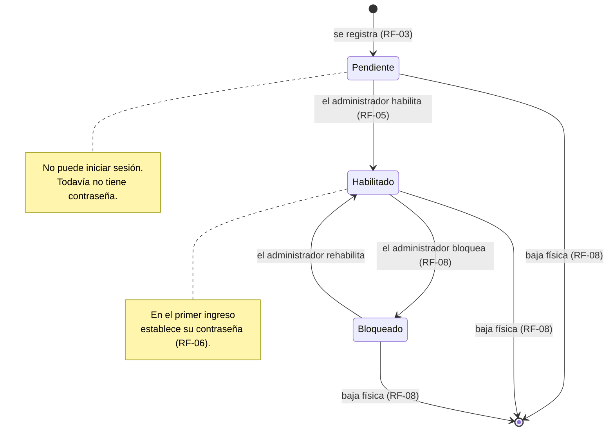
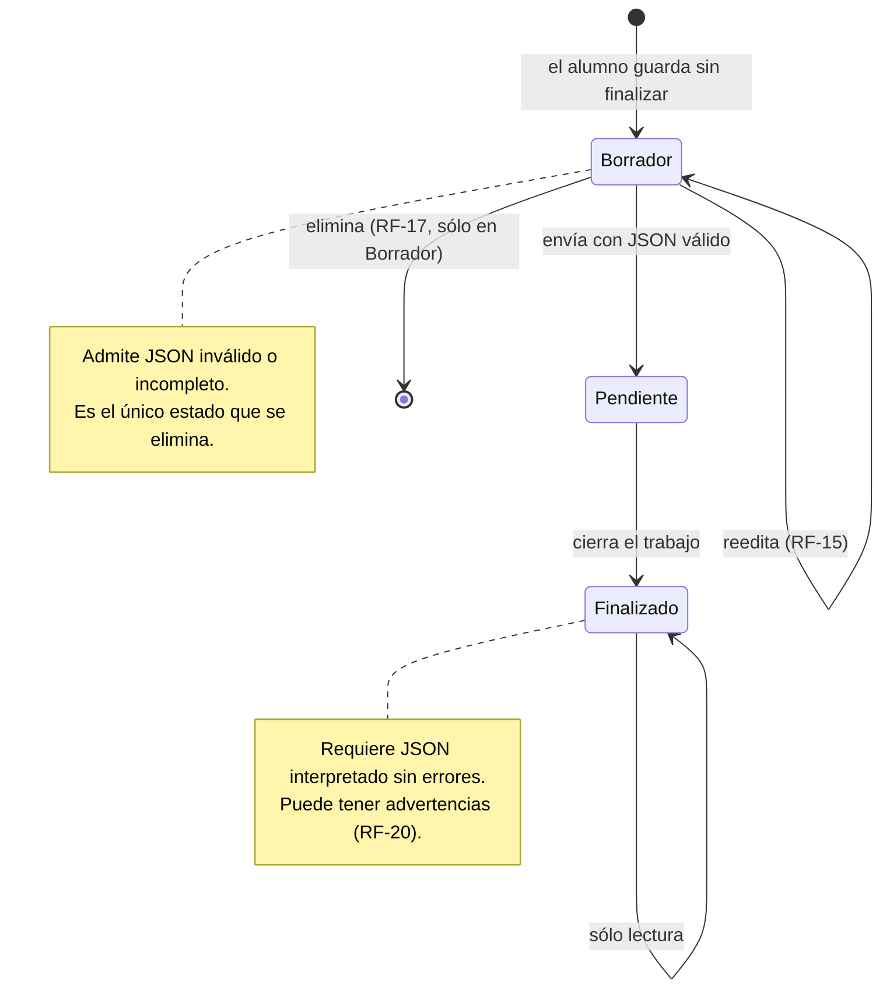
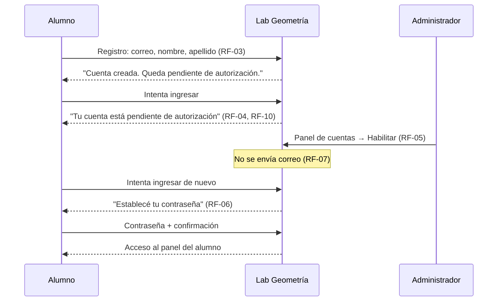
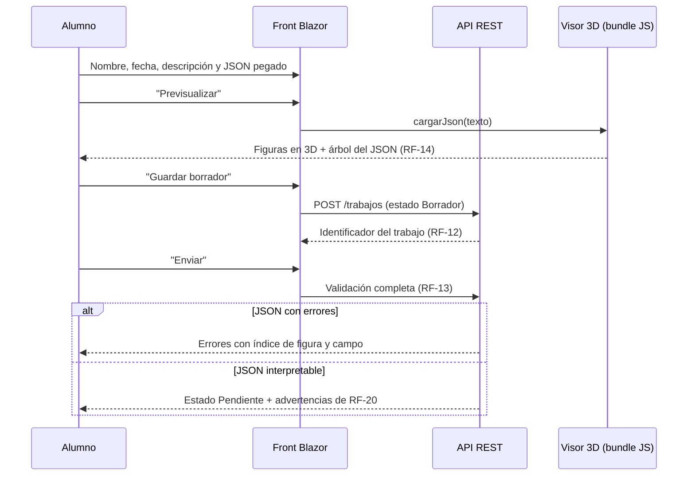
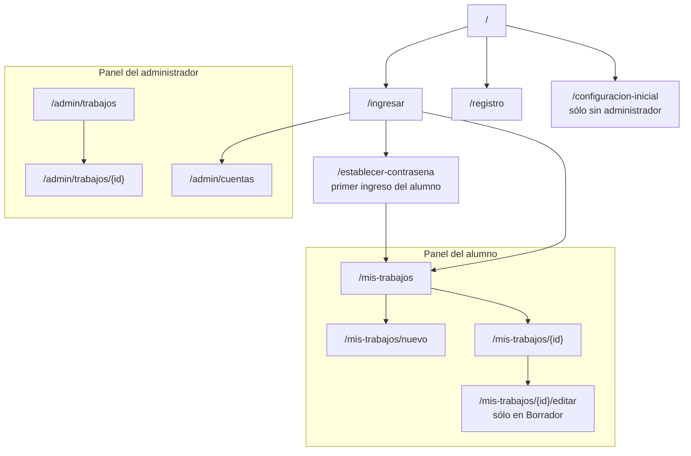

# Requerimientos Funcionales — Lab Geometría

Este documento hereda todos los requerimientos del análisis
[`/PROG2/Geometria/Lab-Geometria.Documentacion/Analisis/Analisis-Actividad-Documento-Integrador.md`](../../../../Analisis/Analisis-Actividad-Documento-Integrador.md)
y cierra sobre él las decisiones funcionales y de planeamiento de la solución a construir en el
repositorio destino `/PROG2/Geometria/Lab-Geometria`. Las decisiones técnicas están en
[`Requerimientos-Tecnicos.md`](Requerimientos-Tecnicos.md).

> **Regla de veracidad aplicada.** Todo lo referido al formato del JSON, al comportamiento del visor
> y a los defectos conocidos está tomado del análisis integrado y lleva su referencia. Lo que
> proviene de una definición del docente y no de una evidencia del código se rotula **[DECISIÓN]**.

---

## Tabla de contenidos

1. [Qué es esta aplicación](#1-qué-es-esta-aplicación)
2. [Actores y roles](#2-actores-y-roles)
3. [Requerimientos funcionales](#3-requerimientos-funcionales)
4. [Estados y transiciones](#4-estados-y-transiciones)
5. [Flujos completos](#5-flujos-completos)
6. [Reglas de negocio](#6-reglas-de-negocio)
7. [Mapa de navegación y maquetado](#7-mapa-de-navegación-y-maquetado)
8. [Fuera de alcance](#8-fuera-de-alcance)
9. [Etapas de desarrollo](#9-etapas-de-desarrollo)
10. [Las etapas](#10-las-etapas)
11. [Informe de cierre de etapa](#11-informe-de-cierre-de-etapa)
12. [Glosario funcional](#12-glosario-funcional)

---

## 1. Qué es esta aplicación

**La aplicación a desarrollar es básica** [DECISIÓN]. Es un laboratorio de aula donde:

- el **alumno** carga *trabajos* —conjuntos de piezas a manufacturar— adjuntando el JSON que produce
  su propia aplicación de la Actividad 1, y lo previsualiza en 3D;
- el **administrador** autoriza las cuentas y revisa los trabajos de todos los alumnos.

**Lo que cambia respecto del visor actual.** Hoy la cadena es *modelar en C# → copiar el texto →
pegarlo en una página estática → verlo en 3D*, sin identidad, sin persistencia y sin entrega
(análisis §3.1, §10.4 D18). Esta aplicación cierra ese circuito: el trabajo **queda guardado, tiene
dueño, tiene estado y se entrega**.

```mermaid
flowchart LR
    A["Alumno modela en C#<br/>Actividad 1"] --> B["Describir&#40;&#41; → texto JSON"]
    B --> C["Carga el trabajo<br/>en Lab Geometría"]
    C --> D["Validación + verificación<br/>de Área y Volumen"]
    D --> E["Previsualización 3D<br/>visor embebido"]
    E --> F["Finaliza el trabajo"]
    F --> G["El administrador lo revisa,<br/>filtra y agrupa por alumno"]
    style C fill:#d5e8d4
    style D fill:#ffe6cc
```



---

## 2. Actores y roles

| Actor | Cómo se crea | Qué puede hacer |
|---|---|---|
| **Administrador** | **En el primer arranque del servicio**, que solicita configurar la cuenta. Es único (INV-05) | Autorizar, bloquear y dar de baja física de cuentas de alumno. Ver, filtrar y agrupar **todos** los trabajos y visualizarlos en 3D y como árbol |
| **Alumno** | Se registra por sí mismo con su **correo como nombre de usuario**, más nombre y apellido | Cargar, editar, finalizar y ver **sus** trabajos. Eliminar **sus** trabajos que estén en borrador |
| **Visitante** | — | Registrarse e iniciar sesión. Nada más |

**No hay más roles ni permisos configurables** [DECISIÓN]: el modelo es de dos roles fijos.

---

## 3. Requerimientos funcionales

### 3.1 Cuentas y acceso

| Id | Requerimiento |
|---|---|
| **RF-01** | En el **primer arranque** del servicio, y sólo mientras no exista administrador, el sistema solicita la configuración de la cuenta de administrador: usuario, contraseña y confirmación, con validación de la contraseña. |
| **RF-02** | Creado el administrador, el alta inicial **deja de ofrecerse**. Reintentar esa ruta lleva al inicio de sesión. |
| **RF-03** | Un alumno se registra indicando **correo** (que es su nombre de usuario), **nombre** y **apellido**. **En el registro no elige contraseña.** |
| **RF-04** | La cuenta recién registrada queda en estado **Pendiente**: no puede iniciar sesión. |
| **RF-05** | El administrador **habilita** la cuenta desde su panel. |
| **RF-06** | La **primera vez que el alumno ingresa con la cuenta ya habilitada, el sistema le solicita establecer su contraseña.** A partir de ahí ingresa con correo y contraseña. |
| **RF-07** | **No se envían notificaciones por correo** [DECISIÓN]. El alumno se entera de que su cuenta fue habilitada intentando ingresar. El sistema se lo dice explícitamente cuando todavía está pendiente. |
| **RF-08** | El administrador puede **bloquear** una cuenta (impide el acceso, conserva los datos) y **darla de baja físicamente** (elimina la cuenta y sus trabajos). |
| **RF-09** | Ambos roles pueden **cerrar sesión** y **cambiar su contraseña** desde la barra superior. El cambio exige la contraseña actual. |
| **RF-10** | Un intento de acceso con credenciales incorrectas se rechaza **sin revelar cuál de los dos campos falló**. Un intento con cuenta pendiente o bloqueada sí informa el motivo. |

> **Nota sobre RF-06 y RF-07.** Este flujo es deliberado y evita el envío de correo: la contraseña
> no se transporta nunca, la elige el alumno en su primer ingreso efectivo. El costo es que el
> alumno debe reintentar hasta que su cuenta esté habilitada; el sistema lo compensa con un mensaje
> claro de estado.

### 3.2 Trabajos

| Id | Requerimiento |
|---|---|
| **RF-11** | El alumno **carga un trabajo** con: nombre, fecha, descripción y el **JSON** de figuras producido por su aplicación de la Actividad 1. |
| **RF-12** | Cada trabajo recibe un **identificador propio** al crearse. |
| **RF-13** | El JSON **se valida** contra la estructura del ejemplo de referencia `/PROG2/Geometria/tup_prog_2_2026_actividad1/Actividad1/Ejemplo2`, tolerando las particularidades reales del emisor (Requerimientos Técnicos §6.3). |
| **RF-14** | El trabajo **se previsualiza en 3D** con el visor de `tools_json_figure_viewer` embebido en la página, junto con la **estructura del JSON en forma de árbol**. |
| **RF-15** | El trabajo puede **guardarse como borrador** y reeditarse en ese estado tantas veces como haga falta, **incluso con JSON inválido**. |
| **RF-16** | El alumno **ve la lista de sus trabajos** con su estado: `Borrador`, `Pendiente` o `Finalizado`. |
| **RF-17** | El alumno **elimina** trabajos propios **sólo si están en `Borrador`**. |
| **RF-18** | El administrador **ve el listado de todos los trabajos**, con capacidad de **agrupar y filtrar por alumno**. |
| **RF-19** | El administrador **visualiza cualquier trabajo** con el mismo visor 3D embebido y con la estructura del JSON en árbol. |
| **RF-20** | El sistema **verifica los valores calculados** del JSON: recalcula `Area` y `Volumen` desde las dimensiones y muestra las discrepancias como **advertencias**, sin impedir el guardado. |

### 3.3 Sobre RF-20, que es el requerimiento con más valor didáctico

El JSON que producen los ejemplos de la Actividad 1 contiene **valores calculados incorrectos ya
verificados**:

| Objeto | Valor declarado | Valor geométrico | Evidencia |
|---|---|---|---|
| `Cubo(3)` de Ejemplo1 | `Area: 36.00` | 54.00 | `Ejemplo1/Models/Cubo.cs:22` usa `4·l²` — análisis §10.2 D3 |
| `Ortoedro(7,7,21)` (ambos ejemplos) | `Volumen: 343.00` | 1029.00 | `Ortoedro.cs` toma `laterales[0].Ancho`, que vale `ladoComun` — análisis §10.2 D4 |

**El sistema no corrige ni rechaza esos valores: los señala.** Que el alumno vea sobre su propio
trabajo que su cubo declara 36.00 donde la geometría dice 54.00 es, según el análisis, material
didáctico de primer orden (§12.2.2), y **no requiere ningún cambio en el formato del JSON**.

---

## 4. Estados y transiciones

### 4.1 Estado de la cuenta del alumno



### 4.2 Estado del trabajo



**Los tres estados son los pedidos explícitamente** [DECISIÓN: "pendiente, borrador o finalizado"].
Su significado operativo:

| Estado | Qué significa | Editable | Eliminable |
|---|---|---|---|
| `Borrador` | El alumno todavía lo está armando | Sí | **Sí** |
| `Pendiente` | Entregado, a la espera de revisión del administrador | No | No |
| `Finalizado` | Cerrado | No | No |

---

## 5. Flujos completos

### 5.1 Alta de alumno, de punta a punta



### 5.2 Carga de un trabajo



### 5.3 Ejemplo práctico concreto — qué ve el alumno con un caso real

Entrada: la salida de `btnDescribirLista_Click` de Ejemplo1, con sus 6 figuras (análisis §4.4).

| Lo que trae el JSON | Lo que muestra la aplicación |
|---|---|
| 3 cilindros, 2 cubos, 1 ortoedro | 6 piezas listadas, cada una con su tipo y sus valores |
| Comas finales tras la última figura | **Nada**: se toleran en silencio, igual que en el visor (análisis §10.5) |
| `Cubo(3)` con `"Area": 36.00` | ⚠ *"Área declarada 36.00; derivada de las dimensiones 54.00"* |
| `Cubo(7)` con `"Area": 196.00` | ⚠ *"Área declarada 196.00; derivada 294.00"* |
| `Ortoedro(7,7,21)` con `"Volumen": 343.00` | ⚠ *"Volumen declarado 343.00; derivado 1029.00"* |
| El ortoedro emite la clave `"Tapas"` | Se dibuja igual. **Hoy, en el visor original, no se dibuja ninguno** (análisis §10.1 D1) |
| Los 3 cilindros | Sin observaciones: sus fórmulas son correctas (análisis §9.1) |

Resultado: el trabajo se guarda y se finaliza **con 3 advertencias**. Ninguna lo bloquea.

---

## 6. Reglas de negocio

| Id | Regla | Verificación |
|---|---|---|
| **RN-01** | Existe **exactamente un** administrador. Su alta sólo es posible mientras no exista ninguno | Intentar la ruta de alta inicial con administrador existente redirige a inicio de sesión |
| **RN-02** | El correo del alumno es **único** | Registrar dos veces el mismo correo se rechaza con mensaje explícito |
| **RN-03** | Un alumno **sólo ve y opera sus propios trabajos** | Pedir el trabajo de otro alumno por su identificador devuelve "no encontrado", no "no autorizado" |
| **RN-04** | Un trabajo **sólo se elimina en `Borrador`** y por su dueño | La acción de eliminar no se ofrece en otros estados **y** se rechaza en el backend si se fuerza |
| **RN-05** | Un trabajo **no puede finalizarse con errores de interpretación** del JSON. Las advertencias **sí** lo permiten | Ver §3.3 |
| **RN-06** | Una cuenta `Pendiente` o `Bloqueada` **no obtiene sesión** | RF-04, RF-08 |
| **RN-07** | La **baja física** elimina la cuenta y **todos sus trabajos**, y exige confirmación explícita escribiendo el correo de la cuenta | RF-08 |
| **RN-08** | El **JSON original del alumno se conserva íntegro** y nunca se reescribe | Es su trabajo y la única fuente fiel (Requerimientos Técnicos §7.2) |
| **RN-09** | Los mensajes de error de validación indican **índice de figura y campo**, nunca un texto genérico | El visor actual usa `alert()` sin ubicación — análisis §10.4 D12 |

---

## 7. Mapa de navegación y maquetado



**Maquetado — decisiones de disposición** [DECISIÓN]:

| Zona | Contenido |
|---|---|
| **Menú lateral** | Alumno: *Mis trabajos*, *Nuevo trabajo*. Administrador: *Cuentas*, *Trabajos* |
| **Barra superior** | Título, identificación del usuario y menú de usuario con *Cambiar contraseña* y *Cerrar sesión* (RF-09) |
| **Área de contenido** | Las páginas del mapa |
| **Página de trabajo** | Dos columnas: a la izquierda los datos y el texto del JSON; a la derecha el **canvas 3D** arriba y el **árbol del JSON** abajo. Es la disposición del visor actual (análisis §7.2), que ya está probada en el aula |

---

## 8. Fuera de alcance

Declarado explícitamente para no reportar como falla algo que nunca se planificó:

| Fuera de alcance | Motivo |
|---|---|
| Notificaciones por correo | [DECISIÓN] RF-07 |
| Recuperación de contraseña olvidada | No hay correo. La resuelve el administrador dando de baja y volviendo a dar de alta |
| Múltiples administradores, roles configurables, permisos finos | La aplicación es básica (§1) |
| Corrección o edición del JSON del alumno desde la aplicación | RN-08: el formato es premisa fija (análisis §12.1) |
| Calificación o devolución escrita del administrador sobre el trabajo | No fue pedido |
| Modo despiece, exportación de imágenes, URL compartible del visor | Propuestas del análisis §12.5 no incluidas en este alcance |
| Ambientación a un problema real (depósito, costos, capacidades) | Propuesta del análisis §12.3; no forma parte de esta aplicación |
| Segundo factor de autenticación | No fue pedido; la elección de autenticación no lo bloquea |

---

## 9. Etapas de desarrollo

### 9.1 Principio rector

Cada etapa termina con un **incremento demostrable**: algo que se pueda ejecutar delante del cliente
y recorrer como un flujo de usuario completo, atravesando todas las capas (interfaz → API →
aplicación → dominio → datos).

**No se planifican etapas por capa técnica** —una de "entidades", otra de "servicios", otra de
"pantallas"—. Cada etapa corta en vertical una funcionalidad acotada y la entrega operativa de punta
a punta. El criterio de corte no es "qué capa toca ahora", sino **"qué puede hacer el usuario al
terminar esta etapa que antes no podía"**.

### 9.2 Los dos tipos de hito

| Tipo | Quién valida | Propósito |
|---|---|---|
| **HI · Hito interno** | El agente humano | Confirmar decisiones estructurales caras de revertir (arquitectura, nomenclatura, fidelidad con la maqueta). Habilita al resto pero **no se muestra al cliente** |
| **HD · Hito demostrable** | El cliente | Entregar un flujo de usuario completo y operativo. **Se ejecuta y se recorre delante del cliente** |

Sólo las etapas `a` y `b` son hitos internos. **De la etapa `c` en adelante todas son hitos
demostrables**, sin excepción: si una etapa planificada no produce algo que el cliente pueda
recorrer, está mal cortada y debe redividirse.

### 9.3 Plantilla obligatoria de etapa

Toda etapa —las definidas abajo y las que el orquestador planifique después— se especifica con esta
plantilla completa. **Una etapa sin criterios de aceptación verificables no se puede iniciar.**

| Campo | Contenido |
|---|---|
| **Tipo** | `HI` o `HD` |
| **Objetivo** | Qué decisión o capacidad se busca confirmar. Una frase |
| **Alcance** | Qué se implementa |
| **Fuera de alcance** | Qué **no** se implementa en esta etapa, para evitar sobre-ingeniería y desborde |
| **Entregable tangible** | El artefacto concreto: solución que compila, servicio levantado en una URL, pantalla operativa |
| **Guion de demostración** | Pasos numerados y reproducibles: comando, URL, acción y resultado esperado. Debe poder ejecutarlo alguien que no escribió el código |
| **Criterios de aceptación** | Afirmaciones verificables, cada una verdadera o falsa. Sin juicios subjetivos |
| **Punto de control** | El orquestador se detiene, presenta el guion y espera. **No se avanza sin OK explícito** |
| **Informe de cierre** | Documento en `/PROG2/Geometria/Lab-Geometria.Documentacion/Avances/`, según §11. Se escribe **antes** de convocar el punto de control |

### 9.4 Reglas transversales

1. **No-regresión.** El guion de demostración es acumulativo: al cerrar cada etapa deben seguir
   pasando, sin correcciones, los guiones de todas las anteriores. Si uno se rompe, la etapa no está
   terminada.
2. **La demostración se levanta con los scripts, dentro del devcontainer.** El host de desarrollo no
   tiene el SDK de .NET: todo guion arranca ejecutando los scripts de `scripts/` **dentro del
   devcontainer**, y el resultado se observa en el navegador del host. No se admiten pasos manuales
   de preparación fuera de esos scripts.
3. **Son dos procesos.** Los guiones levantan primero la API y después el front, y lo dicen
   explícitamente.
4. **Estado de partida reproducible.** Cada guion declara desde qué estado parte (base vacía, base
   con datos de ejemplo) y cómo se llega a él.
5. **Corte por flujo, no por capa.** Si una etapa no se puede describir como una secuencia de
   acciones del usuario en el navegador, está mal cortada.
6. **Trazabilidad.** Cada etapa referencia la sección del análisis integrado o de los requerimientos
   que implementa.
7. **Datos de prueba reales.** Todo guion que involucre JSON usa las salidas verificadas del
   análisis (§14) o del propio `Ejemplo2`. **No se inventan JSON de prueba.**
8. **Informe antes del punto de control.** Ninguna etapa se da por terminada —ni se convoca al
   agente humano— sin el informe de §11 publicado en `Avances/`.

---

## 10. Las etapas

El orden es el pedido por el docente [DECISIÓN, puntos 11.a a 15 del contexto], con los cortes
verticales explicitados.

| Orden | Etapa | Tipo | Corresponde a |
|---|---|---|---|
| `a` | Andamiaje de la solución | `HI` | 11.a |
| `b` | Cáscara del front: menús lateral y superior | `HI` | 11.b |
| `c` | Administrador: alta inicial y sesión | `HD` | 11.c |
| `d` | Alta de alumno y habilitación por el administrador | `HD` | 11.d |
| `e` | Alta de trabajo y vista de trabajos | `HD` | 12.e |
| `f` | Importación y validación del JSON | `HD` | 13.f |
| `g` | Visualización 3D y árbol del JSON | `HD` | 14.g |
| `h…` | Pendientes | `HD` | 15 |

---

### a. Andamiaje de la solución · `HI`

- **Objetivo** — confirmar el entorno de desarrollo, la arquitectura, la organización de carpetas y
  la nomenclatura **antes** de que corregirlas sea caro, y **medir la puerta PT-01**.
- **Alcance** — devcontainer operativo con SDK de .NET 10 y Node; estructura completa de proyectos
  según Requerimientos Técnicos §4.2; scripts `.sh`; endpoint de salud en la API y página de salud
  en el front que la consume; proyecto `visor/` que genera un bundle vacío pero real.
- **Fuera de alcance** — proyectos o carpetas creados "por si acaso"; lógica de negocio; base de
  datos; interfaz más allá de la página de salud; el visor real.
- **Entregable tangible** — la solución compila y los dos servicios se ejecutan desde los scripts,
  dentro del devcontainer.
- **Guion de demostración**
  1. Abrir el repositorio con "Reopen in Container" o `devcontainer up` → el entorno se construye sin
     ningún paso manual.
  2. `scripts/build.sh` → genera el bundle y compila; termina en 0 y sin advertencias.
  3. `scripts/run-api.sh` → la API queda escuchando y anuncia su URL.
  4. `scripts/run-web.sh` → el front queda escuchando y anuncia su URL.
  5. Abrir la página de salud del front en el **navegador del host** → muestra que alcanzó la API.
  6. Presentar el resultado de **PT-01**, con sus cuatro mediciones por separado: entorno de
     ejecución, transporte del circuito, estabilidad del proceso y salida hacia el backend.
- **Criterios de aceptación**
  - [ ] El devcontainer se construye y abre sin pasos manuales, y trae SDK de .NET 10 y Node.
  - [ ] El entorno se levanta de forma declarativa desde `.devcontainer/devcontainer.json`; no existe
        ningún script que haga `docker run` a mano.
  - [ ] Existe un único conjunto de scripts en `scripts/`, sin variantes por entorno.
  - [ ] La depuración funciona con `.vscode/launch.json` y F5, por un camino separado del de los scripts.
  - [ ] `scripts/build.sh` termina en 0.
  - [ ] El front consume la API y lo demuestra en su página de salud.
  - [ ] El árbol de proyectos coincide con Requerimientos Técnicos §4.2 y no hay proyectos vacíos.
  - [ ] **PT-01 está medida en sus cuatro partes y cada resultado documentado**, con la salida
        elegida para las que no pasen:
    - [ ] **PT-01.a** el front publicado arranca en el hosting.
    - [ ] **PT-01.b** transporte del circuito, informado como semáforo: 🟢 WebSockets · 🟡 long
          polling (**aceptable**, se documenta la latencia percibida) · 🔴 sin circuito.
    - [ ] **PT-01.c** 20 minutos de navegación continua sin que el proceso recicle el circuito.
    - [ ] **PT-01.d** el front desplegado obtiene respuesta real de la API del servidor propio.
  - [ ] **PT-04** verificada: la imagen del backend se construye y arranca desde el devcontainer.
  - [ ] El backend **no expone ni requiere WebSockets**: es una API REST sin estado
        (Requerimientos Técnicos §2.3).
- **Punto de control** — el orquestador presenta el árbol de la solución, el resultado de los scripts
  y el de PT-01 y PT-04, y solicita validación de estructura y nomenclatura.
- **Informe de cierre** — `Avances/a-andamiaje.md`.

> **PT-01 se mide acá y no más tarde**, y se mide **por partes**, porque fallan por separado y sus
> salidas son distintas (Requerimientos Técnicos §12). Sólo 🔴 en el transporte (PT-01.b) o una falla
> de estabilidad (PT-01.c) obligan a cambiar el modelo de front; un repliegue a long polling **no
> es motivo de rediseño**. Descubrirlo en la etapa `g` costaría todo el trabajo de interfaz.

---

### b. Cáscara del front · `HI`

- **Objetivo** — confirmar la fidelidad de la interfaz con el maquetado de §7.
- **Alcance** — disposición general: menú lateral, barra superior y área de contenido; todas las
  rutas del mapa de §7 navegables, con pantallas de marcador de posición; componentes MudBlazor.
- **Fuera de alcance** — autenticación, base de datos y datos reales. Las pantallas son cáscaras.
- **Nota de alcance** — la barra superior se completa en la etapa `c` con el menú de usuario. Acá se
  valida su disposición, no su funcionalidad.
- **Entregable tangible** — front navegable en el navegador del host.
- **Guion de demostración**
  1. `scripts/run-web.sh` y abrir la raíz en el navegador del host.
  2. Recorrer cada ítem del menú lateral → navega a su ruta sin error.
  3. Comparar contra el maquetado de §7, pantalla por pantalla.
  4. Reducir el ancho de la ventana → la disposición responde.
- **Criterios de aceptación**
  - [ ] El menú lateral contiene los ítems de §7 con sus rótulos e íconos.
  - [ ] La barra superior presenta las zonas previstas.
  - [ ] Todas las rutas de §7 son navegables y ninguna produce error.
  - [ ] La página de trabajo muestra la disposición de dos columnas de §7, aunque vacía.
  - [ ] Se usan componentes de MudBlazor, sin estilos improvisados fuera del sistema visual.
  - [ ] Sigue pasando el guion de la etapa `a`.
- **Punto de control** — validación visual en el navegador contra el maquetado.
- **Informe de cierre** — `Avances/b-cascara-del-front.md`.

---

### c. Administrador: alta inicial y sesión · `HD` · **primera demostración al cliente**

- **Objetivo** — entregar el primer flujo completo y operativo: primer arranque, alta del
  administrador, inicio de sesión, cambio de contraseña y cierre de sesión, persistido en SQLite.
- **Alcance** — SQLite y EF Core con migraciones iniciales; entidades de cuenta; detección de primer
  arranque (RF-01, RF-02); autenticación ROPC con JWT entre front y API; pantallas de alta inicial,
  ingreso y cambio de contraseña; menú de usuario en la barra superior (RF-09); protección de todas
  las rutas del panel.
- **Fuera de alcance** — cuentas de alumno; recuperación de contraseña; trabajos.
- **Entregable tangible** — aplicación protegida por sesión, con administración de la propia cuenta.
- **Guion de demostración**
  1. `scripts/reset-db.sh`, luego `scripts/run-api.sh` y `scripts/run-web.sh` → el sistema detecta el
     primer arranque y presenta el alta del administrador.
  2. Intentar una contraseña débil → se rechaza con el mensaje de validación.
  3. Crear el administrador con contraseña válida → redirige al panel, con el usuario en la barra
     superior.
  4. Cerrar sesión → redirige al ingreso.
  5. Abrir una ruta interna sin sesión → redirige al ingreso.
  6. Ingresar con credenciales incorrectas → se rechaza **sin decir cuál campo falló** (RF-10).
  7. Ingresar correctamente → accede al panel.
  8. Cambiar la contraseña desde la barra superior → exige la contraseña actual.
  9. Cerrar sesión y volver a entrar con la nueva → accede; la anterior ya no funciona.
  10. Volver a abrir la ruta de alta inicial → **ya no se ofrece** (RF-02).
  11. Detener y volver a ejecutar los dos servicios → el administrador persiste y no se vuelve a pedir
      el alta inicial.
- **Criterios de aceptación**
  - [ ] Los once pasos se cumplen sin intervención manual sobre la base de datos.
  - [ ] La contraseña se almacena con función de derivación de clave, nunca en claro ni con resumen simple.
  - [ ] Ninguna ruta del panel es accesible sin sesión.
  - [ ] **El token JWT no aparece en el navegador** (Requerimientos Técnicos §9.1): se verifica en las
        herramientas de desarrollo.
  - [ ] Las migraciones se aplican solas sobre una base inexistente.
  - [ ] Siguen pasando los guiones de `a` y `b`.
- **Punto de control** — se demuestra al cliente. El orquestador prepara el estado de partida (base
  eliminada) antes de iniciar el guion.
- **Informe de cierre** — `Avances/c-administrador-y-sesion.md`. Debe detallar la contraseña de
  ejemplo, la regla que hace fallar una débil, dónde queda el archivo SQLite y cómo borrarlo.

---

### d. Alumno: registro, habilitación y primer ingreso · `HD`

- **Objetivo** — completar el ciclo de vida de la cuenta de alumno, incluido el flujo sin correo.
- **Alcance** — RF-03 a RF-08 y RF-10; panel de cuentas del administrador con habilitar, bloquear y
  baja física; pantalla de establecer contraseña en el primer ingreso; reglas RN-01, RN-02, RN-06,
  RN-07.
- **Fuera de alcance** — trabajos, y todo lo listado en §8.
- **Entregable tangible** — un alumno se registra, el administrador lo habilita y el alumno entra.
- **Guion de demostración**
  1. Registrar `alumno1@ejemplo.edu` con nombre y apellido → mensaje de cuenta pendiente.
  2. Intentar registrar el mismo correo otra vez → se rechaza (RN-02).
  3. Intentar ingresar con esa cuenta → *"pendiente de autorización"* (RF-04).
  4. Ingresar como administrador → la cuenta aparece en `/admin/cuentas` con estado `Pendiente`.
  5. Habilitarla (RF-05).
  6. Ingresar como el alumno → **solicita establecer contraseña** (RF-06); establecerla.
  7. El alumno accede a `/mis-trabajos` (vacío).
  8. Intentar abrir `/admin/cuentas` como alumno → denegado.
  9. Bloquear la cuenta desde el administrador → el alumno ya no puede ingresar y ve el motivo.
  10. Rehabilitarla → ingresa de nuevo con la contraseña que ya había establecido.
  11. Dar de baja física → se exige escribir el correo para confirmar (RN-07); la cuenta desaparece.
- **Criterios de aceptación**
  - [ ] Los once pasos se cumplen.
  - [ ] Una cuenta `Pendiente` no obtiene sesión, y el motivo se muestra (RF-04, RF-10).
  - [ ] Una cuenta `Bloqueada` no obtiene sesión, y el motivo se muestra.
  - [ ] La baja física exige confirmación escribiendo el correo.
  - [ ] **No se envía ningún correo** en ningún paso (RF-07).
  - [ ] Un alumno autenticado no accede a ninguna ruta de administrador.
  - [ ] Siguen pasando los guiones de `a`, `b` y `c`.
- **Punto de control** — se demuestra al cliente con dos navegadores o dos sesiones privadas, una por
  rol.
- **Informe de cierre** — `Avances/d-cuentas-de-alumno.md`.

---

### e. Alta de trabajo y vista de trabajos · `HD`

- **Objetivo** — que el alumno cargue trabajos y los vea listados con su estado, y que el
  administrador vea el listado completo con agrupación y filtro.
- **Alcance** — RF-11, RF-12, RF-15 a RF-18; entidad `Trabajo`; estados de §4.2; reglas RN-03, RN-04,
  RN-08. **El JSON se guarda como texto sin interpretar**: la validación es la etapa `f`.
- **Fuera de alcance** — validación del JSON, verificación de valores y visualización 3D.
- **Entregable tangible** — alta, listado, edición de borrador y eliminación de borrador, con vistas
  separadas por rol.
- **Guion de demostración**
  1. Ingresar como alumno habilitado y crear un trabajo con nombre, fecha, descripción y un JSON
     pegado (el de `Ortoedro(7,7,21)` del análisis §14) → guardar **como borrador**.
  2. El trabajo aparece en `/mis-trabajos` en estado `Borrador`, con su identificador.
  3. Reeditar el borrador y cambiar la descripción → se conserva.
  4. Guardar un segundo borrador con un JSON **claramente incompleto** → se acepta igual (RF-15).
  5. Enviar el primer trabajo → pasa a `Pendiente` y deja de ser editable y eliminable (RN-04).
  6. Intentar eliminar el trabajo `Pendiente` → la acción no se ofrece.
  7. Eliminar el segundo trabajo, que sigue en `Borrador` → se elimina.
  8. Con un segundo alumno, crear otro trabajo; verificar que **no ve** los del primero (RN-03).
  9. Manipular la URL para abrir el trabajo del otro alumno → "no encontrado".
  10. Ingresar como administrador → `/admin/trabajos` lista los trabajos de **todos**, y se puede
      **agrupar y filtrar por alumno** (RF-18).
  11. Reiniciar los dos servicios → todo persiste.
- **Criterios de aceptación**
  - [ ] Los once pasos se cumplen.
  - [ ] Cada trabajo tiene identificador propio, visible (RF-12).
  - [ ] Un borrador con JSON inválido se guarda sin error (RF-15).
  - [ ] Sólo se elimina en `Borrador` y sólo por su dueño, **verificado también forzando la petición**
        a la API, no sólo por la interfaz (RN-04).
  - [ ] El listado del administrador agrupa y filtra por alumno.
  - [ ] El JSON guardado es **idéntico byte a byte** al pegado (RN-08).
  - [ ] Siguen pasando los guiones anteriores.
- **Informe de cierre** — `Avances/e-trabajos.md`.

---

### f. Importación y validación del JSON · `HD`

- **Objetivo** — que el sistema lea, valide y reconstruya la estructura del JSON de la Actividad 1
  **tal como la emite el programa del alumno**, y verifique los valores calculados.
- **Alcance** — RF-13, RF-20, RN-05, RN-09; validador con la tolerancia de claves de Requerimientos
  Técnicos §6.3 (T1 a T4); reconstrucción del modelo de dominio (§7 técnico); observaciones de error
  y advertencia; transición a `Finalizado`.
- **Fuera de alcance** — visualización 3D (etapa `g`).
- **Entregable tangible** — un trabajo con JSON real del alumno se valida, muestra sus advertencias y
  se finaliza.
- **Guion de demostración** — cada paso usa **datos verificados del análisis**, no inventados:
  1. Cargar la salida real de `Ortoedro(7,7,21)`, **con la clave `"Tapas"` y con comas finales** → se
     interpreta correctamente (T1, T2).
  2. Ver la estructura reconstruida: 1 pieza `Ortoedro`, 2 bases y 4 laterales.
  3. Ver la advertencia de volumen: *declarado 343.00 · derivado 1029.00* (D4).
  4. Cargar el `Cubo(3)` de **Ejemplo1** → advertencia de área: *36.00 · 54.00* (D3).
  5. Cargar el `Cubo(3)` de **Ejemplo2** (caras `Rectangulo`) → se interpreta igual (T3) y **sin**
     advertencia de área, porque hereda la fórmula correcta (análisis §5.3).
  6. Cargar los 3 cilindros → **sin observaciones** (análisis §9.1).
  7. Cargar un JSON con `"Tipo": "Piramide"` → **error** con índice de figura y campo (RN-09).
  8. Cargar un texto que no parsea ni con tolerancia → error ubicado, nunca un mensaje genérico.
  9. Intentar finalizar el trabajo del paso 7 → **rechazado** (RN-05).
  10. Finalizar el trabajo del paso 1 → **aceptado con advertencias** (RN-05).
  11. Cargar el JSON semilla completo del visor (análisis §14.1) → 3 piezas y 2 advertencias.
- **Criterios de aceptación**
  - [ ] Los once pasos se cumplen.
  - [ ] El ortoedro con clave `"Tapas"` se interpreta (T1). **Es el criterio que más veces se rompe si
        el validador se escribe sin leer el análisis.**
  - [ ] Las comas finales no producen error (T2).
  - [ ] Ambas variantes de cara del cubo se interpretan (T3).
  - [ ] Una dimensión en `0.00` **no** descarta la figura (análisis D13).
  - [ ] La comparación de valores usa tolerancia de 0.01, no igualdad exacta.
  - [ ] Todo mensaje de error indica índice de figura y campo (RN-09).
  - [ ] Existen pruebas automatizadas para los nueve casos de la tabla de Requerimientos Técnicos §11.
  - [ ] Siguen pasando los guiones anteriores.
- **Informe de cierre** — `Avances/f-validacion-json.md`. Debe transcribir completos los JSON de
  prueba usados y su origen en el análisis.

---

### g. Visualización 3D y árbol del JSON · `HD`

- **Objetivo** — cerrar el circuito: ver el trabajo en 3D y como árbol, dentro de la aplicación.
- **Alcance** — RF-14, RF-19; bundle del visor (Requerimientos Técnicos §8) embebido por
  interoperabilidad JavaScript; página de trabajo del alumno y del administrador con canvas y árbol;
  sincronización árbol ⇄ escena por índice de pieza; layout determinista.
- **Regla de diseño que gobierna la etapa** — **el bundle es un visualizador puro**
  (Requerimientos Técnicos §8.3, RA-02): Blazor le pasa objetos genéricos por interoperabilidad y el
  bundle dibuja. No tiene configuración, no sabe qué es un trabajo ni un usuario, y **no hace ninguna
  llamada de red**. Es lo que sostiene RA-01 y, con ella, la topología entera: si el visor pidiera
  datos por su cuenta desde el navegador, volverían el contenido mixto, el CORS y la exposición de la
  IP del servidor propio.
- **Fuera de alcance** — modo despiece, exportación, URL compartible (§8).
- **Entregable tangible** — el trabajo cargado se ve en 3D dentro de la aplicación, para ambos roles.
- **Guion de demostración**
  1. Abrir un trabajo finalizado como alumno → se dibujan sus figuras y se despliega el árbol del JSON.
  2. Abrir el trabajo del paso 1 de la etapa `f` → **el ortoedro se dibuja** (hoy, en el visor
     original, ningún ortoedro generado por la aplicación se dibuja — análisis §10.1 D1).
  3. Procesar el mismo trabajo dos veces → **la disposición es idéntica** (cierra D10).
  4. Seleccionar una pieza en el árbol → se resalta en la escena, y a la inversa.
  5. Rotar y acercar con el mouse → responde con fluidez.
  6. Abrir el mismo trabajo como administrador → misma visualización (RF-19).
  7. Navegar a otro trabajo y volver 10 veces → sin degradación (`destruir` libera el contexto WebGL).
  8. Cortar el acceso a internet del navegador y recargar → **el visor sigue funcionando**: Three.js
     está en el bundle, no en un CDN (PT-03).
  9. Con las herramientas de desarrollo abiertas, repetir los pasos 1 a 5 → **la pestaña de red no
     muestra ni una sola petición hacia la API**. Todo el tráfico del navegador va al dominio del
     front (RA-01, RA-02).
- **Criterios de aceptación**
  - [ ] Los nueve pasos se cumplen.
  - [ ] **PT-02 y PT-03 pasan.**
  - [ ] Las figuras del JSON semilla del análisis (§14.1) se dibujan **las tres**, ortoedro incluido.
  - [ ] La disposición es determinista entre procesados.
  - [ ] No se portó código muerto: no existen en el repositorio las variantes comentadas de
        `processObjectArray`, `updateCylinder` ni los manejadores sin implementación (análisis D6,
        D7, D8).
  - [ ] **El bundle no contiene ninguna llamada de red** —`fetch`, `XMLHttpRequest`, `WebSocket`— ni
        lee configuración propia: se verifica por inspección del código fuente de `visor/` **y** por
        la pestaña de red del paso 9 (RA-02).
  - [ ] El bundle se puede ejercitar **sin backend**, con un JSON pegado a mano en una página de
        prueba: la propiedad que hoy tiene `tools_json_figure_viewer` no se perdió.
  - [ ] **La dirección del backend no aparece en nada que llegue al navegador**: ni en el HTML, ni en
        el bundle, ni en enlaces de descarga, ni en redirecciones, ni en mensajes de error
        (Requerimientos Técnicos §2.5, RA-03). Se verifica viendo el código fuente de la página y
        provocando un error con la API detenida.
  - [ ] Durante la interacción 3D no hay tráfico de circuito hacia el servidor
        (Requerimientos Técnicos §8.4).
  - [ ] Siguen pasando los guiones anteriores.
- **Informe de cierre** — `Avances/g-visualizacion-3d.md`. Debe explicar la cadena `visor/` → bundle
  → `wwwroot` → componente, y cómo se regenera.

---

### h y siguientes. Trabajos pendientes

Corresponde al punto 15 del pedido. Se planifican **con la plantilla completa de §9.3** cuando `g`
esté cerrada y demostrada. Candidatos ya identificados, en orden de valor:

| Candidato | Origen |
|---|---|
| Despliegue real: workflow de FTP a somee.com y `compose.yaml` en el servidor propio, con **PT-05** medida desde la facultad | Requerimientos Técnicos §13, §14, PT-05 |
| Panel de resumen del administrador: cantidad de trabajos por alumno y por estado | RF-18 |
| Exportar el trabajo (JSON original y captura de la escena) | análisis §12.5 P2 |
| Modo despiece: expandir un volumen y ver sus caras separadas | análisis §12.5 P1 — es el único modo en que el 3D expresa la composición (D17) |
| Ambientación a un problema real (depósito, costos, capacidades) | análisis §12.3 |

> **El despliegue real conviene no relegarlo al final.** Es lo que valida la premisa completa de la
> topología (Requerimientos Técnicos §2.1) y lo que expone los riesgos R-02 a R-08. Cuanto antes se
> mida PT-05, más barato es reaccionar.

---

## 11. Informe de cierre de etapa

Al terminar cada etapa, y **antes** de convocar el punto de control, el orquestador escribe un
informe autocontenido en:

```
/PROG2/Geometria/Lab-Geometria.Documentacion/Avances/<orden>-<etapa>.md
```

donde `<orden>` es `a`, `b`, `c`, … según el orden de ejecución, y `<etapa>` es el nombre en
minúsculas y con guiones. Ejemplos: `a-andamiaje.md`, `f-validacion-json.md`.

El informe está escrito para alguien que **no vio escribir el código** y que va a sentarse a
probarlo: debe poder abrirlo, seguirlo de arriba abajo y saber en todo momento qué ejecutar, con qué
credenciales, qué debería ver y cómo darse cuenta de que algo salió mal. No se dan por sabidos ni los
nombres de los proyectos, ni las rutas, ni las claves generadas.

Secciones obligatorias, en este orden:

| # | Sección | Contenido |
|---|---|---|
| 1 | **Identificación** | Etapa, tipo (`HI`/`HD`), fecha de cierre, secciones del análisis y de los requerimientos que implementa, y estado (`Pendiente de validación` / `Validada` / `Con correcciones pedidas`) |
| 2 | **Qué se entregó** | Una frase con la capacidad nueva —"qué puede hacer el usuario que antes no podía"— seguida del alcance realmente implementado. Si difiere del planificado, se explica la diferencia y por qué |
| 3 | **Qué quedó fuera** | Lo declarado fuera de alcance, más lo pospuesto durante la ejecución, con la etapa donde se retoma |
| 4 | **Cómo lo levanto** | Estado de partida y cómo se llega a él; comandos exactos en orden, indicando si van **dentro del devcontainer** o en el host; **los dos servicios, en su orden**; las URL que quedan publicadas |
| 5 | **Claves y credenciales** | Toda credencial, clave o secreto que la etapa genere o requiera: cuál es, quién la genera, dónde queda, cómo se regenera y cómo se borra. Las de ejemplo del entorno de desarrollo se escriben completas; **nunca se transcribe un secreto de producción ni una contraseña real elegida por el agente humano** |
| 6 | **Qué probar, paso a paso** | El guion de la etapa, numerado, con **acción → resultado esperado**. Cada paso observable en el navegador o la consola; "funciona correctamente" no es un resultado esperado |
| 7 | **Casos de ejemplo** | Datos concretos: correos, nombres de trabajo, **JSON de prueba transcriptos completos con su origen en el análisis**, contraseñas de prueba. Incluye al menos un **caso de error esperado** con el mensaje que el sistema debe mostrar |
| 8 | **Qué debería ver** | Evidencia esperada: pantallas, estados, mensajes, códigos de respuesta, filas en la base. Y, en contraste, **qué indicaría que algo está mal** |
| 9 | **Cómo está armado el proyecto** | Prosa sobre las piezas que aparecen o cambian por primera vez: qué proyecto o carpeta se agregó, qué responsabilidad tiene, cómo se relaciona con las demás capas y por qué está donde está |
| 10 | **Criterios de aceptación** | La lista de la etapa, con cada casilla marcada y, si alguna quedó sin marcar, el motivo |
| 11 | **No-regresión** | Guiones anteriores re-ejecutados, con su resultado. Si alguno se rompió y se arregló, qué se tocó |
| 12 | **Problemas conocidos** | Fallas, limitaciones o deuda que quedan vivas al cerrar, con su impacto en la demostración. Es preferible declararlas a que aparezcan en el punto de control |
| 13 | **Qué habilita** | Qué etapas quedan desbloqueadas y qué decisión tomada acá condiciona lo que viene |

Reglas de escritura del informe:

- **Autocontenido.** Se puede leer sin abrir el análisis ni el código.
- **Verificable.** Todo comando que aparece fue ejecutado tal como está escrito.
- **Honesto.** Si un criterio no se cumple, se dice en la sección 10 y en la 12. Un informe que
  declara terminada una etapa incompleta invalida el punto de control.
- **Acumulativo, no reescrito.** Cada etapa agrega su archivo; los anteriores sólo se editan para
  actualizar su estado en la sección 1.
- **Índice.** `Avances/README.md` mantiene la lista en orden, con etapa, tipo, fecha y estado.

---

## 12. Glosario funcional

| Término | Definición operativa |
|---|---|
| **Trabajo** | Unidad que carga el alumno: nombre, fecha, descripción y el JSON de un conjunto de piezas a manufacturar. Tiene identificador propio y estado |
| **Pieza** | Cada figura del array raíz del JSON del trabajo |
| **Borrador** | Trabajo guardado sin finalizar. Reeditable, eliminable, y admite JSON inválido |
| **Pendiente (trabajo)** | Trabajo entregado, ya no editable ni eliminable |
| **Finalizado** | Trabajo cerrado. Exige JSON sin errores de interpretación; admite advertencias |
| **Pendiente (cuenta)** | Cuenta registrada y aún no autorizada por el administrador. No puede ingresar ni tiene contraseña |
| **Habilitada** | Cuenta autorizada. En su primer ingreso establece contraseña |
| **Bloqueada** | Cuenta que no puede ingresar pero conserva sus datos y sus trabajos |
| **Baja física** | Eliminación definitiva de la cuenta y de todos sus trabajos |
| **Advertencia** | Discrepancia entre un valor declarado en el JSON y el derivado de las dimensiones. **No impide guardar ni finalizar** |
| **Error de validación** | Defecto que impide interpretar el JSON como figuras. Impide finalizar; no impide guardar como borrador |
| **Valor declarado** | El que trae el JSON del alumno |
| **Valor derivado** | El que recalcula el sistema desde las dimensiones de la figura |
| **Hito interno (`HI`)** | Etapa que valida el agente humano y no se muestra al cliente |
| **Hito demostrable (`HD`)** | Etapa que se ejecuta y se recorre delante del cliente |
| **Punto de control** | Detención obligatoria al cerrar una etapa, a la espera del OK explícito |
| **No-regresión** | Que los guiones de todas las etapas anteriores sigan pasando sin correcciones |
| **Circuito** | Conexión viva entre el navegador y **el front**. Si se corta, la página avisa y reconecta. **No involucra al servidor domiciliario** |
| **Visualizador puro** | El bundle 3D: recibe objetos genéricos desde Blazor y dibuja. Sin configuración, sin red y sin conocimiento del sistema |
| **Estado degradado** | Situación en la que el front funciona pero la API no responde. Se informa explícitamente al usuario, nunca como un error sin manejar |
