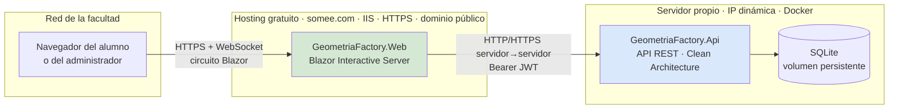
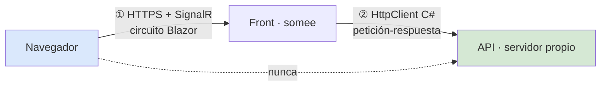
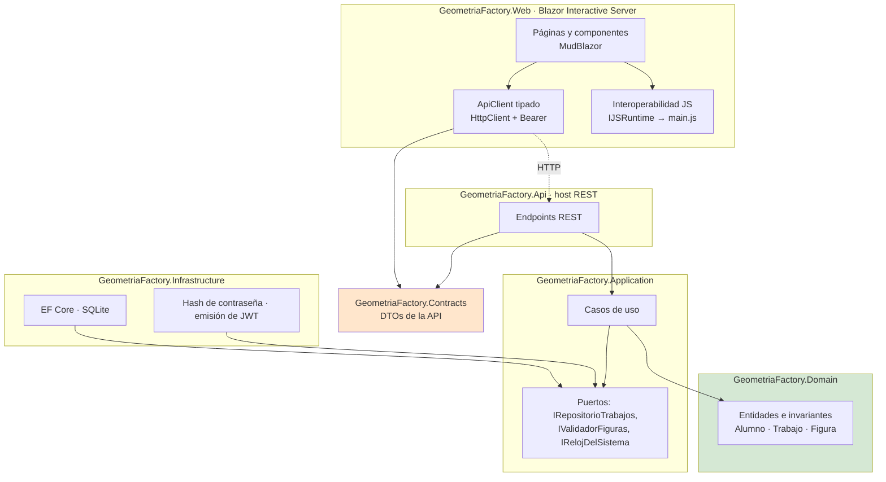
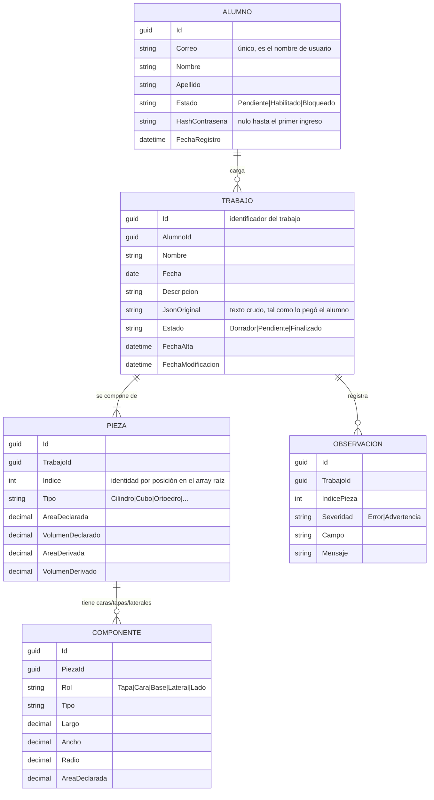
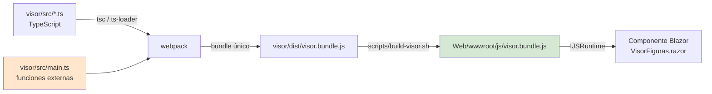
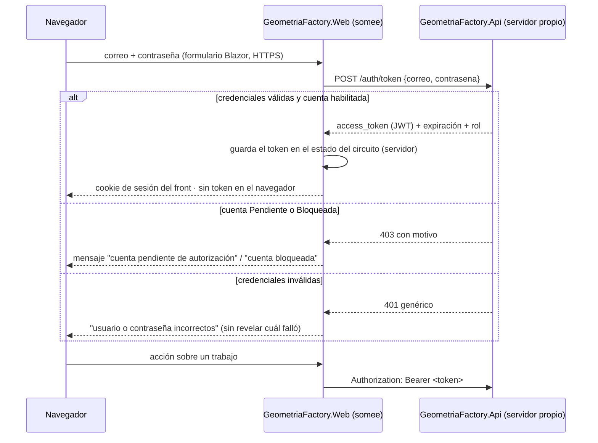

# Requerimientos Técnicos — Lab Geometría

Este documento hereda todos los requerimientos técnicos del análisis
[`/PROG2/Geometria/Lab-Geometria.Documentacion/Analisis/Analisis-Actividad-Documento-Integrador.md`](../../../../Analisis/Analisis-Actividad-Documento-Integrador.md)
y cierra sobre él las decisiones técnicas de la solución a construir en el repositorio destino
`/PROG2/Geometria/Lab-Geometria`.

> **Regla de veracidad aplicada.** Todo dato de estructura, nombre de clave, firma o comportamiento
> citado acá fue leído del código del workspace o del análisis integrado, y lleva su referencia.
> Lo que todavía no se puede verificar en este entorno —versiones exactas de paquetes, capacidades
> del hosting gratuito— **no se afirma**: se declara como **[A VERIFICAR]** y, cuando condiciona la
> arquitectura, se convierte en una **puerta técnica** de §12. Las decisiones que provienen de una
> definición del docente y no de una medición se rotulan **[DECISIÓN]**.

---

## Tabla de contenidos

1. [Datos de la solución](#1-datos-de-la-solución)
2. [Topología de despliegue y por qué es así](#2-topología-de-despliegue-y-por-qué-es-así)
3. [Plataforma y librerías](#3-plataforma-y-librerías)
4. [Arquitectura y estructura de la solución](#4-arquitectura-y-estructura-de-la-solución)
5. [Entorno de desarrollo · devcontainer](#5-entorno-de-desarrollo--devcontainer)
6. [Contrato de datos · el JSON de la Actividad 1](#6-contrato-de-datos--el-json-de-la-actividad-1)
7. [Modelo de dominio y de datos](#7-modelo-de-dominio-y-de-datos)
8. [El visor 3D dentro de Blazor · bundle JavaScript e interoperabilidad](#8-el-visor-3d-dentro-de-blazor--bundle-javascript-e-interoperabilidad)
9. [Autenticación y autorización](#9-autenticación-y-autorización)
10. [Persistencia](#10-persistencia)
11. [Pruebas](#11-pruebas)
12. [Puertas técnicas](#12-puertas-técnicas)
13. [Despliegue del backend · Docker y Compose desde Git](#13-despliegue-del-backend--docker-y-compose-desde-git)
14. [Despliegue del front · FTP a somee.com](#14-despliegue-del-front--ftp-a-someecom)
15. [Riesgos técnicos abiertos](#15-riesgos-técnicos-abiertos)
16. [Flujo de trabajo en GitHub](#16-flujo-de-trabajo-en-github)
17. [Glosario](#17-glosario)

---

## 1. Datos de la solución

| Dato | Valor |
|---|---|
| Nombre de la solución | **GeometriaFactory** |
| Repositorio destino | `/PROG2/Geometria/Lab-Geometria` (hoy contiene sólo `README.md` y `.gitignore` — análisis §2.1) |
| Repositorio de documentación | `/PROG2/Geometria/Lab-Geometria.Documentacion` |
| Repositorios de referencia (sólo lectura) | `tup_prog_2_2026_actividad1` (emisor del JSON) · `tools_json_figure_viewer` (visor 3D a reutilizar) |
| Cantidad de desarrolladores | 1 docente + agente IA |
| Tiempo de desarrollo | Sin plazo. El avance se mide por etapas cerradas (ver requerimientos funcionales). |
| Modo de trabajo | Etapas **en serie**. El punto de control de cada etapa es un cuello por diseño: no se abre la siguiente sin el OK del agente humano. |
| Naturaleza de la aplicación | **Básica** [DECISIÓN]: alta de trabajos con JSON de figuras, validación, previsualización 3D y administración de cuentas. No es un producto de producción. |

---

## 2. Topología de despliegue y por qué es así

### 2.1 La restricción que ordena todo

El servidor propio **no tiene IP estática**, y la red de la facultad bloquea el acceso a direcciones
dinámicas [DECISIÓN, contexto aportado por el docente]. A la vez, el hosting gratuito con dominio
público y HTTPS **resetea el estado persistente**. La topología es la respuesta a esas dos
restricciones combinadas:

- **El front vive donde no lo bloquean** (hosting público con HTTPS y dominio).
- **Los datos viven donde persisten** (servidor propio, en contenedor, con volumen).



### 2.2 Consecuencia técnica favorable, y no es menor

Con **Blazor Interactive Server**, el componente se ejecuta **en el servidor de somee**, no en el
navegador. Por lo tanto **la llamada a la API la hace el servidor del front, no el navegador del
alumno**. Eso tiene tres efectos verificables sobre las restricciones de arriba:

| Efecto | Detalle |
|---|---|
| **No hay bloqueo por contenido mixto** | Una página servida por HTTPS no puede invocar por `fetch` un endpoint HTTP: el navegador lo bloquea. Como acá la llamada sale del servidor, esa regla **no aplica**. Con Blazor WebAssembly sí aplicaría, y obligaría a poner HTTPS válido en el servidor de IP dinámica. |
| **No hace falta CORS** | El origen del navegador es siempre el dominio del front. La API no recibe peticiones del navegador. |
| **La IP dinámica queda oculta al cliente** | El alumno nunca ve ni resuelve la dirección del servidor propio: sólo la conoce el front, por configuración. |

> **Esta es la razón técnica por la que Interactive Server es la opción correcta acá**, y no una
> preferencia de estilo. Cualquier cambio a WebAssembly reabre las tres filas de la tabla.

**Regla RA-01 · Ningún JavaScript del navegador invoca la API.** Las tres filas de arriba no son una
propiedad del hosting: son consecuencia de que **todo el tráfico hacia la API salga de código C# del
servidor del front**. El día que un `fetch` del navegador apunte a la API, vuelven los tres
problemas a la vez. En consecuencia:

- El bundle del visor (§8) **no hace red**: recibe los datos ya resueltos por interoperabilidad.
- No se agregan bibliotecas JavaScript que consulten servicios por su cuenta.
- Si alguna vez hiciera falta que el navegador llame a la API, **no se la expone directamente**: se
  usa la pasarela de §2.4.

### 2.3 Dónde termina cada conexión

Es la distinción que evita el error de diagnóstico más probable de esta topología: **el circuito de
Blazor no llega al backend.** Son dos tramos independientes, con protocolos, extremos y modos de
falla distintos.

| Tramo | Protocolo | Extremos | Si falla |
|---|---|---|---|
| **Circuito Blazor** | HTTPS + SignalR (WebSocket, o repliegue) | Navegador ↔ **front en somee** | La página deja de responder y muestra el cartel de reconexión. **El backend no se entera y no interviene** |
| **Consumo de la API** | HTTP/HTTPS, petición-respuesta, `Bearer` | **Front en somee** ↔ backend domiciliario | La acción del usuario falla con estado degradado. El circuito sigue vivo |



**Consecuencias operativas:**

- El backend **no necesita soportar WebSockets** ni sesiones persistentes. Es una API REST sin estado.
- Una desconexión de circuito **no es un problema del backend**: no se lo diagnostica mirando sus
  registros. Se diagnostica en el hosting (PT-01).
- Al reconectarse un circuito, Blazor restablece el estado del servidor del front, **no vuelve a
  autenticar contra la API**: el token vive en el estado del circuito (§9.1).

### 2.4 Pasarela en el front · salida especificada, no implementada

**Es posible, y es simple:** el front es una aplicación ASP.NET Core, así que puede exponer una ruta
`/api/*` que reenvíe al backend (con una biblioteca de proxy inverso o con un manejador propio). El
navegador vería entonces **un único origen HTTPS**: el dominio de somee.

| Aspecto | Detalle |
|---|---|
| **Qué resuelve** | Habilita que JavaScript del navegador use la API sin romper RA-01, sin CORS y sin contenido mixto. Es el camino obligado si alguna vez se pasa a WebAssembly |
| **Qué cuesta** | Todo el tráfico atraviesa somee **dos veces**. En un plan gratuito, el ancho de banda y el tiempo de proceso son el recurso más escaso |
| **Qué NO resuelve** | **No cambia nada respecto de la salida de somee hacia el servidor propio.** Con pasarela o sin ella, el servidor del front debe poder abrir una conexión saliente hacia la IP y el puerto del backend. Ese es el riesgo R-05, y se mide igual en PT-01 |

> **Decisión: no se implementa en este alcance** [DECISIÓN]. Hoy nada del navegador toca la API
> (RA-01), de modo que la pasarela sólo agregaría consumo sobre el recurso más escaso. Queda
> **especificada** para adoptarla sin rediseño el día que aparezca una necesidad concreta: descarga
> de archivos, carga directa desde el navegador o migración a WebAssembly.

### 2.5 Cómo se rompe este modelo sin querer

El navegador nunca alcanza el backend **por construcción**, no por configuración: el circuito de
Blazor termina en somee (§2.3) y ningún JavaScript llama a la API (RA-01). No hay nada que bloquear
desde la facultad, porque el cliente sólo habla con un servidor.

Eso deja **una sola forma real de romperlo**: que una URL del backend se filtre hasta el navegador.
Ocurre por descuido, no por decisión, y siempre por una de estas cuatro vías:

| Vía de filtración | Ejemplo concreto en esta aplicación | Qué pasa |
|---|---|---|
| **Enlace de descarga directo** | Un botón "Exportar JSON" que apunte a `http://<ip-casa>:puerto/trabajos/{id}/json` | El alumno en la facultad hace clic y no descarga nada. Además, contenido mixto |
| **Recurso incrustado** | Un `` o una hoja de estilo servida por la API | El recurso no carga; la página queda a medias sin error claro |
| **Redirección** | El front responde `302` hacia una URL de la API | El navegador sigue la redirección y falla |
| **Mensaje de error** | Una excepción sin manejar que muestra la dirección del servicio que falló | Se filtra la dirección del servidor propio a cualquiera que provoque el error |

> **Regla RA-03 · Todo lo que el navegador deba obtener del backend pasa por el front.** Descargas,
> archivos, imágenes y redirecciones se sirven desde el dominio del front, que a su vez los pide a
> la API con `HttpClient`. Los mensajes de error mostrados al usuario **nunca** incluyen direcciones
> de servicios internos: se registran del lado del servidor y se muestra un texto neutro.
>
> Si esa necesidad deja de ser ocasional y se vuelve frecuente, **es el momento de adoptar la
> pasarela de §2.4**, que está especificada exactamente para este caso.

### 2.6 Dirección del backend

| Aspecto | Definición |
|---|---|
| Configuración | El front toma la dirección base de la API de configuración (`ApiBaseUrl`), **nunca embebida en el código**. |
| IP dinámica | Se admite IP directa [DECISIÓN: "la IP dinámica realmente no cambia tanto"]. **Recomendación:** apuntar a un nombre DDNS para que un cambio de IP no exija redesplegar el front por FTP; con IP directa, cada cambio obliga a un redespliegue. |
| Puerto | Publicado por el contenedor y abierto en el router hacia el servidor propio. |
| Tiempos de espera | El front debe tolerar que la API no responda y mostrar un estado degradado explícito, no una excepción sin manejar: el enlace atraviesa internet y una conexión doméstica. |

---

## 3. Plataforma y librerías

| Componente | Decisión | Estado |
|---|---|---|
| Plataforma | **.NET 10** | [DECISIÓN]. Coherente con la actividad, que ya usa `net10.0-windows` (`Ejemplo1.JerarquiaDeObjetos.csproj`, `Ejemplo2.JerarquíaClases.csproj`) |
| Front | **Blazor** con páginas **Interactive Server** | [DECISIÓN] · fundamento en §2.2 · condicionada por **PT-01** |
| Componentes de interfaz | **MudBlazor** | [DECISIÓN]. **La versión exacta se ancla al crear el andamiaje y se registra en este documento en ese momento.** No se fija acá: en este entorno no se puede verificar contra el registro de paquetes **[A VERIFICAR]** |
| Backend | **API REST** en proceso separado, Clean Architecture | [DECISIÓN] |
| Acceso a datos | **Entity Framework Core** con proveedor SQLite; migraciones aplicadas al arrancar | [DECISIÓN] |
| Base de datos | **SQLite**, archivo único en volumen | [DECISIÓN] · ver §10 |
| Autenticación | **ROPC** con **JWT Bearer** | [DECISIÓN] · ver §9 |
| Visor 3D | **Three.js**, heredado de `tools_json_figure_viewer` (hoy **r128** por CDN, `index.html:230`) | Ver §8 y **PT-03** |
| Empaquetado del visor | **Node.js + webpack**, fuente **TypeScript** transpilada | [DECISIÓN] · ver §8 |

**Regla de anclaje de versiones.** Toda versión de paquete se fija explícitamente en el `.csproj` o
`package.json` y se anota en la tabla de arriba en la etapa que la introduce. Un cambio de versión
mayor es una decisión que se documenta, nunca el efecto colateral de una actualización.

---

## 4. Arquitectura y estructura de la solución

### 4.1 Patrón

**Clean Architecture** en el backend, con la regla de dependencias apuntando siempre hacia adentro:
`Api → Infrastructure → Application → Domain`, y `Domain` sin dependencias.

**Dos procesos desplegables** [DECISIÓN], porque van a servidores distintos (§2):

| Proceso | Artefacto | Destino |
|---|---|---|
| `GeometriaFactory.Api` | Imagen Docker | Servidor propio |
| `GeometriaFactory.Web` | Publicación de ASP.NET Core subida por FTP | somee.com |



### 4.2 Estructura de carpetas del repositorio destino

```
Lab-Geometria/
├── GeometriaFactory.sln
├── src/
│   ├── GeometriaFactory.Domain/          entidades, invariantes; sin dependencias
│   ├── GeometriaFactory.Application/     casos de uso y puertos
│   ├── GeometriaFactory.Infrastructure/  EF Core + SQLite, seguridad, validador de figuras
│   ├── GeometriaFactory.Contracts/       DTOs de la API; referenciado por Api y por Web
│   ├── GeometriaFactory.Api/             host REST, autenticación, migraciones al arrancar
│   └── GeometriaFactory.Web/             Blazor Interactive Server + MudBlazor
│       └── wwwroot/js/                destino del bundle generado (no se edita a mano)
├── visor/                             proyecto Node.js del visor (TypeScript + webpack)
│   ├── package.json
│   ├── webpack.config.js
│   ├── src/
│   │   ├── main.ts                    funciones externas expuestas a Blazor
│   │   └── visor/                     port del visor de tools_json_figure_viewer
│   └── dist/                          bundle → se copia a Web/wwwroot/js/
├── tests/
│   ├── GeometriaFactory.Domain.Tests/
│   ├── GeometriaFactory.Application.Tests/
│   └── GeometriaFactory.Integration.Tests/
├── deploy/
│   ├── Dockerfile                     backend, multietapa (§13)
│   └── compose.yaml                   despliegue desde Git en destino (§13)
├── .devcontainer/devcontainer.json
├── .github/workflows/deploy-front-ftp.yml   (§14)
├── scripts/
└── changelog.md
```

**Regla de aislamiento del visor** — el código JavaScript del visor se consume **exclusivamente** a
través de `main.js` (§8). Ningún componente Blazor invoca funciones internas del bundle ni manipula
el `canvas` por su cuenta. Es lo que permite reemplazar el motor 3D sin tocar las páginas.

---

## 5. Entorno de desarrollo · devcontainer

### 5.1 Restricción de partida

**El host Linux de desarrollo no tiene instalado el SDK de .NET, y no se va a instalar** [DECISIÓN].
Todo el ciclo —compilar, ejecutar, migrar, depurar, probar, empaquetar el bundle— ocurre dentro de
un **Dev Container** (especificación `containers.dev`).

> **Único requisito del host: Docker.** El host aporta el motor de contenedores y el editor.
> Ningún comando de un guion de demostración puede asumir `dotnet` disponible en el host.

### 5.2 Reglas del entorno

**R1 · El SDK vive dentro del contenedor, y ahí es "local".** Dentro del devcontainer `dotnet` está
en el `PATH` como en cualquier máquina con el SDK instalado. No hay nada que compensar.

**R2 · Los scripts son agnósticos del entorno.** Los scripts de `scripts/` asumen `dotnet` y `npm`
en el `PATH` y nada más.
> **No** existe un conjunto de scripts duplicado por entorno, ni una "versión devcontainer" de
> `build` o `run`. Que la premisa del `PATH` sólo se cumpla dentro del devcontainer es contexto de
> ejecución, no algo que el script deba saber.

**R3 · La orquestación del entorno es declarativa.** Se define en `.devcontainer/devcontainer.json`
—más `Dockerfile` o `compose` si hacen falta— y se levanta con "Reopen in Container" o
`devcontainer up`.
> **No** usar scripts con `docker run` a mano para levantar el entorno.

**R4 · La depuración no pasa por los scripts.** Se resuelve con `.vscode/launch.json` (`coreclr`) y
F5.
> Los scripts **sólo compilan, empaquetan y ejecutan**. Sin modos ni banderas de depuración.

**R5 · La imagen de desarrollo no es la de producción.** La del devcontainer lleva SDK, Node y
depurador; la de producción es sólo entorno de ejecución y la construye el `Dockerfile` de §13.
> El devcontainer **no** define, ni deriva, ni condiciona la imagen de producción.

**R6 · El bundle del visor es un artefacto generado.** `Web/wwwroot/js/visor.bundle.js` se produce
desde `visor/` y **no se edita a mano**. Si se versiona, se versiona como salida reproducible; si se
ignora, `scripts/build.sh` debe generarlo antes de publicar.

### 5.3 Composición del devcontainer

| Elemento | Definición |
|---|---|
| Imagen base | Imagen oficial de devcontainer con el **SDK de .NET 10** (`mcr.microsoft.com/devcontainers/dotnet`). El tag exacto se ancla en `devcontainer.json` al crearlo. |
| Node.js | Característica `node` del devcontainer, necesaria para `visor/` (§8). Versión LTS anclada. |
| Depurador | `coreclr`, con `.vscode/launch.json` versionado (R4). |
| Herramientas | `dotnet-ef` como herramienta **local** del repositorio, para que la versión quede versionada junto al código. |
| Puertos | Se reenvían al host los puertos del front y de la API, para abrirlos desde el navegador del host. |
| Protocolo en desarrollo | **HTTP**, sin certificado de desarrollo: evita la fricción del certificado de confianza dentro del contenedor. HTTPS es asunto del despliegue. |
| Usuario | No `root`. |

### 5.4 Scripts del repositorio

Shell (`.sh`), en `scripts/`, un único conjunto sin variantes por entorno: el host es Linux, el
devcontainer es Linux y el servidor de backend es Linux.

| Script | Función |
|---|---|
| `scripts/build.sh` | Instala dependencias de `visor/`, genera el bundle, restaura y compila la solución. Termina en 0 y sin advertencias. |
| `scripts/run-api.sh` | Ejecuta la API y anuncia su URL. |
| `scripts/run-web.sh` | Ejecuta el front apuntando a la API local y anuncia su URL. Punto de partida de todo guion de demostración. |
| `scripts/build-visor.sh` | Sólo el bundle de `visor/` (ciclo corto de trabajo sobre el visor). |
| `scripts/migrate.sh` | Genera y aplica migraciones de EF Core. |
| `scripts/test.sh` | Ejecuta la batería de pruebas completa. |
| `scripts/reset-db.sh` | Elimina la base local para reproducir el estado de primer arranque. |

> El front y la API son dos procesos: un guion de demostración típico levanta primero
> `run-api.sh` y después `run-web.sh`. Si se agrega un script combinado, no reemplaza a los dos
> individuales.

---

## 6. Contrato de datos · el JSON de la Actividad 1

Esta sección es **la más restrictiva del documento**: el formato de entrada **no es negociable**.
Todo lo que sigue está verificado contra el código de `tup_prog_2_2026_actividad1` y contra las
secciones 8 y 10 del análisis integrado.

### 6.1 Premisa fija

> **El JSON lo produce el alumno con `Describir()` y su formato es el que está** (análisis §12.1).
> El servicio **se adapta al dato**, nunca al revés. El backend valida y reconstruye; no le pide al
> alumno que cambie una coma.

### 6.2 Reglas generales verificadas

| Regla | Valor | Evidencia |
|---|---|---|
| Raíz | Array de figuras (o figura única) | análisis §8.1 |
| Discriminante | `"Tipo"`, string PascalCase, sensible a mayúsculas | `js/visor.js` — `switch (data.Tipo)` |
| Formato numérico | Punto decimal, **exactamente 2 decimales**, `InvariantCulture` | `Ortoedro.cs` → `ToString("f2", culture)` |
| Campos calculados | `"Area"` siempre; `"Volumen"` sólo en volúmenes | análisis §8.2 |
| Anidamiento | 2 niveles: figura volumétrica → figuras planas componentes | análisis §8.1 |
| Identidad, unidades, versión de esquema | **No existen en el dato** | análisis §8.1 |
| Comas finales | **Presentes** en la salida real del programa | `Ejemplo2/Models/Ortoedro.cs` (`{ lateralesDescripcion },`) · `Ejemplo2/FormPrincipal.cs` |

### 6.3 Las cuatro trampas del formato, y cómo las resuelve el backend

Son defectos ya identificados en el análisis. **El validador debe nacer sabiéndolos**; si no, la
etapa de importación falla contra el dato real de los alumnos.

| # | Hecho verificado | Evidencia | Qué hace el backend |
|---|---|---|---|
| **T1** | El `Ortoedro` emite la clave **`"Tapas"`**, no `"Bases"` | `Ejemplo1/Models/Ortoedro.cs:55` · `Ejemplo2/Models/Ortoedro.cs:55` · el visor exige `Bases` en `js/visor.js:852` | Acepta **`Bases` o `Tapas`** como sinónimos en el ortoedro. Es la línea que desbloquea el renderizado de todos los ortoedros (análisis §12.2.1) |
| **T2** | El texto **no es JSON estrictamente válido**: hay comas finales | análisis §10.1 D2 | Parsea con `AllowTrailingCommas` y omisión de comentarios. La tolerancia es **por diseño**, igual que en `cleanJSON()` del visor |
| **T3** | Las caras del cubo llevan `Tipo` distinto según el ejemplo: `Cuadrado` en Ejemplo1, `Rectangulo` en Ejemplo2 | análisis §10.4 D16 | Acepta ambos. Ambos traen `Largo`, que es lo que se usa |
| **T4** | Hay valores calculados **erróneos** en el dato del alumno: área del cubo `4·l²` y volumen del ortoedro que ignora el largo | análisis §10.2 D3, D4 | **No rechaza el trabajo.** Recalcula desde las dimensiones y registra la discrepancia como **advertencia**. Ver §6.5 |

### 6.4 Ejemplo práctico completo — un trabajo válido mínimo

Texto tal como sale del `TextBox` de Ejemplo2 para `Ortoedro(7, 7, 21)` (reconstrucción determinista
del análisis §14, comas finales incluidas):

```text
[
{
  "Tipo": "Ortoedro",
  "Tapas":
  [
    { "Tipo": "Rectangulo", "Largo": 7.00, "Ancho": 7.00, "Area": 49.00 },
    { "Tipo": "Rectangulo", "Largo": 7.00, "Ancho": 7.00, "Area": 49.00 }
  ],
  "Laterales":
    [
      { "Tipo": "Rectangulo", "Largo": 21.00, "Ancho": 7.00, "Area": 147.00 },
      { "Tipo": "Rectangulo", "Largo": 21.00, "Ancho": 7.00, "Area": 147.00 },
      { "Tipo": "Rectangulo", "Largo": 21.00, "Ancho": 7.00, "Area": 147.00 },
      { "Tipo": "Rectangulo", "Largo": 21.00, "Ancho": 7.00, "Area": 147.00 },
    ],
  "Area": 686.00,
  "Volumen": 343.00
},
]
```

Qué tiene que pasar con ese texto, paso a paso:

| Paso | Resultado esperado | Por qué |
|---|---|---|
| 1. Parseo | **Éxito**, pese a las dos comas finales | T2 |
| 2. Reconocimiento del tipo | `Ortoedro` | `Tipo` |
| 3. Lectura de las bases | Éxito leyendo la clave `Tapas` | T1 — con un validador ingenuo, acá falla |
| 4. Verificación de `Area` | `2·49 + 4·147 = 686.00` = declarado → **sin observación** | análisis §9.2 |
| 5. Verificación de `Volumen` | Derivado `7·7·21 = 1029.00` ≠ declarado `343.00` → **advertencia**, no error | T4 / D4 |
| 6. Guardado | El trabajo se guarda **con** la advertencia asociada | §6.5 |

**Contraejemplo — qué sí es un error de importación:** un texto sin `Tipo` en algún elemento, un
`Tipo` desconocido, un array raíz vacío, o un texto que no parsea ni con tolerancia. En esos casos
el mensaje debe indicar **índice del elemento y campo**, nunca un mensaje genérico (el visor actual
usa un `alert()` sin ubicación — análisis §10.4 D12; el backend no repite ese error).

### 6.5 Verificación de `Area` y `Volumen` — dos niveles

| Nivel | Significado | Efecto |
|---|---|---|
| **Error** | El JSON no se puede interpretar como un conjunto de figuras | El trabajo **no se guarda como finalizado**. Sí puede guardarse como borrador con el texto crudo |
| **Advertencia** | El JSON se interpreta bien, pero un valor declarado no coincide con el derivado de las dimensiones | El trabajo se guarda; la discrepancia queda registrada y visible para el alumno y para el administrador |

> **Esto no es una funcionalidad accesoria: es el mayor valor didáctico del servicio.** Con el JSON
> tal como está, sin cambiarle nada, la verificación detecta exactamente los defectos D3 y D4 del
> análisis (§12.2.2). El alumno ve, sobre su propio trabajo, que su cubo declara 36.00 donde la
> geometría dice 54.00.

Tolerancia de comparación: los valores llegan redondeados a 2 decimales por el emisor (análisis
§9.3), de modo que la comparación se hace con tolerancia absoluta de **0.01**, nunca por igualdad
exacta de punto flotante.

---

## 7. Modelo de dominio y de datos

### 7.1 Entidades

La reconstrucción del dominio **sí puede ajustarse a un modelo realista** [DECISIÓN del docente]: el
formato de entrada es fijo, la representación interna no.



### 7.2 Decisiones de modelado y su fundamento

| Decisión | Fundamento verificable |
|---|---|
| **Se conserva `JsonOriginal` íntegro** | Es el trabajo del alumno y la única fuente fiel. Permite reprocesar si el validador mejora, y es lo que se le devuelve al visor |
| **La identidad de la pieza es su índice en el array** | El JSON no trae `Id` (análisis §8.1). El índice es estable mientras el alumno no reordene y alcanza para selección y resaltado (§12.2.2) |
| **Se guardan por separado declarado y derivado** | Es lo que hace posible §6.5 sin recalcular en cada consulta |
| **La familia (plana / volumétrica) no se persiste** | Se deriva de `Tipo` por tabla de consulta: `Circulo`, `Cuadrado`, `Rectangulo`, `RectanguloDesarrollado` son planas; `Cilindro`, `Cubo`, `Ortoedro` volumétricas (análisis §12.2.2) |
| **La redundancia del JSON no se replica tal cual** | Un `Cubo(3)` serializa 6 caras idénticas para expresar un solo número (análisis §9.4). Se persisten los componentes porque son parte del ejercicio, pero las consultas de listado nunca los cargan |

### 7.3 Invariantes del dominio

| Id | Invariante |
|---|---|
| **INV-01** | El correo del alumno es único en todo el sistema. |
| **INV-02** | Un alumno sólo accede a sus propios trabajos. No existe consulta que devuelva trabajos de otro alumno a un rol de alumno. |
| **INV-03** | Un trabajo sólo se elimina si está en estado `Borrador` y pertenece al alumno que lo elimina. |
| **INV-04** | Un trabajo `Finalizado` tiene JSON interpretado sin errores (puede tener advertencias). |
| **INV-05** | Existe **exactamente un** administrador configurado; su alta sólo es posible mientras no exista ninguno. |
| **INV-06** | Un alumno en estado `Pendiente` o `Bloqueado` no obtiene token. |

---

## 8. El visor 3D dentro de Blazor · bundle JavaScript e interoperabilidad

### 8.1 Qué se reutiliza y qué no

`tools_json_figure_viewer` se **reutiliza embebido** en las páginas Blazor [DECISIÓN]. El análisis
documenta con precisión qué parte de ese código sirve y qué parte no:

| Del visor actual | Decisión | Evidencia |
|---|---|---|
| `create3DObject` y las funciones `create*` (mapeo `Tipo` → malla) | **Se porta**, con la tabla de adaptadores de §6.3 | análisis §7.6 |
| Árbol JSON colapsable (`createJSONTree`) | **Se porta**. Es "el mejor recurso didáctico del visor" | análisis §7.8 · §11.1 |
| Escena, luces, cámara orbital | **Se porta** | análisis §7.7 |
| `cleanJSON()` | **No viaja al front**: la validación es del backend (§6). En el front sólo queda la tolerancia de parseo para previsualizar un borrador | análisis §7.4 |
| Las 5 variantes comentadas de `processObjectArray` y las 2 de `getRandomPosition` | **No se portan**: 527 de 1101 líneas (48 %) de código inactivo | análisis §10.3 D8 |
| `updateCylinder()` y los manejadores `toggleWireframe` / `centerObjects` | **No se portan**: referencian elementos inexistentes y funciones no definidas | análisis §10.3 D6, D7 |
| Layout con `sort(() => Math.random() - 0.5)` | **Se reemplaza** por posición derivada del índice | análisis §10.4 D10 · §12.5 |
| jQuery, Popper, Bootstrap JS | **No se portan**: cargados sin uso | análisis §10.3 D9 |

> Portar el archivo tal cual sería arrastrar el 48 % de código muerto y dos controles inoperantes a
> una solución nueva. **Se porta lo que el análisis verificó que funciona.**

### 8.2 Proyecto Node.js y cadena de construcción



| Aspecto | Definición |
|---|---|
| Lenguaje fuente | **TypeScript**, transpilado por webpack |
| Salida | **Un único bundle**, expuesto como biblioteca en `window` con un nombre propio (sin globales sueltas) |
| Three.js | Entra como **dependencia de `package.json`**, no por CDN. Termina dentro del bundle: el front debe funcionar sin acceso a CDN externos |
| Dónde se ejecuta | `npm` corre **dentro del devcontainer** (R2) |
| Versionado del artefacto | R6 de §5.2 |

### 8.3 El bundle es un visualizador puro

Regla de diseño central del visor, y la que fija su lugar en la arquitectura:

> **RA-02 · El bundle no conoce el sistema.** No tiene configuración, no sabe qué es un trabajo, un
> alumno ni una sesión, no lee direcciones de servicios y **no hace ninguna llamada de red**. Recibe
> objetos genéricos por interoperabilidad y dibuja. Nada más.

| El bundle **recibe** | El bundle **nunca** |
|---|---|
| El texto o la estructura del JSON de figuras, ya obtenida por el front | Consulta la API ni ningún otro servicio |
| Opciones de presentación (colores, unidad, escala) como argumento | Lee configuración propia, variables de entorno o `appsettings` |
| Un índice de pieza para resaltar | Guarda estado entre páginas ni escribe en almacenamiento del navegador |
| El elemento `canvas` sobre el que dibujar | Sabe quién es el usuario ni qué rol tiene |

Tres consecuencias que justifican la regla:

1. **Sostiene RA-01** (§2.2). Si el bundle no hace red, es imposible que aparezca un `fetch` del
   navegador hacia la API, y los tres problemas de contenido mixto, CORS y exposición de la IP no
   pueden volver por la puerta de atrás.
2. **Se prueba sin backend.** Se abre una página con **la estructura de piezas puesta a mano** y se
   verifica el dibujo. La propiedad de probar sin backend —y sin instalar nada— **no se pierde**; lo
   que cambia es **qué se pega**: ya no el texto del alumno, porque interpretarlo es del laboratorio
   [DECISIÓN 2026-08-16, `ADR-08006`]. Hoy `tools_json_figure_viewer` come el texto crudo, y ese
   tramo es el que pasa al backend: **lo que se conserva es poder ver el dibujo sin levantar nada**,
   no la vía por la que el dato llega.
3. **Es reemplazable.** Cambiar el motor 3D no toca ninguna página Blazor, porque el contrato es el
   de §8.4 y no incluye ninguna noción del dominio.

**Dónde vive entonces cada responsabilidad:**

| Responsabilidad | Dónde |
|---|---|
| Obtener el trabajo y su JSON | Front, en C#, contra la API |
| **Validar** el JSON y verificar `Area` / `Volumen` | **Backend** (§6). El bundle **no valida** |
| Interpretar el JSON para dibujar | **Backend** (§6) [DECISIÓN 2026-08-16, `ADR-08006`]. El bundle recibe **las piezas ya reconstruidas** y no aplica ninguna tolerancia de claves: la de §6.3 vive en un solo lugar, y ese lugar es el validador |
| Decidir qué puede ver el usuario | Front y backend, nunca el bundle |

> Que el bundle tolere las mismas claves que el backend (T1, T3) **no es duplicar la validación**:
> el backend decide si el trabajo es válido, el bundle sólo necesita saber de dónde sacar una
> dimensión para dibujar. Uno emite observaciones; el otro, mallas.

### 8.4 Las tres capas de la interoperabilidad

Esta separación es obligatoria y es el motivo por el que existe `main.ts`:

| Capa | Archivo | Responsabilidad | Qué **no** hace |
|---|---|---|---|
| **1. Componente Blazor** | `VisorFiguras.razor` | Ciclo de vida, referencia al elemento `canvas`, invocaciones `IJSRuntime` | No conoce Three.js ni nombres internos del bundle |
| **2. Fachada externa** | `main.ts` → `visor.bundle.js` | Funciones planas invocables desde Blazor. Traduce entre el mundo de Blazor y el servicio del visor | No contiene lógica de dibujo |
| **3. Servicio del visor** | clase del bundle | Escena, mallas, árbol, layout. API orientada a objetos | No conoce Blazor |

Contrato de la fachada (nombres definitivos se fijan en la etapa que la implementa):

| Función expuesta | Propósito |
|---|---|
| `inicializar(elemento, opciones)` | Crea la escena sobre el `canvas` y devuelve un identificador de instancia |
| `cargarJson(id, texto)` | Procesa el JSON y dibuja; devuelve el resultado de la interpretación |
| `seleccionarPieza(id, indice)` | Resalta la pieza del índice indicado (sincroniza árbol ⇄ escena) |
| `redimensionar(id)` | Recalcula la relación de aspecto |
| `destruir(id)` | Libera geometrías, materiales y el contexto WebGL |

**Regla de ciclo de vida, no opcional bajo Interactive Server.** Cada circuito Blazor es una sesión
viva en el servidor del front; el `canvas` y el contexto WebGL viven en el navegador. `destruir`
**debe** invocarse en `DisposeAsync` del componente. Sin eso, navegar entre trabajos acumula
contextos WebGL en el navegador hasta que el navegador empieza a descartar los más antiguos.

**Regla de rendimiento.** El JSON viaja del servidor al navegador **una sola vez por trabajo**, en
la invocación de `cargarJson`. Ni el árbol ni la escena se re-renderizan desde el servidor: eso
convertiría cada interacción 3D en tráfico de circuito. Es el mismo principio que la "regla de oro"
de cualquier lienzo interactivo bajo Interactive Server: durante el gesto no se notifica al
servidor.

---

## 9. Autenticación y autorización

### 9.1 Flujo

**ROPC (Resource Owner Password Credentials) con JWT Bearer** [DECISIÓN explícita del docente].



**Consecuencia de la topología:** como el front es Interactive Server, **el token nunca llega al
navegador** (§2.2). Vive en el estado del circuito, del lado del servidor del front. El navegador
sólo maneja la cookie de sesión del front.

### 9.2 Definiciones

| Aspecto | Definición |
|---|---|
| Endpoint de token | `POST /auth/token` con correo y contraseña |
| Formato | JWT firmado con clave simétrica de la instancia (HS256) |
| Reclamos | Identificador de usuario, correo, **rol** (`Alumno` / `Administrador`), expiración |
| Vigencia | Corta. Renovación por reingreso; **sin token de refresco** en este alcance |
| Sesión del front | Cookie `HttpOnly`, `Secure`, `SameSite=Strict` |
| Contraseñas | Almacenadas con **función de derivación de clave** (PBKDF2/Argon2), nunca en claro ni con resumen simple |
| Clave de firma | Generada o provista en el primer arranque. **Fuera del repositorio y fuera de la imagen**: variable de entorno o archivo montado |
| Autorización | Por rol en cada endpoint, **más** verificación de pertenencia (INV-02, INV-03). El rol no alcanza: un alumno autenticado no debe poder leer el trabajo de otro cambiando el identificador en la petición |

### 9.3 Nota de seguridad, dicha sin rodeos

ROPC es un flujo **desaconsejado por OAuth 2.1** porque obliga a la aplicación intermedia a manejar
la contraseña del usuario en claro. Acá es aceptable porque: el intermediario es el propio front del
mismo sistema, el tránsito navegador→front es HTTPS, y el alcance es un laboratorio de aula
[DECISIÓN reafirmada del docente]. Queda registrado como decisión consciente, no como omisión.

**Dónde queda expuesta la contraseña, y dónde no.** Conviene decirlo con precisión, porque los dos
tramos de §2.3 tienen respuestas distintas:

| Tramo | Estado |
|---|---|
| Navegador → front | **Protegido**: HTTPS del dominio de somee. Ni la red de la facultad ni la del alumno ven las credenciales |
| Front → API | **En claro**, si ese salto va por HTTP plano. La negociación es servidor a servidor en C#, de modo que no la ve nadie del lado del cliente, pero **sí quien tenga acceso al camino entre el hosting y la conexión domiciliaria** |

**Decisión: el riesgo del segundo tramo se acepta por escrito** [DECISIÓN], dado que el alcance es un
laboratorio de aula y que las credenciales son de cuentas creadas para la materia. La salida
documentada, si alguna vez se quiere cerrar, es el túnel saliente de §15.1. Queda registrado como
riesgo **R-02** con dueño y salida, no como omisión.

---

## 10. Persistencia

| Aspecto | Definición |
|---|---|
| Motor | SQLite, archivo único, en el **backend** exclusivamente. El front **no tiene base de datos** |
| Ubicación | Configurable. En producción, en un **volumen persistente**, nunca dentro de la imagen. Es justamente lo que el hosting gratuito no puede garantizar y por lo que los datos viven en el servidor propio (§2.1) |
| Modo de diario | **WAL** |
| Concurrencia de escritura | **Escritor único**: SQLite no admite escrituras concurrentes |
| Alcance del `DbContext` | Uno por operación |
| Migraciones | Se aplican automáticamente al arrancar sobre base inexistente o desactualizada |
| Almacenamiento del JSON | Como texto en la fila del trabajo (§7.2). No se usa `json1` ni consultas sobre el contenido |
| Respaldo | Copia del archivo con WAL activo, consistente. Frecuencia a definir por el docente |

---

## 11. Pruebas

La regla de no-regresión de los requerimientos funcionales hace que verificar manualmente cada guion
cueste más en cada etapa. Se contiene con automatización desde la primera.

| Nivel | Proyecto | Qué cubre |
|---|---|---|
| Unitarias de dominio | `GeometriaFactory.Domain.Tests` | Invariantes §7.3 y transiciones de estado de trabajo y de cuenta |
| Unitarias de aplicación | `GeometriaFactory.Application.Tests` | Casos de uso con repositorios simulados; autorización por pertenencia (INV-02, INV-03) |
| Integración | `GeometriaFactory.Integration.Tests` | Persistencia real contra SQLite y **API real** por HTTP con `WebApplicationFactory` |

**Batería obligatoria del validador de figuras** (§6), con casos tomados del análisis:

| Caso de prueba | Entrada | Resultado esperado |
|---|---|---|
| Ortoedro con clave `Tapas` | Salida real de `Ortoedro.cs:55` | Interpretado correctamente (T1) |
| Texto con comas finales | Salida real de `FormPrincipal.cs` | Parseo exitoso (T2) |
| Cubo de Ejemplo1 (caras `Cuadrado`) | análisis §14.1 | Interpretado (T3) |
| Cubo de Ejemplo2 (caras `Rectangulo`) | análisis §5.5 | Interpretado (T3) |
| Área de `Cubo(3)` de Ejemplo1 | `"Area": 36.00` | **Advertencia**: derivado 54.00 (D3) |
| Volumen de `Ortoedro(7,7,21)` | `"Volumen": 343.00` | **Advertencia**: derivado 1029.00 (D4) |
| Dimensión en `0` | `"Largo": 0.00` | **No** descarta la figura: se compara por existencia, no por veracidad (D13) |
| `Tipo` desconocido | `"Tipo": "Piramide"` | **Error** con índice y campo |
| JSON semilla del visor completo | análisis §14.1 | 3 figuras, 2 advertencias |

**Criterio de cierre de etapa:** una etapa no está terminada sin pruebas automatizadas de las reglas
de negocio que introdujo. Los guiones de demostración siguen siendo manuales.

---

## 12. Puertas técnicas

Verificaciones **medidas** que condicionan decisiones de arquitectura. Una puerta que no pasa
**detiene la planificación de las etapas que dependen de ella**; no se arrastra como deuda.

### PT-01 · El hosting gratuito soporta el front — **la puerta crítica**

**Debe ejecutarse en la etapa `a`, antes que cualquier otra cosa.** Mide **cuatro cosas
independientes** contra el plan gratuito de somee.com; ninguna está verificada en este entorno
**[A VERIFICAR]**. Se miden por separado porque **fallan por separado y sus salidas son distintas**.

#### PT-01.a · Entorno de ejecución

| Criterio | Umbral | Si no pasa |
|---|---|---|
| El front publicado arranca y sirve la página inicial | Respuesta 200 en la URL pública | Bajar la versión objetivo **del front** hasta la que el hosting soporte. El backend conserva .NET 10: son dos artefactos independientes |

#### PT-01.b · Transporte del circuito — **semáforo de tres estados, no pasa/no pasa**

El circuito de Blazor va sobre SignalR, que **negocia el transporte**: WebSockets y, si no están
disponibles, repliegue a *long polling*. El circuito funciona en ambos casos; lo que cambia es la
latencia. Por eso el resultado de esta medición no es binario:

| Resultado | Veredicto | Consecuencia |
|---|---|---|
| 🟢 **WebSockets** | Ideal | Sin acción |
| 🟡 **Repliegue a long polling** | **Aceptable** | Se documenta la degradación y se mide la latencia percibida al tipear en un formulario. La interacción 3D no se ve afectada: ocurre entera en el navegador (RA-02) |
| 🔴 **No se establece circuito** | No pasa | Se aplican las salidas de PT-01.d |

> **Este tramo es navegador ↔ front (§2.3).** El backend no participa: no necesita WebSockets ni
> sesiones persistentes. Una falla acá **no se diagnostica en el servidor domiciliario**.

#### PT-01.c · Estabilidad del proceso — **el criterio que más duele si falla**

| Criterio | Umbral | Si no pasa |
|---|---|---|
| El proceso no se recicla durante el uso | 20 minutos de navegación continua sin corte de circuito | Es el peor escenario, porque no tiene mitigación en el código: el usuario pierde el estado de la pantalla cada pocos minutos. Se aplican las salidas de PT-01.d |
| La reconexión funciona | Al cortar y restablecer la red del navegador, el circuito se recupera y la página vuelve a responder | Manejo explícito del cartel de reconexión en la interfaz |

#### PT-01.d · Salida hacia el backend

| Criterio | Umbral |
|---|---|
| Desde el front desplegado se obtiene respuesta de la API del servidor propio | Una llamada de salud devuelve datos reales |
| El puerto del backend no está bloqueado en la salida | Ver R-05. **La pasarela de §2.4 no ayuda acá**: con pasarela o sin ella, la conexión saliente es la misma |
| Despliegue por FTP | La publicación sube y la aplicación reinicia sin intervención manual |

**Salidas si PT-01.b o PT-01.c dan rojo**, en orden de preferencia:

1. **Blazor WebAssembly** servido como estático. **Costo:** reabre las tres filas de §2.2 —contenido
   mixto, CORS y exposición de la IP—, obliga a HTTPS válido en el servidor propio y **vuelve
   obligatoria la pasarela de §2.4**. A favor: el visor no sufre, porque ya es un visualizador puro
   que corre en el navegador (RA-02), y el bundle no cambia una línea.
2. **Servir el front desde el propio contenedor** del servidor propio. **Costo:** se pierde el
   motivo por el que existe esta topología (el bloqueo desde la facultad). Sólo tiene sentido
   combinado con un túnel que dé nombre público y HTTPS (R-02).

### PT-02 · El visor funciona embebido en Blazor

Debe verificarse **antes de comprometer la etapa de visualización 3D**.

- [ ] El bundle generado por webpack carga en una página Blazor Interactive Server.
- [ ] `inicializar` crea la escena sobre un `canvas` de un componente Razor.
- [ ] `cargarJson` dibuja las 3 figuras del JSON semilla del análisis (§14.1), **incluido el
      ortoedro** (hoy no se dibuja por T1).
- [ ] Navegar a otra página y volver 10 veces no degrada el rendimiento (`destruir` libera).
- [ ] El árbol JSON y la escena se sincronizan por índice de pieza.

### PT-03 · Three.js empaquetado

- [ ] Three.js entra por `package.json` y queda dentro del bundle: la página funciona **sin acceso a
      CDN**.
- [ ] La versión elegida se ancla y se registra en §3. Si se toma una posterior a r128, se documenta
      el cambio de API que exija (el visor actual reimplementa la cámara orbital a mano porque r128
      no trae `OrbitControls` — análisis §10.4 D19).

### PT-04 · Publicación de la API desde el devcontainer

- [ ] `scripts/build.sh` construye la imagen del backend con el `Dockerfile` de §13.
- [ ] El contenedor arranca, aplica migraciones sobre una base vacía y responde el endpoint de salud.
- [ ] El front que corre en el devcontainer consume esa API por su puerto publicado.

### PT-05 · Alcanzabilidad real desde la facultad

Verificación **de campo**, no de laboratorio, y es la que valida la premisa completa de §2.1:

- [ ] Desde la red de la facultad se abre el dominio público del front.
- [ ] Una operación que requiere datos (listar trabajos) devuelve datos reales del servidor propio.
- [ ] Se mide el tiempo de respuesta y se registra como línea de base.

---

## 13. Despliegue del backend · Docker y Compose desde Git

| Aspecto | Definición |
|---|---|
| Formato | Contenedor Docker sobre Linux |
| Construcción | `deploy/Dockerfile` **multietapa**: una etapa con el SDK compila y publica; la imagen final lleva **sólo el entorno de ejecución**, sin SDK ni depurador |
| Relación con el devcontainer | **Ninguna** (R5). Son artefactos independientes sin linaje compartido |
| Quién despliega | **El docente, a mano** [DECISIÓN]. El agente IA entrega el `Dockerfile` y el `compose.yaml`; no ejecuta el despliegue |
| Mecanismo | `docker compose` **construyendo en destino desde el repositorio Git**, usando el contexto de construcción remoto que Compose admite. Evita publicar la imagen en un registro |
| Volúmenes | Base de datos SQLite en volumen persistente. **Nunca dentro de la imagen** |
| Variables | Clave de firma JWT, ruta de la base y orígenes permitidos, por variables de entorno o archivo `.env` **fuera del repositorio** |
| Exposición | Un puerto publicado hacia el router. Es el único punto de entrada al servidor propio |
| Reemplazo de versión | *Detener y arrancar*, con ventana de indisponibilidad. Sin proxy inverso no hay despliegue con solapamiento |
| Salud | Endpoint de salud + `healthcheck` en el `compose.yaml`, para que el reinicio automático sirva de algo |

**Advertencia sobre la construcción en destino [A VERIFICAR].** Construir desde el repositorio Git
en el servidor exige que el motor de contenedores del destino resuelva la referencia al repositorio
y tenga credenciales si es privado. Debe probarse una vez, en la primera entrega desplegable, antes
de depender del mecanismo.

---

## 14. Despliegue del front · FTP a somee.com

| Aspecto | Definición |
|---|---|
| Destino | Hosting gratuito **somee.com**, con dominio público, HTTPS y servidor de información [DECISIÓN] |
| Mecanismo | **Workflow de GitHub Actions** que publica la aplicación y sube el resultado por **FTP** |
| Disparo | Manual y por fusión a la rama principal, restringido a cambios bajo `src/GeometriaFactory.Web/` y `visor/` |
| Credenciales | Servidor, usuario y contraseña de FTP, **como secretos del repositorio**. Nunca en el archivo del workflow ni en el código |
| Configuración de la API | La dirección de la API se inyecta en la publicación como variable de entorno o `appsettings.Production.json` generado en el workflow, **no versionado con la IP real** |
| Persistencia en el front | **Ninguna.** El front no guarda estado propio: es exactamente el problema que la topología evita (§2.1) |

Pasos del workflow:

```mermaid
flowchart LR
    A["Fusión a la rama principal"] --> B["actions/checkout"]
    B --> C["setup-dotnet .NET 10"]
    C --> D["setup-node + npm ci<br/>en visor/"]
    D --> E["webpack → bundle<br/>copia a wwwroot/js"]
    E --> F["dotnet publish -c Release<br/>GeometriaFactory.Web"]
    F --> G["Inyecta ApiBaseUrl<br/>desde secretos"]
    G --> H["Subida FTP al hosting"]
    H --> I["Verificación: la URL pública<br/>responde 200"]
    style H fill:#ffe6cc
    style I fill:#d5e8d4
```



**Regla de verificación.** El workflow **no termina en la subida**: termina comprobando que la URL
pública responde. Una subida por FTP que deja la aplicación caída y se reporta como exitosa es peor
que una falla visible.

**Riesgo del FTP** (§15, R-03): la subida por FTP no es transaccional. Durante la copia el sitio
queda en un estado intermedio. En un laboratorio de aula es aceptable; conviene desplegar fuera del
horario de uso.

---

## 15. Riesgos técnicos abiertos

| Id | Riesgo | Impacto | Mitigación |
|---|---|---|---|
| **R-01** | El hosting gratuito no soporta el entorno de ejecución del front | Alto | **PT-01.a en la etapa `a`**. Salida: bajar la versión objetivo **del front**, no del backend |
| **R-02** | El tramo front→API va por HTTP plano: la contraseña del alumno viaja en claro en ese salto | Alto en confidencialidad | **Aceptado por escrito** dado el alcance de aula (§9.3), con la salida documentada abajo |
| **R-03** | El despliegue por FTP no es atómico | Medio | Desplegar fuera de horario de uso; verificación posterior obligatoria (§14) |
| **R-04** | Cambio de la IP dinámica deja el front apuntando a la nada | Medio | DDNS (§2.6). Con IP directa, procedimiento escrito de redespliegue |
| **R-05** | El hosting bloquea la salida hacia puertos arbitrarios | **Alto** | Se mide en PT-01.d. Si ocurre, publicar la API en un puerto convencional. **La pasarela de §2.4 no lo resuelve** |
| **R-06** | Reciclado del proceso en el hosting corta los circuitos Blazor | **Alto: no tiene mitigación en el código** | Se mide en PT-01.c. Es el criterio que puede forzar el cambio de modelo de front |
| **R-07** | El circuito no consigue WebSockets | **Bajo** | Repliegue a long polling: el circuito funciona con más latencia (PT-01.b). **No es motivo de rediseño** |
| **R-08** | El servidor propio no está disponible (corte de luz, de internet) | Medio | Estado degradado explícito en el front (§2.6), no una excepción sin manejar. El circuito Blazor sigue vivo (§2.3) |
| **R-09** | La versión de Three.js elegida rompe el código portado de r128 | Bajo | PT-03: anclar versión y documentar diferencias de API |
| **R-10** | Aparece JavaScript que llama a la API desde el navegador y reabre contenido mixto, CORS y exposición de la IP | Alto | **RA-01 y RA-02** como reglas escritas, verificadas en el criterio de aceptación de la etapa `g`. Si la necesidad es legítima, se adopta la pasarela de §2.4 |

### 15.1 Salida documentada para R-02 y R-04

Si en algún momento se quiere cerrar el tramo en claro **sin pelear con la IP dinámica ni abrir
puertos en el router**, la vía más directa es un **túnel saliente** desde el servidor domiciliario
(por ejemplo Cloudflare Tunnel): el servidor inicia la conexión hacia afuera y obtiene un **nombre
público con HTTPS válido**. Resuelve R-02, R-04 y R-05 de una sola vez.

| Aspecto | Detalle |
|---|---|
| Requisito | Un **dominio propio** administrado en el proveedor del túnel. Los túneles efímeros dan URL aleatorias que cambian y **no sirven** acá **[A VERIFICAR: si el docente dispone de un dominio]** |
| Efecto sobre la arquitectura | La API queda alcanzable por HTTPS desde cualquier red, **incluida la de la facultad**. Eso **debilita la premisa de §2.1**: si el bloqueo por IP deja de aplicar, el front en somee ya no sería estrictamente necesario |
| Decisión | **No se adopta en este alcance** [DECISIÓN]. Queda registrada porque cambia el análisis de la topología, no sólo el de seguridad. Reevaluar si aparece un dominio propio o si PT-01 obliga a mover el front |

---

## 16. Flujo de trabajo en GitHub

**Unidad de trabajo: una rama y un pull request por etapa.** El pull request *es* el punto de
control definido en los requerimientos funcionales.

Ciclo por etapa:

1. El agente IA crea la rama de la etapa a partir de la rama principal.
2. Desarrolla la etapa completa: código, pruebas y actualización de `changelog.md`.
3. Ejecuta `scripts/build.sh` y `scripts/test.sh` dentro del devcontainer, y verifica que **todos**
   los guiones de demostración anteriores siguen pasando.
4. Realiza los commits y prepara el pull request.
5. Informa al agente humano la URL del pull request, junto con el guion de demostración de la etapa.
6. El agente humano ejecuta el guion, valida y decide: **OK** o correcciones.
7. Con el OK, el agente humano fusiona y borra la rama en el remoto.
8. El agente humano avisa al agente IA que la tarea está completa.
9. El agente IA actualiza el repositorio local y queda listo para la etapa siguiente.

**Reglas asociadas:**

- No se abre la rama de una etapa antes de que se haya fusionado la anterior. Las etapas van en serie.
- El `changelog.md` se actualiza en la rama de la etapa, no después de la fusión.
- Cada etapa cerrada y fusionada recibe una **etiqueta**, para poder volver a cualquier demostración.
- **Ningún secreto entra al repositorio**: ni la clave de firma JWT, ni las credenciales de FTP, ni
  la dirección real del servidor propio.

---

## 17. Glosario

### 17.1 Términos de la solución

| Término | Definición operativa |
|---|---|
| **Trabajo** | Conjunto de piezas a manufacturar que el alumno carga: nombre, fecha, descripción y un JSON de figuras. Recibe un identificador propio |
| **Pieza** | Cada figura del array raíz del JSON. Su identidad es el índice en ese array |
| **Componente** | Figura plana que forma parte de una pieza: tapa, cara, base, lateral o lado |
| **Borrador** | Estado de un trabajo guardado sin finalizar, reeditable, que puede tener JSON inválido |
| **Observación** | Resultado de la verificación del JSON: `Error` (impide finalizar) o `Advertencia` (no impide) |
| **Valor declarado / derivado** | El que trae el JSON del alumno / el que recalcula el backend desde las dimensiones |

### 17.2 Términos del contrato de datos

| Término | Definición | Referencia |
|---|---|---|
| **Discriminante de tipo** | Campo `"Tipo"` que indica de qué figura se trata en un JSON polimórfico | análisis §8.1 |
| **Tapa** | Cada uno de los 2 círculos que cierran un cilindro. En el ortoedro, la clave `"Tapas"` se usa —erróneamente— para las bases | análisis §13.1 · T1 |
| **Rectángulo desarrollado** | Superficie lateral del cilindro desenrollada: `Ancho = 2πr`, `Largo = altura`. El nombre no lo sugiere; es una trampa clásica para el consumidor | análisis §8.2 |
| **Coma final** | Coma antes del cierre de un array u objeto. La emite el programa del alumno y el JSON estricto la rechaza | análisis §10.1 D2 |
| **Tolerancia de claves** | Aceptar sinónimos (`Bases` ≡ `Tapas`, cara `Cuadrado` ≡ `Rectangulo`) en vez de exigir una única forma | análisis §12.2.1 |
| **Fallo silencioso** | Error que no produce mensaje: en el visor actual, la figura simplemente no aparece | análisis §13.3 |

### 17.3 Términos técnicos

| Término | Definición |
|---|---|
| **Interactive Server** | Modo de Blazor donde el componente se ejecuta en el servidor y el navegador recibe sólo actualizaciones de interfaz por el circuito |
| **Circuito** | Sesión viva navegador ↔ **front** de Blazor Interactive Server. **No llega al backend** (§2.3). Si se corta, la página deja de responder hasta reconectar |
| **Negociación de transporte** | Mecanismo de SignalR que elige cómo viaja el circuito: WebSockets o, si no están disponibles, *long polling* |
| **Long polling** | Transporte de repliegue: el navegador mantiene peticiones HTTP abiertas en vez de un socket. Funciona, con más latencia (PT-01.b) |
| **Pasarela** | Ruta del front que reenvía peticiones al backend para que el navegador vea un único origen HTTPS (§2.4). Especificada, no implementada |
| **RA-01** | Regla de arquitectura: ningún JavaScript del navegador invoca la API (§2.2) |
| **RA-02** | Regla de arquitectura: el bundle del visor es un visualizador puro, sin configuración ni red (§8.3) |
| **RA-03** | Regla de arquitectura: todo lo que el navegador deba obtener del backend pasa por el front (§2.5) |
| **Filtración de URL** | Que una dirección del backend llegue al navegador por un enlace, un recurso, una redirección o un mensaje de error. Es la única forma real de romper la topología (§2.5) |
| **ROPC** | Flujo de autenticación donde la aplicación recibe usuario y contraseña y los canjea por un token |
| **JWT Bearer** | Token firmado que se envía en `Authorization: Bearer <token>` |
| **Interoperabilidad JS** | Mecanismo por el que Blazor invoca funciones JavaScript (`IJSRuntime`) y JavaScript invoca métodos .NET |
| **Bundle** | Archivo JavaScript único producido por webpack a partir de varios módulos y dependencias |
| **Contenido mixto** | Recurso HTTP solicitado desde una página HTTPS. El navegador lo bloquea; ver §2.2 |
| **Dev Container** | Entorno de desarrollo definido de forma declarativa en un contenedor (`containers.dev`) |
| **WAL** | Modo de diario de SQLite que permite lectura concurrente con escritura |
| **Puerta técnica** | Verificación medida que condiciona una decisión de arquitectura y detiene la planificación si no pasa |
