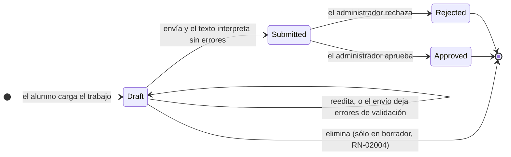
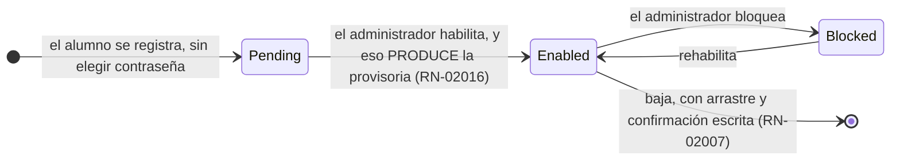

# 03 · Dominio, casos de uso y reglas de negocio

> **Propósito:** el vocabulario del dominio con sus conjuntos cerrados, y el catálogo de necesidades,
> casos de uso y reglas que el producto tiene que cumplir.
> **Fuente primaria:** `src/GeometriaFactory.Domain/`, `src/GeometriaFactory.Application/`,
> `SDD/Docs/01-Necesidades-Negocio/` y
> `SDD/Docs/Unidades-Entrega/*/02-Especificacion-Funcional/`.

---

## 1. Las cinco entidades

| Entidad | Qué es | Nota que decide su forma |
| --- | --- | --- |
| `Account` | Cuenta de la comisión. Una fila por persona, alumno o administrador | La identidad la da el **correo normalizado** (`EmailIdentity`) |
| `Work` | Trabajo entregado por un alumno: una fila por entrega, con dueño, identidad propia y estado | El texto original se conserva **íntegro** (`RN-02008`, `RC-06001`) |
| `Piece` | Cada figura del conjunto raíz del trabajo | **Su identidad es su posición** en ese conjunto: el dato del alumno no trae identificador (`RC-06002`) |
| `Component` | Figura plana que forma parte de una pieza | Su lugar dentro de la pieza es contiguo desde 0 |
| `Observation` | Lo que el producto emite al interpretar: advertencia o error de validación | Sólo el error de validación impide el paso a `Submitted` |

## 2. Los conjuntos cerrados

| Conjunto | Valores (identidad de código → etiqueta) |
| --- | --- |
| `WorkStatus` | `Draft` «Borrador» · `Submitted` «Pendiente» · `Approved` «Finalizado» · `Rejected` «Rechazado» |
| `AccountStatus` | `Pending` «Pendiente» · `Enabled` · `Blocked` |
| `Role` | `Student` «Alumno» · `Administrator` «Administrador» |
| `FigureType` | `Cylinder` · `Cube` · `Orthohedron` · `Rectangle` · `Square` · `Circle` · `DevelopedRectangle` (siete, y son etiquetas **del emisor**) |
| `ComponentRole` | `Cap` «Tapa» · `Face` · `Base` · `Lateral` · `Side` |
| `ObservationKind` | Advertencia · Error de validación |
| `WorkOutcome` | Aprobar (→ `Approved`) · Rechazar (→ `Rejected`) — **los dos son terminales** |
| `WorkOperation` | `View` (la admiten las dos resoluciones) · `Edit` (**sólo** la del alumno) · `Delete` (las dos, con alcances opuestos) |

`FigureType` y `ComponentRole` llevan **el vocabulario del emisor**: son las etiquetas que el texto
del alumno trae, no una taxonomía propia del producto (decisión `F-02` de la norma de nomenclatura).

## 3. Los códigos de condición del dominio

`ConditionCode` es el catálogo cerrado de motivos internos. Entre otros:
`REQUIRED_FIELD_MISSING`, `EMAIL_UNIQUENESS_NOT_VERIFIED`, `ACCOUNT_PENDING`, `ACCOUNT_BLOCKED`,
`ACCOUNT_TRANSITION_NOT_ALLOWED`, `ADMINISTRATOR_ALREADY_CONFIGURED`, `CREDENTIAL_ALREADY_SET`,
`CURRENT_CREDENTIAL_NOT_VERIFIED`, `PASSWORD_CHANGE_PENDING`, `EDIT_OUTSIDE_DRAFT`,
`SUBMISSION_OUTSIDE_DRAFT`, `OUTCOME_OUTSIDE_SUBMITTED`, `OUTCOME_REQUIRES_ADMINISTRATOR_ROLE`,
`TRANSITION_FROM_TERMINAL_STATUS`, `ORIGINAL_JSON_ALTERED`, `ERROR_WITHOUT_LOCATION`,
`OBSERVATION_ON_MISSING_PIECE`, `DELETION_WITHOUT_WORK_CASCADE`, `RESET_WITH_WORK_CASCADE`.

**Un motivo interno no es un código de contrato.** La traducción de uno a otro vive en
`Api/Endpoints/ContractTranslation.cs` — ver
[`04_Superficie-HTTP-Y-Contratos.md`](04_Superficie-HTTP-Y-Contratos.md).

---

## 4. Las nueve necesidades de negocio

| Id | Necesidad |
| --- | --- |
| `NB-00001` | Control de admisión al laboratorio |
| `NB-00002` | Identidad propia del alumno, **sin correo** de verificación |
| `NB-00003` | Trabajo con dueño, estado y persistencia |
| `NB-00004` | Interpretación **fiel** del dato del alumno |
| `NB-00005` | Visibilidad del error de cálculo |
| `NB-00006` | Visualización dentro del producto |
| `NB-00007` | Revisión de la comisión en un solo lugar |
| `NB-00008` | Alcance del laboratorio desde el aula |
| `NB-00009` | Desenlace explícito de la entrega |

## 5. Los casos de uso

### 5.1 Unidad `GeometriaFactory-Api` — nueve

| Id | Caso de uso | Realizado por |
| --- | --- | --- |
| `CU-00021` | Dar de alta una cuenta de alumno | `RegisterAccountUseCase` |
| `CU-00022` | Ingresar al laboratorio y sostener la sesión | `ResolveSignInUseCase` + `AccessTokenIssuer` |
| `CU-00023` | Gobernar las cuentas de la comisión | `GovernCommissionAccountsUseCase` |
| `CU-00024` | Resetear la contraseña de un alumno | `ResetStudentPasswordUseCase` |
| `CU-00025` | Configurar la cuenta de administrador en el primer arranque | `ConfigureAdministratorUseCase` |
| `CU-00026` | Enviar un trabajo y ver sus observaciones | `LoadAndEditOwnWorkUseCase` + `LocalFigureValidator` |
| `CU-00027` | Eliminar un trabajo | `DeleteWorkUseCase` |
| `CU-00028` | Consultar el listado y el detalle de los trabajos | `ConsultOwnWorksUseCase` / `ReviewCommissionWorksUseCase` |
| `CU-00029` | Dar desenlace a la revisión | `ResolveWorkUseCase` |

Las **catorce operaciones internas** (`CU-00009` a `CU-00011` y `CU-06001` a `CU-06010`) están en
`05-Arquitectura-Tecnica/Operaciones-Internas/`: interpretar el texto, verificar declarado contra
derivado, guardar y recuperar, borrado físico con arrastre, derivar contraseña, producir la
provisoria, emitir el acceso firmado, proveer el reloj y preparar el almacén.

### 5.2 Unidad `GeometriaFactory-Web` — diez

`CU-10001` registrar la cuenta · `CU-10002` iniciar y cerrar sesión sin exponer la credencial ·
`CU-10003` establecer y cambiar la contraseña propia · `CU-10004` administrar las cuentas de la
comisión · `CU-10005` enviar un trabajo y ver la interpretación · `CU-10006` consultar el listado
propio y operar sobre el borrador · `CU-10007` abrir un trabajo y explorarlo en escena y árbol ·
`CU-10008` recorrer la entrega de la comisión · `CU-10009` resolver un trabajo con comentario
opcional · `CU-10010` sostener la aplicación en estado degradado y reconexión.

---

## 6. Las dieciséis reglas de negocio (`RN-020XX`)

| Id | Regla |
| --- | --- |
| `RN-02001` | Administrador único y papeles fijos |
| `RN-02002` | Correo del alumno único |
| `RN-02003` | Trabajo ajeno **indistinguible de inexistente** |
| `RN-02004` | Eliminación acotada al borrador |
| `RN-02005` | Finalización sin errores de validación |
| `RN-02006` | Cuenta pendiente o bloqueada, sin acceso |
| `RN-02007` | Baja con arrastre y confirmación escrita |
| `RN-02008` | Texto original conservado íntegro |
| `RN-02009` | Observación de error con posición y campo |
| `RN-02010` | Desenlace exclusivo del administrador, y terminalidad |
| `RN-02011` | El administrador **no ve los borradores** |
| `RN-02012` | Reseteo conserva la cuenta y sus trabajos |
| `RN-02013` | Cambio forzado antes de toda otra capacidad |
| `RN-02014` | Provisoria producida por el sistema |
| `RN-02015` | Reseteo independiente del estado de cuenta |
| `RN-02016` | Habilitar produce la provisoria |

## 7. Las siete reglas conceptuales de modelo (`RC-060XX`)

`RC-06001` texto original escrito una sola vez · `RC-06002` identidad **posicional** de la pieza ·
`RC-06003` valor declarado y derivado por separado · `RC-06004` la familia no se persiste ·
`RC-06005` retiro físico con arrastre · `RC-06006` tres sellos de tiempo distintos ·
`RC-06007` la marca no es un estado de cuenta.

---

## 8. El ciclo de vida, en dos máquinas de estado

**«Enviar» es la única acción de guardado del alumno**: no hay una acción separada de guardar sin
enviar. Los dos desenlaces son terminales y no existe camino de vuelta a `Pendiente`.

El **reseteo** es independiente del estado de cuenta (`RN-02015`) y conserva los trabajos
(`RN-02012`); deja la cuenta con **cambio forzado** pendiente, que antecede a toda otra capacidad
(`RN-02013`).
