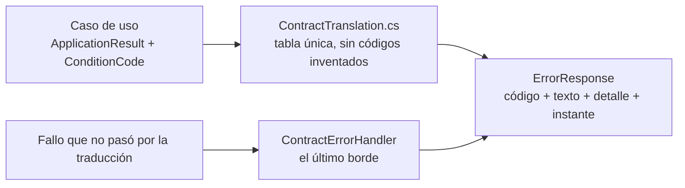

# 04 · Superficie HTTP y contratos

> **Propósito:** la superficie exacta que el servicio de datos expone, los tipos que cruzan la
> frontera y cómo un motivo interno se convierte en una respuesta de protocolo.
> **Fuente primaria:** `src/GeometriaFactory.Api/Endpoints/`,
> `src/GeometriaFactory.Contracts/` y
> `SDD/Docs/Unidades-Entrega/GeometriaFactory-Api/05-Arquitectura-Tecnica/Contratos-REST.md`
> (que es **la fuente autorizada** cuando el detalle importa: acá está el mapa, no el contrato).

---

## 1. Los puntos de acceso

Cada punto tiene un identificador `A-XX` que el corpus usa en todos lados. **Las rutas son
derivadas**: `Definicion-Superficie-HTTP.md` §3 declara el punto y no su ruta; la ruta la fijó la
decisión `A-4` / `Api BT-07` del punto de control de la etapa `a`.

| `A-XX` | Método y ruta | Qué hace | Acceso |
| --- | --- | --- | --- |
| `A-01` | `POST /auth/token` | Canjea correo y contraseña por un acceso firmado | Anónimo |
| `A-02` | `POST /cuentas` | Registra una cuenta de alumno, **sin campo de contraseña** | Anónimo |
| `A-03` | `POST /cuentas/administrador` | Configura la cuenta de administrador en el primer arranque | Anónimo (**sólo mientras no exista ninguno**) |
| `A-05` | `POST /cuenta/contrasena` | Cambia la contraseña propia exigiendo la vigente; admite dos formas de autenticarse | Anónimo por diseño (intake 1.34) |
| `A-06` | `GET /cuentas` | Lista las cuentas de la comisión | Firmado · administrador |
| `A-07` | `POST /cuentas/{id}/situacion` | Habilita, bloquea o rehabilita; **habilitar produce la provisoria** | Firmado · administrador |
| `A-08` | `DELETE /cuentas/{id}` | **Única operación destructiva**: elimina la cuenta y sus trabajos. Lleva cuerpo (confirmación escrita) | Firmado · administrador |
| `A-09` | `POST /cuentas/{id}/reseteo-de-contrasena` | Resetea la contraseña de un alumno; **único punto que devuelve un valor de credencial** | Firmado · administrador |
| `A-10` | `POST /trabajos` | Envía un trabajo (alta) | Firmado · alumno |
| `A-11` | `POST /trabajos/{id}` | Reenvía / reedita un trabajo en borrador | Firmado · alumno |
| `A-12` | `DELETE /trabajos/{id}` | Elimina un trabajo | Firmado |
| `A-13` | `GET /trabajos` | Listado; sin parámetro con el que pedir borradores ajenos | Firmado |
| `A-14` | `GET /trabajos/{id}` | Detalle del trabajo interpretado | Firmado |
| `A-15` | `POST /trabajos/{id}/desenlace` | Aprueba o rechaza, con comentario opcional | Firmado · administrador |
| `A-16` | `GET /salud` | Estado del servicio: `200` listo, `503` si la preparación no terminó | Anónimo |
| `A-17` | `GET /aprovisionamiento` | Si el laboratorio ya tiene administrador | Anónimo |
| `A-18` | `POST /interpretaciones` | Interpreta un texto **sin persistir nada** | Firmado · alumno |

**`A-04` quedó retirado y no se recicla**: exponía el establecimiento de la contraseña como punto
propio, y esa capacidad la absorbió `A-05`.

**Las cuatro ausencias declaradas de la guardia** son `A-01`, `A-02`, `A-03` y `A-16`; `A-17` se les
suma por el guardián 1 de `Web ADR-10003` §2, que necesitaba preguntar sin poder autenticarse.

**El `404` de `A-11`, `A-12` y `A-14` es de seguridad y no de cortesía** (`RN-02003`): un trabajo
ajeno es indistinguible de uno inexistente.

**`A-16` no lleva dirección de servicio interno, ni ruta del almacén, ni traza** (`US-29` §3), y su
ruta la usan las tres cosas que dependen de ella: el `healthcheck` de `deploy/compose.yaml`, la
página de estado del front y la comprobación de la publicación.

---

## 2. Los tipos de transferencia — `GeometriaFactory.Contracts`

| Área | Tipos |
| --- | --- |
| `Accounts/` | `AccountRegistrationRequest`/`Response`, `AdministratorSetupRequest`, `AccountSetupResponse`, `CredentialExchangeRequest`, `SessionResponse`, `OwnPasswordChangeRequest`, `PasswordResetRequest`/`Response`, `AccountStatusChangeRequest`/`Response`, `AccountDeletionRequest`, `AccountListItem` |
| `Works/` | `WorkSubmissionRequest`/`Response`, `WorkInterpretationRequest`/`Response`, `WorkListItem`, `WorkDetailResponse`, `WorkPiece`, `WorkObservation`, `WorkObservationKind`, `WorkOutcomeRequest`/`Response`, `WorkOutcomeName`, `WorkTextNode` |
| `Errors/` | `ErrorCode`, `ErrorDetail`, `ErrorResponse` |
| `Service/` | `ServiceHealth`, `LaboratoryProvisioning` |

Decisiones que gobiernan esta capa: `ADR-08001` (tipos planos sin dependencias), `ADR-08002` (tipo
de error único con conjunto cerrado), `ADR-08003` (versionado por compilación compartida),
`ADR-08004` (regla de exposición de la frontera), `ADR-08005` (**proyección de listado separada del
detalle**), `ADR-08006` (**el visor recibe piezas reconstruidas y no el texto**) y `ADR-08008` (la
superficie se describe y el explorador no se publica solo).

---

## 3. El conjunto cerrado de códigos de error

Quince constantes en `Contracts/Errors/ErrorCode.cs`. Identificadores en inglés y **sin el prefijo
`CONTRATO_`**, por la decisión `F-03` de la norma de nomenclatura §5.3, con correspondencia uno a
uno en su §6.8.6.

| Código | Cuándo |
| --- | --- |
| `REQUIRED_FIELD_MISSING` | La solicitud llega incompleta |
| `INVALID_CREDENTIALS` | El par no corresponde a ninguna cuenta. **Genérico**: no declara cuál de los dos campos falló |
| `ACCOUNT_NOT_ENABLED` | La cuenta está `Pending` o `Blocked` (`RN-02006`) |
| `EMAIL_ALREADY_REGISTERED` | `RN-02002` |
| `ADMINISTRATOR_ALREADY_CONFIGURED` | `RN-02001` |
| `PASSWORD_CHANGE_REQUIRED` | Un solo código para todas las operaciones bloqueadas por el cambio forzado |
| `SERVICE_UNAVAILABLE` | Sin dirección del servicio que falló |
| `CONFIRMATION_MISMATCH` | La confirmación escrita de la baja no coincide (`RN-02007`) |
| `STUDENT_NOT_FOUND` | Alumno referenciado inexistente |
| `OPERATION_ADMIN_ONLY` | Falta de facultad fuera del desenlace |
| `RESET_NOT_APPLICABLE_TO_ADMINISTRATOR_ACCOUNT` | `RN-02015`; el camino que sí existe es el cambio propio |
| `WORK_NOT_FOUND` | Trabajo inexistente **o ajeno** |
| `STATE_FORBIDS_DELETE` | Eliminación fuera del borrador |
| `STATE_FORBIDS_UPDATE` | Reedición fuera del borrador **y** desenlace sobre un estado que no lo admite |
| `UNCLASSIFIED_ERROR` | Motivo interno sin código propio. **El hueco se declara en lugar de taparse con un código nuevo** |

**La capa que expone no inventa códigos**: lo que este conjunto no declara, no viaja como código.

---

## 4. Cómo un motivo interno se vuelve una respuesta

Dos decisiones lo gobiernan: **`ADR-00004` — dos traducciones con tabla única y sin códigos
inventados**, y `ContractErrorHandler`, que convierte cualquier fallo no traducido en una respuesta
que **sí** cumple el contrato y deja el detalle del lado del servidor.

Ejemplo del criterio, verificable en `ContractTranslation.cs`: el desenlace sobre un trabajo que ya
no lo admite responde **`409` y no `403`** —quien pide tiene la facultad; lo que no procede es el
desenlace—, la respuesta declara el estado actual y **no sugiere ninguna forma de volver a
`Pendiente`**, porque no existe.

---

## 5. Documentación navegable

`Composition/ApiDocumentation.cs` publica el documento **OpenAPI** y el explorador **Scalar**
(`Scalar.AspNetCore` 2.16.20). Por `ADR-08008`, la superficie se describe pero **el explorador no
se publica solo**. `ApiDocumentationSurfaceTests` y `ContractCoverageTests` verifican que la
descripción cubra la superficie real.
