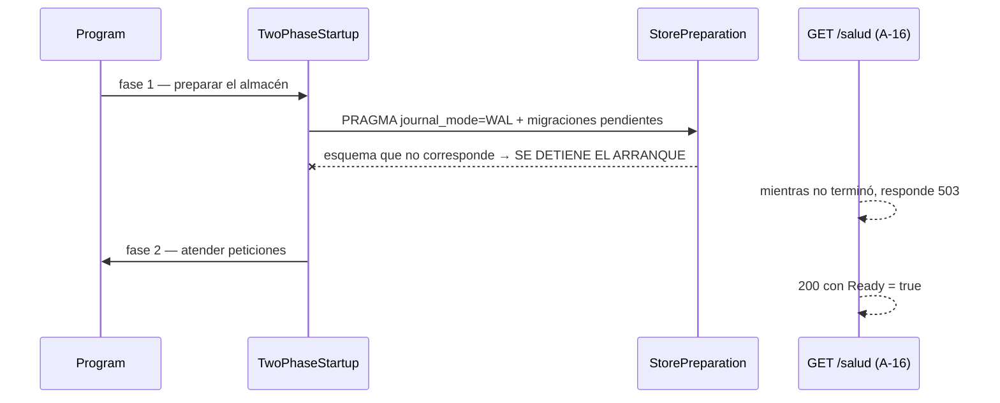

# 06 · Persistencia y seguridad

> **Propósito:** cómo se guarda el dato, cómo evoluciona el esquema y cómo se firma y verifica el
> acceso — incluidas las dos guardias que **detienen el arranque** a propósito.
> **Fuente primaria:** `src/GeometriaFactory.Infrastructure/`,
> `src/GeometriaFactory.Api/Composition/`, `deploy/` y
> `SDD/Docs/Unidades-Entrega/GeometriaFactory-Api/05-Arquitectura-Tecnica/Modelo-Datos-Logico.md`.

---

## 1. El almacén

**EF Core sobre SQLite**, un único archivo. Reglas que lo gobiernan:

| Regla | Dónde vive | Nota |
| --- | --- | --- |
| Un contexto **por operación** | `GeometriaFactoryDbContext` | `ADR-06002`: un archivo escritor único y una unidad de trabajo por operación |
| **Diario WAL**, fijado una sola vez en la preparación | `StorePreparation` | El `PRAGMA` es persistente: va en la preparación y no por conexión. Si el motor no informa WAL, **el arranque falla** — el procedimiento de respaldo depende de WAL |
| Un adaptador por puerto, sin repositorio genérico | `EfCoreAccountRepository`, `EfCoreWorkRepository` | `ADR-06001` |
| Comparación de correos y el índice que la sostiene | `AccountConfiguration` | `ADR-06003` |
| Lectura tolerante y tabla de derivación por tipo | `EfCoreWorkRepository` | `ADR-06006` |

**La ruta del almacén no está versionada, y es deliberado.** `appsettings.json` lo dice con todas
las letras: una ruta absoluta sería la de una máquina, y la ruta relativa que hubo hasta la etapa
`d` creaba la base **adentro del árbol del repositorio**. El valor llega por la variable de entorno
`ConnectionStrings__Store` — en desarrollo la calcula `scripts/store-path.sh` sobre
`$XDG_DATA_HOME/geometria-factory/`, y en el despliegue la fija el `ENV` del `Dockerfile` sobre el
volumen `/datos`. **Sin ella el servicio no arranca**, por guardia de `CompositionRoot`: es
preferible a escribir en un archivo que nadie eligió.

Configuraciones de mapeo: una por entidad — `AccountConfiguration`, `WorkConfiguration`,
`PieceConfiguration`, `ComponentConfiguration`, `ObservationConfiguration`.

## 2. Transformaciones de esquema

Cuatro migraciones versionadas con el código de su etapa, más el snapshot del modelo:

| Migración | Qué trajo |
| --- | --- |
| `20260815010950_Account` | La cuenta (etapa `c`) |
| `20260815222049_Work` | El trabajo (etapa `e`) |
| `20260816153319_Interpretation` | Piezas, componentes y observaciones (etapa `f`) |
| `20260816230145_PieceOwnDimensions` | Las dimensiones propias de las figuras planas del conjunto raíz |

Reglas: **una transformación ya fusionada no se edita** (`ADR-06007`, linaje inmutable), y **las
transformaciones se aplican solas al arrancar** — por eso `scripts/migrate.sh` sólo **genera**, no
aplica. La etapa `a` no generó ninguna: el modelado de entidades estaba anclado a la etapa `c`.

## 3. Arranque en dos fases

`ADR-00007`: arranque en dos fases y punto de salud sin acceso. `StorePreparation` **detiene el
arranque ante un esquema que no corresponde** en lugar de seguir con una base incierta.

---

## 4. Acceso firmado

| Pieza | Qué hace |
| --- | --- |
| `AccessTokenIssuer` | Emite el acceso firmado (`CU-06008`). **Cuatro reclamos y ninguno por defecto**: identificador, correo, papel y expiración |
| `SigningOptions` | Sección de configuración **`AccessToken`**: `SigningKey`, `LifetimeInMinutes` (por omisión **480**), `Issuer` y `Audience` (`GeometriaFactory`) |
| La guardia de `CompositionRoot` | **Si `AccessToken:SigningKey` no llegó, el arranque se detiene.** Una clave más corta que el resumen cuenta como ausente: HS256 firma con un resumen de 32 bytes |
| La guardia de verificación | Verifica firma y expiración del acceso presentado. **Su `401` no lleva código del contrato**, deliberadamente |

**Por qué esa guardia existe, y vale recordarlo**: sin ella el servicio se levantaba **como si
estuviera sano** y fallaba recién con una persona adelante intentando entrar. Está registrado como
origen de la versión 1.11 de la norma de nomenclatura y cubierto por `SigningKeyStartupTests`.

## 5. Credenciales

| Pieza | Cómo |
| --- | --- |
| `PasswordDerivation` | **PBKDF2** (`Rfc2898DeriveBytes`) con **SHA-256**, sal de **16 bytes** e **210.000 iteraciones ancladas**. Las fuentes declaran «PBKDF2 o Argon2» y no eligen; `ADR-06004` deja la elección abierta y ésta la cierra con parámetros versionados |
| `ProvisionalPasswordFactory` | Produce la contraseña provisoria de la habilitación y del reseteo: **no adivinable y sin repetirse** (`ADR-06005`) |

**El alumno nunca elige contraseña al registrarse**: la recibe al ser habilitado (`A-07`), y el
primer ingreso exige el **cambio forzado** antes de toda otra capacidad (`RN-02013`).

## 6. Copia y vuelta atrás

`Entornos-Deploy.md` §11.1 declara que **el respaldo es el único mecanismo del producto para volver
atrás sobre datos**: volver a una etiqueta de imagen no deshace el esquema del almacén. Los dos
guiones existen desde el **2026-08-31** (hallazgo `MI-01` de la mesa de ese día):

- `scripts/respaldo-almacen.sh` — la copia, tomable **desde adentro del contenedor** (por eso la
  imagen final instala `sqlite3`).
- `scripts/restaurar-almacen.sh` — la otra mitad, separada a propósito: «un respaldo que nadie
  restituyó nunca no es un respaldo: es un archivo».

**Toda rutina destructiva usa archivo propio.** El 2026-08-15 una corrida de guiones se llevó una
cuenta; desde entonces es regla del repositorio.
